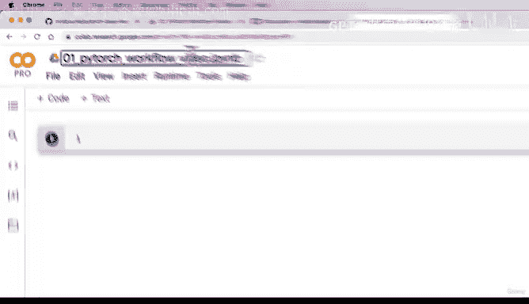
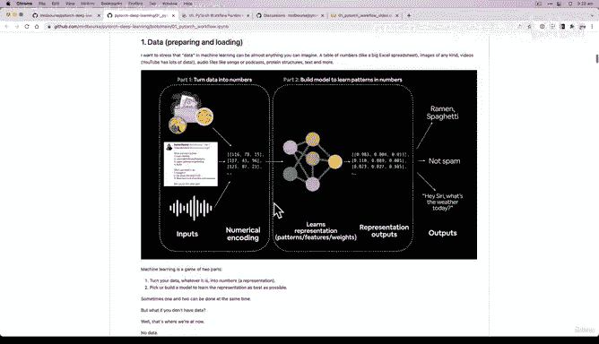
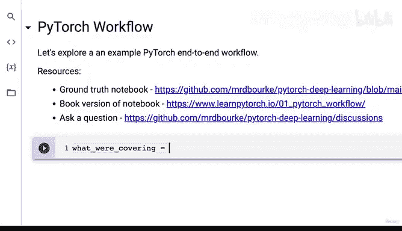
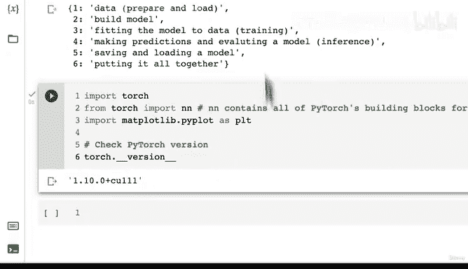
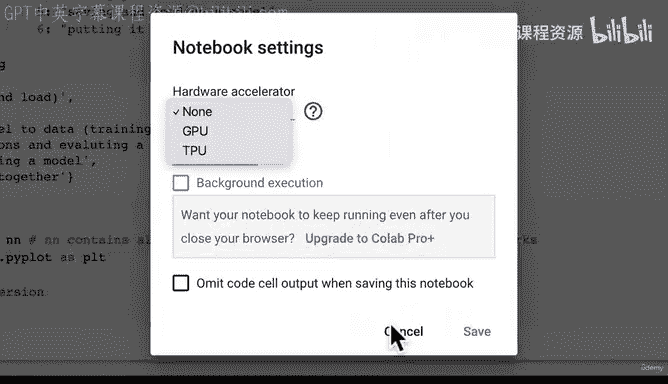
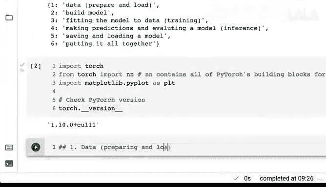

# 38：环境配置与内容规划 🚀


在本节课中，我们将学习如何设置PyTorch开发环境，并规划一个完整的端到端深度学习项目流程。我们将从零开始，在Google Colab中创建一个新的笔记本，并导入必要的库，为后续的实战编码做好准备。

---



## 概述 📋

我们将遵循一个标准的机器学习工作流程，涵盖从数据准备到模型部署的核心步骤。具体来说，我们将学习：
1.  数据准备与加载。
2.  使用PyTorch构建机器学习或深度学习模型。
3.  将模型拟合到数据上，即训练模型。
4.  使用训练好的模型进行预测并评估其性能。
5.  保存和加载训练好的模型。
6.  将所有步骤整合在一起。



本节课的目标是搭建好开发环境，并清晰地理解我们将要执行的每一步。

---

## 创建新笔记本与标题

首先，我们访问 `colab.research.google.com` 并创建一个新的笔记本。

我将这个笔记本命名为 `01_pytorch_workflow`，并注明它源自本视频课程。这样，在课程资源中，你可以清楚地知道这个笔记本的来源。




在课程资源中，我们提供了原始的参考笔记本，其中包含丰富的图片和文本注释。视频将主要聚焦于代码实现，而你可以将原始笔记本作为参考。

因此，我将在笔记本开头链接这两个资源：
*   **原始参考笔记本**
*   **书籍版本的笔记本**（内容相同，格式不同）

最后，我还会添加一个链接，指向课程讨论页面，方便提问。

---

## 课程核心内容规划

上一节我们设置了笔记本的基本信息，本节中我们来看看本课程将要涵盖的具体内容。

我们将遵循一个PyTorch端到端工作流程。与花费大量时间讲解幻灯片不同，我更倾向于直接一起编写代码，并在需要时解释相关概念。这更贴近实际使用PyTorch进行开发的方式。

以下是本课程将要覆盖的六个核心步骤：

1.  **数据准备与加载**：学习如何获取和格式化数据以供模型使用。
2.  **构建模型**：学习如何使用PyTorch的构建块创建机器学习或深度学习模型。
3.  **训练模型**：学习如何将模型拟合到数据上。“拟合”是机器学习中“训练”的另一种说法。
4.  **评估模型**：学习如何使用训练好的模型进行预测并评估其性能。进行预测也常被称为“推理”。
5.  **保存与加载模型**：学习如何保存训练好的模型，以便后续重新加载和使用。
6.  **整合所有步骤**：将以上所有步骤组合成一个完整的工作流程。

这个流程与我们稍后会深入学习的完整PyTorch工作流程略有不同。完整的流程还包括“通过实验改进模型”等环节，我们将在后续课程中重点探讨。

---

## 导入必要的依赖库

在开始编码之前，我们需要导入必要的Python库。以下是本课程所需的依赖项：

```python
import torch
from torch import nn
import matplotlib.pyplot as plt

# 检查PyTorch版本
print(f“PyTorch版本：{torch.__version__}”)
```

*   `torch`：导入PyTorch主库。
*   `torch.nn`：`nn`模块包含了构建神经网络的所有基础构建块。在PyTorch文档中，你可以看到`nn`模块提供了用于构建计算图（对于神经网络，即网络层结构）的各种组件。作为数据科学家和机器学习工程师，我们的任务就是组合这些构建块来创建各种神经网络。
*   `matplotlib.pyplot`：用于数据可视化。我们的信条是：可视化、可视化、再可视化。
*   `torch.__version__`：检查当前PyTorch版本。确保版本至少为1.10（如果版本更高，代码通常也能正常运行）。输出中的“CUDA”表示是否支持GPU加速，目前我们的运行时尚未启用GPU，后续可能会进行设置。

---





## 总结 🎯

本节课中，我们一起学习了如何为PyTorch深度学习项目设置开发环境。我们创建了一个新的Colab笔记本，规划了从数据准备到模型保存的完整端到端工作流程，并导入了所有必要的库（`torch`、`torch.nn`、`matplotlib`）。



现在，我们的“视频笔记本”已经准备就绪，拥有了清晰的路线图和所需的工具。在下一节课中，我们将正式进入第一个实战环节：**数据准备与加载**。