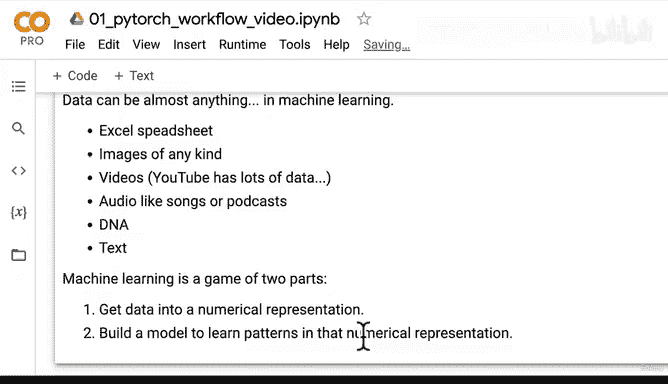
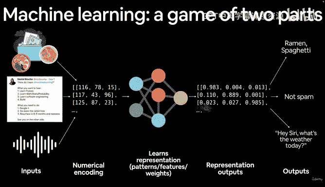
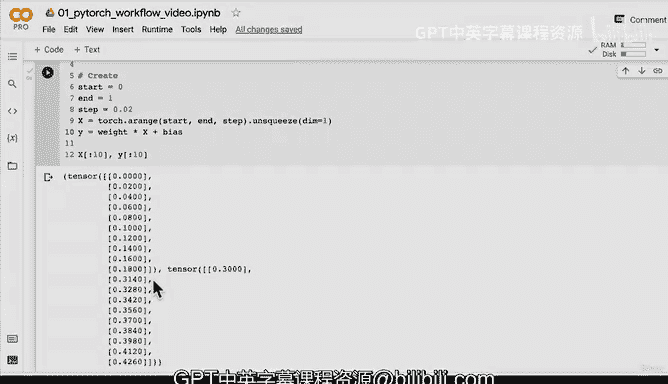

# 39：使用线性回归公式创建简单数据集 📊


在本节课中，我们将学习PyTorch深度学习工作流程的第一步：数据的准备与加载。我们将通过创建一个简单的线性回归数据集来演示这一过程。

---

## 概述：机器学习的两部分游戏 🎮

机器学习，包括深度学习，本质上可以看作一个由两部分组成的游戏。

1.  **将数据转换为数值表示**：无论数据是Excel表格、图像、视频、音频、DNA序列还是文本，第一步都是将其转换为数值形式（通常是张量）。
2.  **构建模型以学习数值表示中的模式**：然后，我们构建一个模型（如神经网络）来学习这些数值数据中的模式、特征或权重。



模型的最终目标是输出学到的表示，并基于此进行预测或分类，例如判断一张图片是拉面还是意大利面，或者一条推文是否为垃圾信息。



上一节我们介绍了机器学习的基本框架，本节中我们来看看如何动手创建我们的第一个数据集。

---

## 创建已知参数的线性回归数据 📈

为了清晰地展示上述过程，我们将从一个已知的、简单的数据集开始。我们将使用线性回归公式来生成一条直线数据。

线性回归的标准公式通常表示为：
**`y = a + bX`**
其中：
*   `X` 是自变量（解释变量）。
*   `y` 是因变量。
*   `b` 是直线的斜率（在深度学习中常称为**权重**）。
*   `a` 是截距（在深度学习中常称为**偏置**）。

我们将手动设定权重和偏置的值，然后根据公式生成对应的 `X` 和 `y` 数据。我们的目标是让后续构建的模型能够从 `X` 和 `y` 的对应关系中，学习并逼近我们预先设定的这些参数值。

以下是创建数据的具体步骤：

```python
import torch

# 1. 设定已知参数（模型最终要学习的目标）
weight = 0.7  # 斜率 b
bias = 0.3    # 截距 a

# 2. 创建输入数据 X：生成从0到1，步长为0.02的一系列数值
start = 0
end = 1
step = 0.02
X = torch.arange(start, end, step).unsqueeze(dim=1) # unsqueeze添加一个维度，便于后续计算

# 3. 根据线性公式计算输出数据 y
y = weight * X + bias

# 4. 查看生成的数据
print(f"前10个X值:\n{X[:10]}")
print(f"\n前10个y值:\n{y[:10]}")
print(f"\nX的长度: {len(X)}")
print(f"y的长度: {len(y)}")
```

代码解析：
*   `torch.arange(start, end, step)` 创建了一个一维张量。
*   `.unsqueeze(dim=1)` 的作用是在索引为1的维度上增加一个维度。例如，将形状 `[50]` 变为 `[50, 1]`。这通常是为了让数据的形状符合模型对输入格式的要求（例如，每个样本是一个特征）。
*   我们完全知晓 `weight` 和 `bias` 的值（0.7和0.3），但后续的模型将不知道这些，它需要从 `X` 和 `y` 中自己发现这个关系。

运行上述代码，我们将得到50对 `(X, y)` 数据点。模型的任务就是观察这些 `X` 值，并学习预测出对应的 `y` 值，进而推断出背后 `y = 0.7*X + 0.3` 的关系。

---

## 总结与下节预告 🎯

本节课中我们一起学习了机器学习工作流的基础，并亲手创建了一个用于线性回归的简单数据集。我们明确了两个核心步骤：将数据数值化，以及构建模型学习模式。同时，我们通过代码实现了：
*   定义了模型的**权重**和**偏置**参数。
*   生成了自变量 `X` 和因变量 `y` 的张量数据。



目前，我们的数据还只是“页面上的数字”，不够直观。在下一节课中，我们将遵循数据探索者的格言：“可视化你的数据”，通过绘图来更直观地观察我们刚刚创建的 `X` 和 `y` 之间的关系。