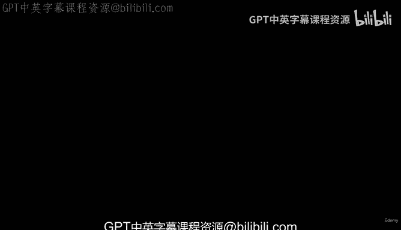
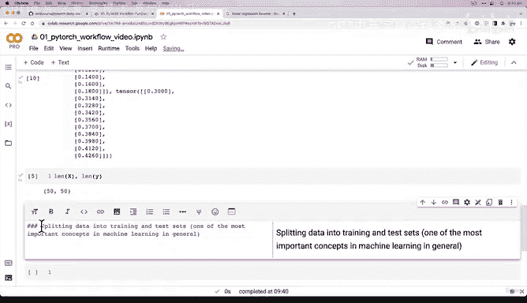
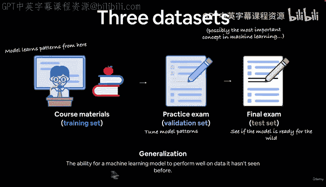
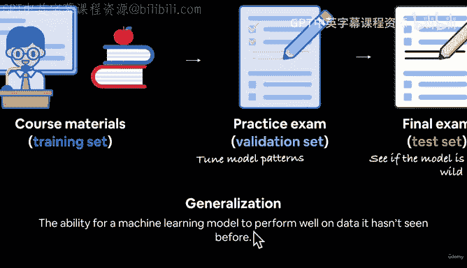
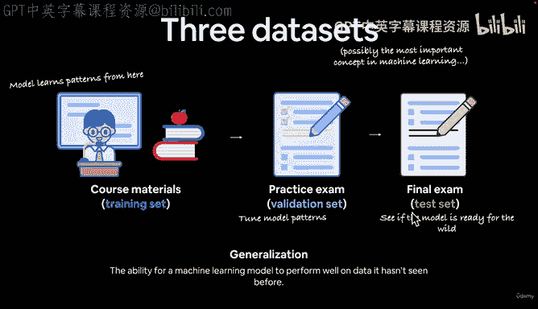
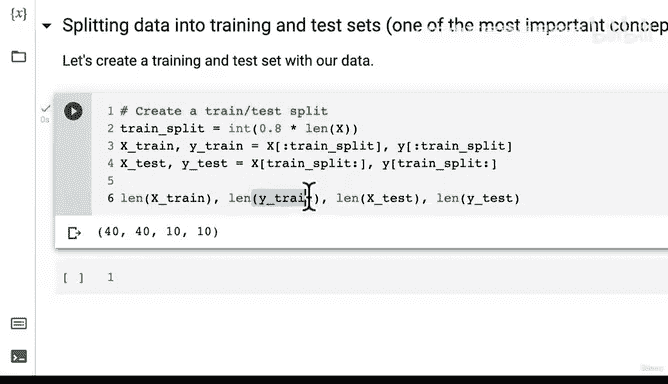
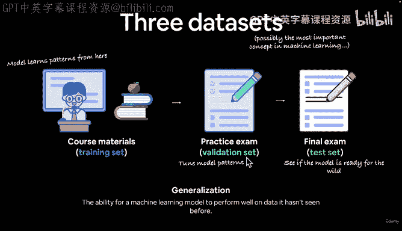
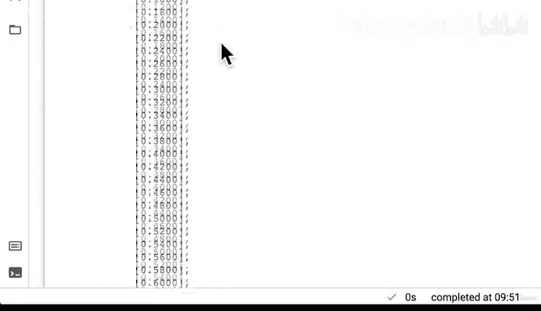

#  40：划分训练集与测试集 📊

在本节课中，我们将学习机器学习中一个至关重要的概念：如何将数据划分为训练集和测试集。我们将通过一个简单的线性回归数据示例，来实践这一划分过程，并理解其背后的核心思想。



---

## 概述



上一节我们使用线性回归公式和一些已知参数创建了一些数据。本节中，我们将介绍机器学习中最核心的概念之一：将数据划分为训练集和测试集。这是评估模型泛化能力的关键步骤。

---

## 机器学习中的核心概念

在机器学习中，数据通常被划分为三个主要部分：训练集、验证集和测试集。这类似于大学的学习过程：

*   **训练集**：相当于课程的全部学习材料。模型从这里学习数据中的模式。
*   **验证集**：相当于期中考试或模拟考试。用于在训练过程中调整和评估模型，看其是否从训练材料中学到了东西。
*   **测试集**：相当于期末考试。用于最终评估模型在从未见过的数据上的表现，检验其**泛化**能力。

**泛化**的定义是：机器学习或深度学习模型在**未见过的数据**上表现良好的能力。我们的最终目标正是构建一个能在训练数据上学习模式，并能在部署后对新数据做出有效预测的模型。

---

## 数据划分的常见比例

以下是数据划分的典型比例：

*   **训练集**：通常占数据的 **60% 到 80%**。
*   **验证集**（如果使用）：通常占数据的 **10% 到 20%**。
*   **测试集**：通常占数据的 **10% 到 20%**。

**训练集和测试集是必须的，而验证集则经常使用，但并非总是必需**。对于我们的简单数据集，我们将只创建训练集和测试集。





---



## 实践：划分我们的数据

我们之前创建了包含50个样本的数据（X 和 y）。我们将采用一个非常常见的比例：**80% 用于训练，20% 用于测试**。

首先，我们计算训练集的大小：

```python
train_split = int(0.8 * len(X))  # 计算80%分界点的索引
```

接下来，我们使用索引来划分特征（X）和标签（y）：

```python
# 划分训练集（前80%的数据）
X_train, y_train = X[:train_split], y[:train_split]

# 划分测试集（后20%的数据）
X_test, y_test = X[train_split:], y[train_split:]
```

现在，让我们检查划分后的数据大小：

```python
len(X_train), len(y_train), len(X_test), len(y_test)
```

结果应该是 `(40, 40, 10, 10)`。这意味着我们有40个训练样本（特征和标签）和10个测试样本。

---

## 重要说明



*   我们这里使用的划分方法非常简单直接。在实际项目中，更常用的是像 **Scikit-learn 的 `train_test_split`** 这样的函数，它可以为划分过程引入随机性，使结果更可靠。
*   创建恰当的训练集和测试集是机器学习中最大的挑战之一，因此理解这个概念至关重要。

---



## 总结

本节课中，我们一起学习了机器学习数据划分的核心概念。我们了解了训练集、验证集和测试集的作用，并亲自动手将一个简单的数据集按 80/20 的比例划分成了训练集和测试集。记住，测试集的目的是评估模型的**泛化能力**，即模型处理新数据的能力。



在下一节，我们将探索如何将这些“纸上的数字”可视化，以便更直观地理解我们的数据和模型。