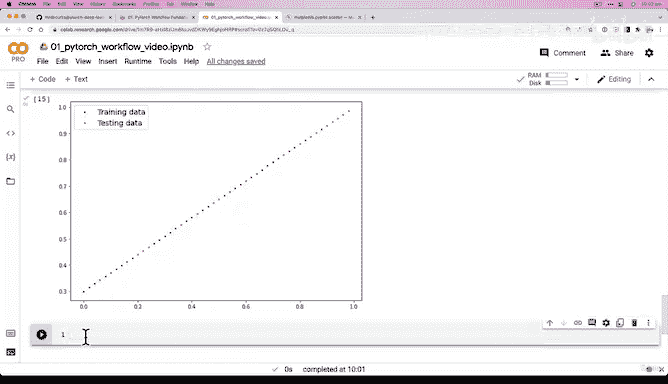
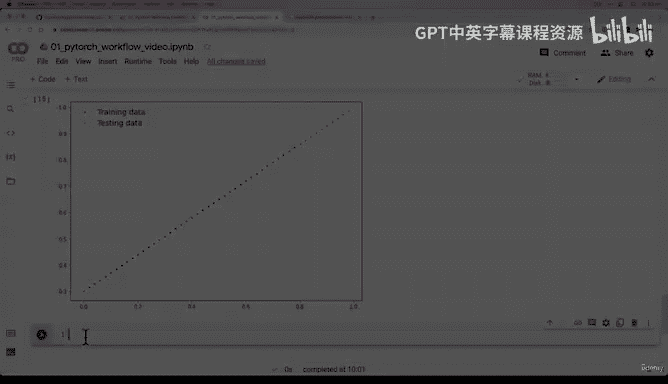

#  41：构建数据可视化函数 📊


在本节课中，我们将学习如何构建一个数据可视化函数，以便更直观地理解我们的训练数据和测试数据。通过可视化，我们可以清晰地看到数据之间的关系，为后续构建机器学习模型打下基础。

---

## 概述

上一节我们将数据分割成了训练集和测试集。本节中，我们将构建一个名为 `plot_predictions` 的函数，用于可视化这些数据。这个函数将帮助我们直观地观察数据点，并理解模型预测的目标。

---

## 构建可视化函数

为了探索和理解数据，一个有效的方法是将其可视化。因此，我们创建一个函数来绘制数据点。

以下是 `plot_predictions` 函数的定义：

```python
def plot_predictions(train_data=X_train,
                     train_labels=Y_train,
                     test_data=X_test,
                     test_labels=Y_test,
                     predictions=None):
    """
    绘制训练数据、测试数据，并比较预测结果。
    """
    plt.figure(figsize=(10, 7))

    # 绘制训练数据，用蓝色表示
    plt.scatter(train_data, train_labels, c="b", s=4, label="Training data")

    # 绘制测试数据，用绿色表示
    plt.scatter(test_data, test_labels, c="g", s=4, label="Testing data")

    # 如果存在预测结果，则用红色绘制
    if predictions is not None:
        plt.scatter(test_data, predictions, c="r", s=4, label="Predictions")

    # 显示图例
    plt.legend(prop={"size": 14})
```

---

## 函数参数说明

该函数接受以下参数：
*   `train_data`：训练数据的特征值。
*   `train_labels`：训练数据的标签值。
*   `test_data`：测试数据的特征值。
*   `test_labels`：测试数据的标签值。
*   `predictions`：模型的预测结果，初始设置为 `None`。

---

## 可视化结果分析

运行该函数后，我们得到一张散点图。图中蓝色点代表训练数据，绿色点代表测试数据。

我们构建机器学习模型的目标是：让模型学习蓝色数据点（训练数据）中 `X` 与 `Y` 之间的关系。然后，当我们向模型输入绿色数据点的 `X` 值（测试数据特征）时，模型能够预测出对应的 `Y` 值。

一个完美的模型，其预测结果（红色点）应该与绿色点（测试数据的真实标签）完全重合。这背后的数据关系，实际上是由我们之前定义的线性公式生成的：`Y = weight * X + bias`，也就是大家熟知的线性方程 `y = mx + c`。

---

## 总结





本节课我们一起学习了如何构建一个数据可视化函数。通过这个函数，我们能够直观地看到训练集和测试集的分布情况，并理解了模型预测的最终目标——让预测值尽可能接近测试集的真实值。在下一节中，我们将开始构建一个能够学习这种数据关系的模型。