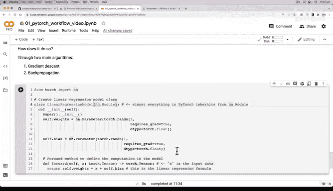

# 42：创建首个 PyTorch 线性回归模型 🧠


在本节课中，我们将学习如何从零开始构建一个 PyTorch 线性回归模型。我们将创建一个能够学习数据中潜在模式的模型，并使用它进行预测。

---

## 回顾与准备

上一节我们介绍了如何可视化数据，并遵循了“可视化、可视化、再可视化”的数据探索者格言。我们了解了训练数据和测试数据，目标是构建一个模型来学习训练数据中的模式（主要是这里的上升趋势），以便预测测试数据。

现在，让我们开始构建我们的第一个 PyTorch 模型。

---

## 构建线性回归模型类

我们将直接进入代码部分。首先，创建一个线性回归模型类。如果你不熟悉 Python 类，没关系，我会在编写代码时解释每一步。但如果你想深入了解，我推荐阅读 Real Python 关于 Python 类和面向对象编程（OOP）的教程。

以下是创建模型类的步骤：

1.  **导入必要的模块**：我们使用 `torch.nn` 模块，它是构建 PyTorch 模型的基础。
2.  **定义模型类**：创建一个继承自 `nn.Module` 的类。在 PyTorch 中，几乎所有模型都继承自这个基类，它提供了构建模型所需的大量内置功能。
3.  **初始化参数**：在类的构造函数 `__init__` 中，我们初始化模型的参数（权重和偏置）。这些参数开始时是随机值。
4.  **定义前向传播方法**：在 `forward` 方法中，我们定义模型如何根据输入数据计算输出。

以下是具体的代码实现：

```python
import torch
from torch import nn

# 创建线性回归模型类
class LinearRegressionModel(nn.Module):
    def __init__(self):
        super().__init__()
        # 初始化权重参数，使用随机值并启用梯度计算
        self.weights = nn.Parameter(torch.randn(1, requires_grad=True, dtype=torch.float32))
        # 初始化偏置参数，使用随机值并启用梯度计算
        self.bias = nn.Parameter(torch.randn(1, requires_grad=True, dtype=torch.float32))

    def forward(self, x: torch.Tensor) -> torch.Tensor:
        # 定义前向计算：y = weights * x + bias
        return self.weights * x + self.bias
```

---

## 模型工作原理详解

现在，让我们详细解释一下上面代码的每个部分及其背后的原理。

### 1. 继承 `nn.Module`
`nn.Module` 是 PyTorch 中所有神经网络模块的基类。通过继承它，我们的模型自动获得了 PyTorch 框架提供的许多功能，例如参数管理、梯度计算等。

### 2. 参数初始化
我们使用 `nn.Parameter` 来定义模型的参数（`weights` 和 `bias`）。`nn.Parameter` 是 `torch.Tensor` 的一个子类，具有一个特殊属性：当它被赋值给一个模块属性时，会自动被添加到模块的参数列表中，便于后续的优化器访问和更新。

*   `torch.randn(1)`：生成一个来自标准正态分布的随机数作为参数的初始值。
*   `requires_grad=True`：这是关键设置。它告诉 PyTorch 需要计算这个张量（参数）的梯度。梯度是优化算法（如梯度下降）用来更新参数、使模型表现更好的关键信息。
*   `dtype=torch.float32`：将数据类型设置为 PyTorch 默认且高效使用的 32 位浮点数。

### 3. 前向传播方法
`forward` 方法定义了数据如何通过模型。对于线性回归，这就是线性公式：
**`output = weights * input + bias`**
这正是我们创建原始数据时使用的公式。模型的目标是学习出接近真实数据生成过程（即我们预设的 `weight` 和 `bias`）的权重和偏置值。

---

## 模型的学习目标

为了更清晰地理解模型在做什么，让我们回顾一下机器学习的基本流程：

1.  **起点**：模型从随机初始化的权重和偏置开始。
2.  **观察数据**：模型查看训练数据（输入 `X_train` 和标签 `y_train`）。
3.  **调整参数**：通过算法（梯度下降和反向传播），模型不断调整其随机的权重和偏置值。
4.  **目标**：使调整后的参数值尽可能接近（甚至完美匹配）我们用来生成数据的真实参数值。

这就是机器学习的核心：**从随机开始，通过查看数据，让模型自动找到数据背后的规律**。

PyTorch 的伟大之处在于，它已经为我们实现了复杂的优化算法（如梯度下降和反向传播）。我们只需要编写高级代码来定义模型结构和数据流，PyTorch 会自动处理底层的梯度计算和参数更新。

---

## 总结

本节课中，我们一起学习了：

*   如何创建一个继承自 `nn.Module` 的 PyTorch 模型类。
*   如何使用 `nn.Parameter` 定义并初始化模型的可学习参数（权重和偏置）。
*   如何在 `forward` 方法中实现线性回归的前向计算逻辑。
*   理解了模型 `requires_grad=True` 参数的重要性，它启用了自动梯度计算，这是模型能够学习的基础。
*   明确了模型的学习目标：从随机参数出发，通过观察训练数据，逐步调整参数以拟合数据中的真实模式。



在下一节中，我们将更深入地探讨 PyTorch 的核心模块，并开始训练这个模型，观察它如何从随机状态学习到有意义的参数。