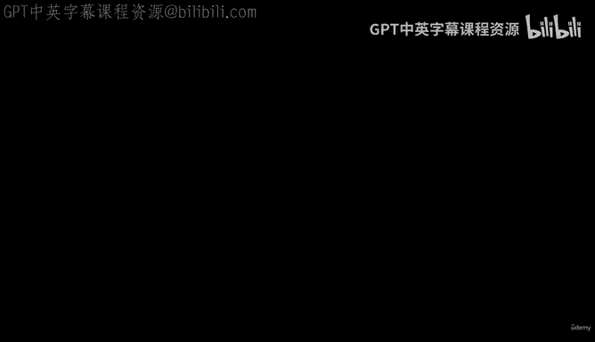
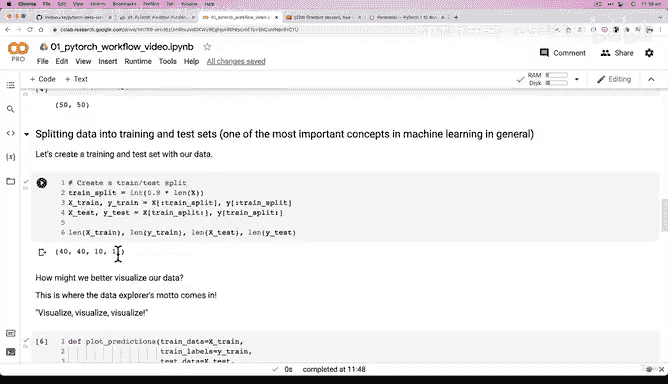
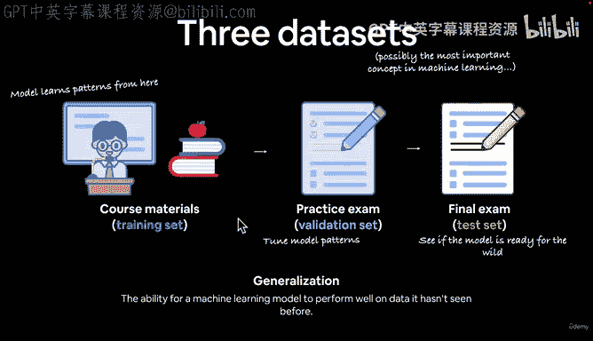
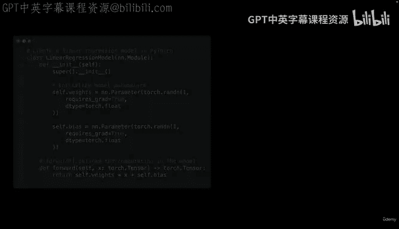
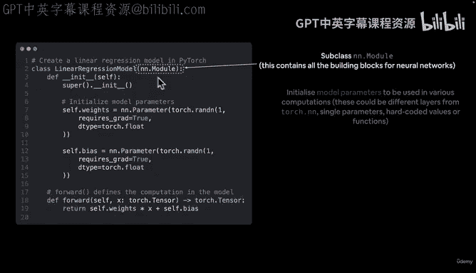
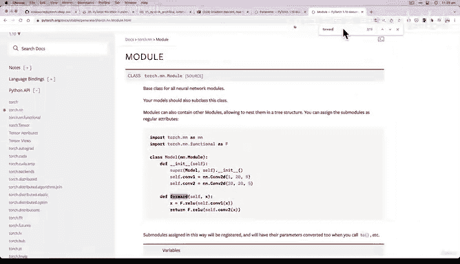

# 43：解析线性回归模型运行机制 🧠



在本节课中，我们将深入解析线性回归模型的运行机制，理解PyTorch如何通过面向对象编程构建模型，并探索模型参数、梯度跟踪以及前向传播的核心概念。

---

## 概述

上一节我们介绍了如何创建一个继承自`nn.Module`的PyTorch模型，并讨论了面向对象编程在PyTorch中的广泛应用。本节中，我们将进一步解析模型的内部机制，包括参数初始化、梯度跟踪以及前向传播的实现。

---

## 模型构建基础



在PyTorch中构建模型时，我们通常会继承`nn.Module`类。这个类包含了神经网络的所有基础构建块。以下是我们上一节创建的线性回归模型代码：

```python
import torch
from torch import nn

class LinearRegressionModel(nn.Module):
    def __init__(self):
        super().__init__()
        self.weight = nn.Parameter(torch.randn(1, requires_grad=True, dtype=torch.float32))
        self.bias = nn.Parameter(torch.randn(1, requires_grad=True, dtype=torch.float32))
    
    def forward(self, x: torch.Tensor) -> torch.Tensor:
        return self.weight * x + self.bias
```

---

## 参数初始化与梯度跟踪

在模型构造函数中，我们初始化了模型参数。对于简单的数据集，我们可以显式定义权重和偏置参数。但在更复杂的场景中，如处理图像数据，我们可能不会手动定义这些参数，而是使用`nn`模块中的层来自动处理。

以下是参数初始化的关键点：





*   **随机初始值**：模型开始时使用随机值作为权重和偏置，例如通过`torch.randn()`生成。
*   **梯度跟踪**：通过设置`requires_grad=True`，PyTorch会自动跟踪这些参数的梯度，以便在反向传播中使用。
*   **数据类型**：我们明确指定了数据类型为`torch.float32`，虽然PyTorch默认会处理这些设置，但显式定义有助于保持代码的清晰性。



---

## 前向传播方法

任何继承自`nn.Module`的子类都必须重写`forward`方法。这个方法定义了模型在每次前向传播中执行的计算。在我们的线性回归模型中，`forward`方法实现了线性回归函数：

**公式**：`y = weight * x + bias`

当我们将数据传入模型时，`forward`方法会自动被调用，执行上述计算。

---

## 核心概念总结

以下是本节课的核心概念总结：

*   **模型继承**：PyTorch模型通过继承`nn.Module`类来构建。
*   **参数初始化**：在构造函数中初始化模型所需的参数或层。
*   **梯度跟踪**：设置`requires_grad=True`以启用自动梯度计算。
*   **前向传播**：重写`forward`方法定义模型的计算逻辑。



---

## 下一步计划

在接下来的课程中，我们将进一步探索PyTorch模型构建的要点，包括检查模型内容、使用模型进行预测等。通过动手实践，你将更深入地理解模型的运行机制。

---

## 总结

本节课中，我们一起学习了线性回归模型的内部运行机制，包括参数初始化、梯度跟踪和前向传播的实现。理解这些基础概念是掌握PyTorch深度学习的关键步骤。在下一节课中，我们将继续深入，动手实践模型的使用和预测。