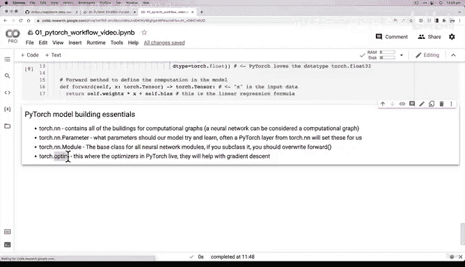
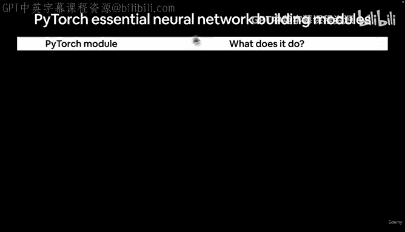
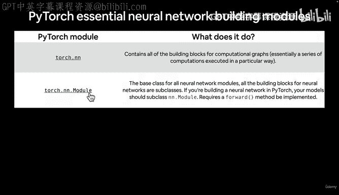
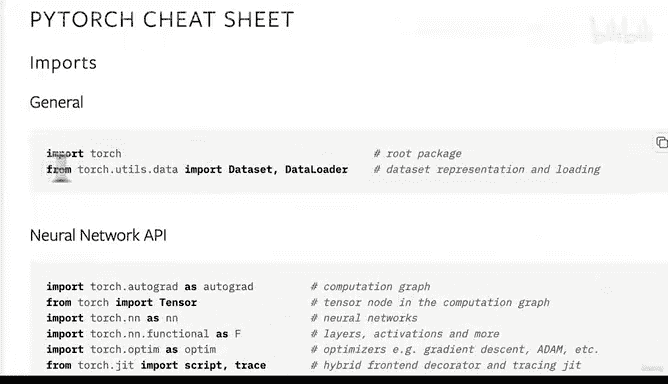

# 44：核心PyTorch模型构建类详解 🧱

在本节课中，我们将详细解析构建PyTorch模型时最核心的几个类。理解这些基础组件是掌握PyTorch的关键。

在上一节视频中，我们逐步创建了第一个PyTorch模型。虽然看起来涉及不少内容，但主要的收获是：几乎所有的PyTorch模型都继承自 `nn.Module`。如果你要继承 `nn.Module`，就必须重写 `forward` 方法，以定义模型内部的计算过程。

后续，当我们的模型开始学习时（即通过梯度下降和反向传播，将其权重和偏置值从随机值更新为更符合数据的值），我们将编写代码来触发这些过程。目前，我们只是定义了一个包含前向计算过程的模型。

说到模型，让我们来看看几个PyTorch模型构建的核心要素。本节视频不会编写太多代码，内容相对简短，旨在介绍你将在PyTorch中交互的一些主要类，其中一些我们已经见过了。

以下是几个核心的PyTorch构建模块：

*   **`torch.nn`**：包含构建计算图（即神经网络）的所有基础模块。
*   **`torch.nn.Parameter`**：定义模型应该尝试学习的参数。通常，PyTorch的 `torch.nn` 层会为我们设置这些参数。
*   **`torch.nn.Module`**：所有神经网络模块的基类。如果你继承它，就必须重写 `forward` 方法，正如我们之前所做的那样。
*   **`torch.optim`**：优化器所在之处。它们将协助进行梯度下降。优化器包含了算法，能够将模型的随机参数优化为能更好表示我们数据的值。
*   **`torch.utils.data`**：我们尚未详细讨论，但后续会用到。当你拥有更复杂的数据集时，`Dataset` 和 `DataLoader` 会非常有帮助。它们能协助我们加载数据。

关于 `nn.Module` 的 `forward` 方法，需要明确的是：所有 `nn.Module` 的子类都要求你重写 `forward`。这个方法定义了前向计算的过程。在我们的例子中，如果向线性回归模型传递一些数据，`forward` 方法会接收这些数据并执行我们定义的计算。随着模型变得越来越大、越来越复杂，这个前向计算过程可以根据你的需求变得简单或复杂。

PyTorch是一个相当庞大的库。本节课的额外学习建议是花5到10分钟浏览PyTorch速查表，阅读其中的内容。你不需要立刻全部理解，我们将在后续通过编写代码来逐渐熟悉它们。

本节课我们一起学习了PyTorch中构建神经网络模型的核心类，包括 `torch.nn`、`torch.nn.Module`、`torch.optim` 和 `torch.utils.data`。理解这些组件是有效使用PyTorch的基础。

在下一节视频中，我们将实际创建一个线性回归模型的实例，看看会发生什么。