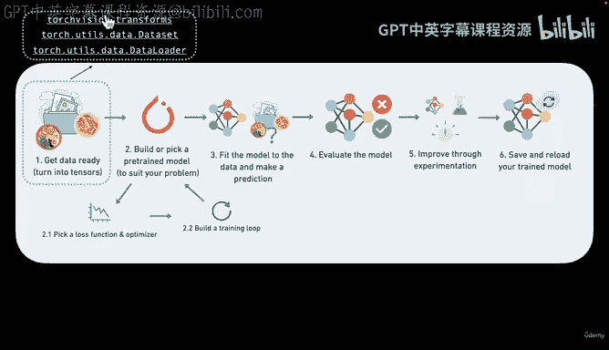
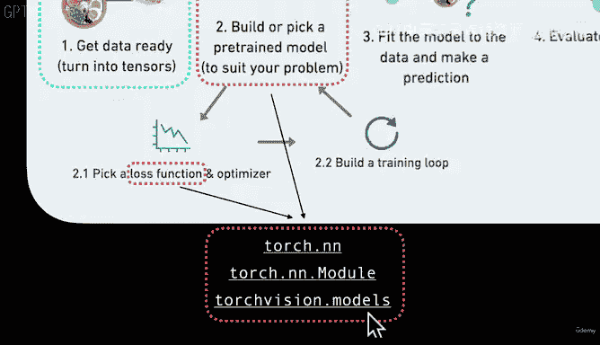
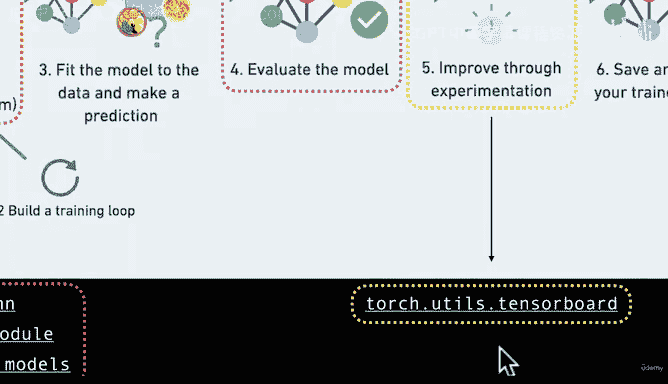
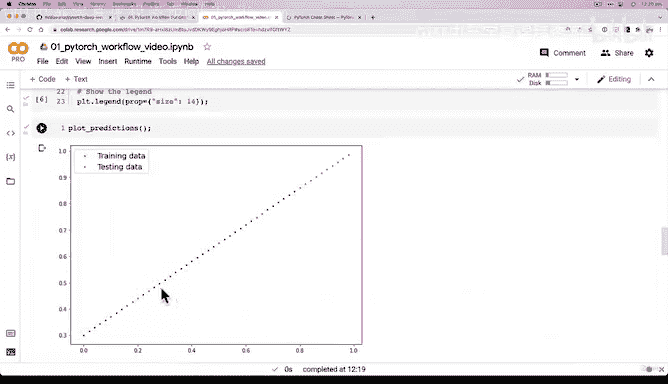
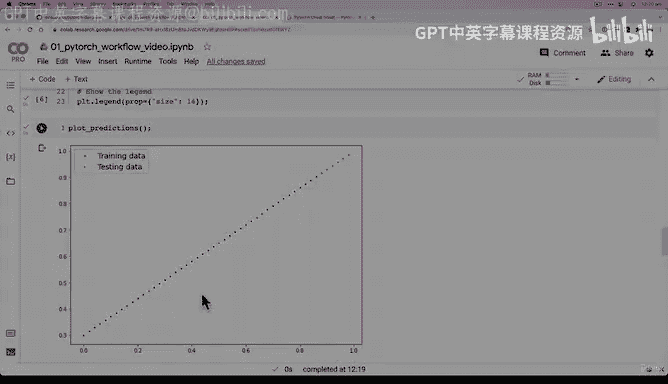

# 45：探究模型内部结构 🔍


在本节课中，我们将深入探究我们构建的第一个PyTorch模型的内部结构。我们将学习如何查看模型的参数，理解这些参数是如何初始化的，并思考模型如何通过学习数据来调整这些参数。




---



上一节我们介绍了PyTorch模型构建的基本要素。本节中，我们来看看如何检查我们刚刚构建的线性回归模型内部有什么。



首先，为了确保结果的可复现性，我们需要设置一个随机种子。这是因为模型的参数通常使用随机值进行初始化。

```python
torch.manual_seed(42)
```

接下来，我们创建模型的一个实例。

```python
model_0 = LinearRegressionModel()
```

现在，让我们看看模型内部有什么。我们可以使用 `.parameters()` 方法来查看模型的参数。

```python
list(model_0.parameters())
```

这会返回一个生成器，将其转换为列表后，我们可以看到模型包含两个参数：权重（weight）和偏置（bias）。这些参数目前是随机初始化的张量，并且 `requires_grad=True`，这意味着PyTorch会跟踪这些张量的所有操作，以便后续进行梯度计算和反向传播。

为了更好地理解参数的结构，我们可以查看模型的状态字典。

```python
model_0.state_dict()
```

这会返回一个字典，清晰地展示了参数 `weight` 和 `bias` 的名称及其当前的随机值。

以下是理解模型参数的关键点：
*   模型的参数（权重和偏置）在创建时被随机初始化。
*   深度学习的核心过程就是：**从随机值开始，通过观察训练数据并利用梯度下降和反向传播算法，不断调整这些参数，使它们尽可能接近能够准确描述数据关系的理想值。**
*   在我们的简单例子中，我们预先知道理想参数（`weight=0.7, bias=0.3`）。但在大多数实际场景中，我们并不知道理想值是什么，模型的目标就是通过训练去发现它们。

---





本节课中我们一起学习了如何检查PyTorch模型的内部参数，理解了模型参数随机初始化的意义，并建立了深度学习模型通过调整参数来拟合数据的基本概念。在下一节，我们将使用这个尚未训练的、参数随机的模型进行预测，并观察其预测效果。