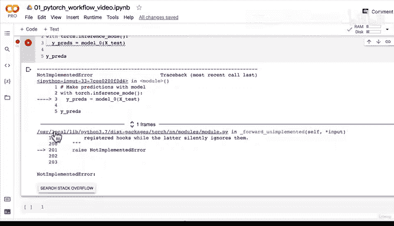
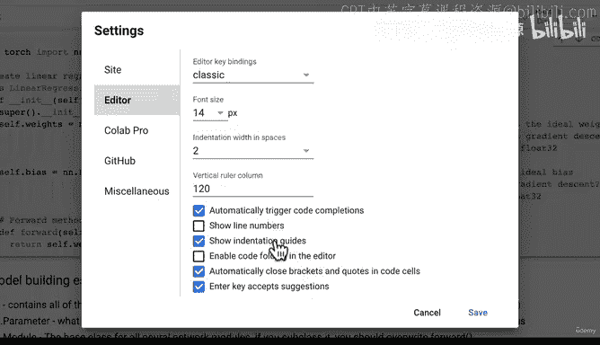
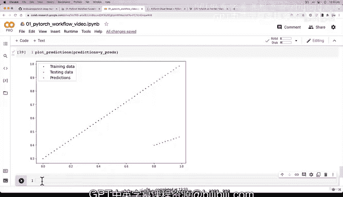

# 46：使用推理模式进行随机模型预测 🧠


在本节课中，我们将学习如何使用PyTorch的推理模式（`torch.inference_mode()`）来评估一个随机初始化模型的预测能力。我们将看到，由于模型参数是随机初始化的，其初始预测结果会非常不准确。

---

## 回顾与过渡

上一节我们探讨了第一个PyTorch模型的内部结构。我们发现，由于我们使用`torch.randn()`创建模型参数，这些参数初始值是随机的。深度学习的核心前提正是从随机数开始，然后根据数据逐步优化这些数字，使其变得不那么随机，更接近理想值。

在开始优化这些参数之前，本节我们来看看它们当前的预测能力如何。

---

## 使用推理模式进行预测

为了检查模型的预测能力，我们需要看看它在测试数据`X_test`上的表现如何。机器学习模型的另一个前提是：接收一些特征作为输入，并输出接近真实标签的预测值。

当我们把数据传入模型时，模型会执行其`forward`方法。以下是进行预测的步骤：

1.  使用`torch.inference_mode()`上下文管理器。
2.  将测试数据`X_test`传入模型。
3.  获取预测结果`y_preds`。

以下是核心代码：

```python
with torch.inference_mode():
    y_preds = model_0(X_test)
```



**代码解释**：
*   `torch.inference_mode()`：一个上下文管理器，用于在推理（预测）时关闭梯度跟踪，以提高效率。
*   `model_0(X_test)`：这实际上会调用我们定义的`forward`方法，将`X_test`作为输入`x`传入。

> **注意**：在PyTorch代码中，`forward`方法的输入参数通常命名为`x`，代表输入数据。



---

## 处理常见错误

在执行上述代码时，你可能会遇到一个常见的错误：`NotImplementedError`。这通常是由于代码缩进问题导致的。

**解决方法**：
确保`forward`方法的定义与类定义正确对齐。在Google Colab等环境中，有时需要手动调整缩进。请检查并确保`forward`方法体相对于`class`定义有正确的缩进级别。

---

## 可视化预测结果

现在，让我们将模型的预测结果`y_preds`与真实的测试标签`y_test`进行比较并可视化。

```python
plot_predictions(predictions=y_preds)
```

**结果分析**：
由于模型参数是随机初始化的，其预测结果（红色点）与真实测试数据（绿色点）相差甚远。一个理想的模型，其预测点（红色）应该与真实数据点（绿色）基本重合。

目前，我们的模型做出的基本上是随机预测。

---

## 理解推理模式

我们使用了`torch.inference_mode()`，它与直接调用模型（`y_preds = model_0(X_test)`）有什么区别？

**主要区别在于梯度跟踪**：
*   **直接调用**：输出张量会附带一个`.grad_fn`属性，这意味着PyTorch仍在跟踪计算图，为梯度下降和反向传播做准备。
*   **使用`inference_mode()`**：输出张量**没有**`.grad_fn`属性。它关闭了梯度跟踪。

**为什么在推理时关闭梯度跟踪？**
1.  **提升速度**：在推理（预测）阶段，我们不需要计算或更新梯度。关闭梯度跟踪可以减少PyTorch在后台需要记录的数据量，从而加快预测速度，尤其是在处理大型数据集时。
2.  **减少内存占用**：不保存训练时所需的中间数据，可以节省内存。

**历史用法**：
在`torch.inference_mode()`出现之前，常用的是`torch.no_grad()`。两者功能相似，但`inference_mode()`在性能上更有优势，是当前推荐用于推理的方法。

```python
# 旧方法（仍可使用，但不推荐为首选）
with torch.no_grad():
    y_preds_old = model_0(X_test)
```

> 想了解更多关于推理模式的细节，可以查阅PyTorch官方文档或相关技术博客。

---

## 本节总结

在本节课中，我们一起学习了以下内容：

1.  **使用推理模式**：我们学会了使用`torch.inference_mode()`上下文管理器来进行模型预测。
2.  **评估初始模型**：我们验证了使用随机参数初始化的模型，其预测能力几乎等同于随机猜测。
3.  **理解推理优化**：我们探讨了在推理时关闭梯度跟踪（`requires_grad=False`）的重要性，它能提升预测速度并节省内存。
4.  **可视化对比**：通过绘图，我们直观地看到了模型当前糟糕的预测结果（红色点）与理想目标（绿色点）之间的巨大差距。



目前，我们的模型预测结果远不理想。在接下来的课程中，我们将编写PyTorch训练代码，通过查看训练数据来优化模型参数，目标是让这些红色预测点逐渐向绿色的真实数据点靠拢。