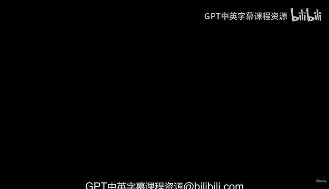
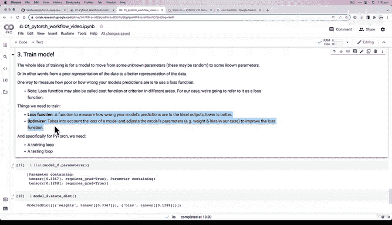

#  47：模型训练直觉（必备要素）🧠

在本节课中，我们将学习训练一个机器学习模型所需的核心要素。我们将探讨模型如何从随机参数开始，通过特定的机制逐步改进其预测能力，最终逼近理想状态。

上一节我们介绍了如何构建一个简单的线性回归模型，并观察到其初始预测效果不佳。本节中，我们来看看如何通过训练来改进模型。

## 训练的核心思想

训练的根本目的是让模型从一组未知的（通常是随机的）参数，逐步调整到一组已知的、理想的参数。换句话说，是让模型对数据的**表征**从较差的状态改进到更好的状态。

以我们的模型为例，其预测的红点与真实的绿点之间存在明显偏差，这表明当前的表征是较差的。

## 衡量预测误差：损失函数

为了量化模型预测的“错误”程度，我们需要一个衡量标准。以下是衡量模型预测错误程度的方法：

*   **损失函数**：一个用于衡量模型预测值与理想输出值之间差异的函数。差异越小（损失值越低），模型性能越好。

在PyTorch中，损失函数有时也被称为**代价函数**或**准则**。其核心作用是提供一个可量化的指标，指导模型的优化方向。

## 调整模型参数：优化器

仅仅知道预测有多“错”还不够，我们需要一个机制来修正它。以下是调整模型参数以改进预测的方法：

*   **优化器**：优化器的作用是考虑模型的损失值，并据此调整模型的参数（在我们的例子中，即权重 `weight` 和偏置 `bias`），以降低损失函数的值。

我们可以通过 `model.state_dict()` 查看模型的当前参数。优化器将根据损失值，智能地更新这些参数。

## 训练与评估流程

在PyTorch中，完整的模型训练通常包含两个循环过程：

1.  **训练循环**：在此循环中，模型在训练数据上进行前向传播计算预测值，计算损失，通过反向传播计算梯度，最后优化器利用梯度更新模型参数。
2.  **测试循环**：在此循环中，模型在未见过的测试数据上进行前向传播以评估其泛化性能，此阶段不更新模型参数。

这些核心概念——损失函数和优化器——是通用的。无论模型只有两个参数（如我们的线性模型）还是有数百万个参数（如复杂的计算机视觉模型），其训练的基本原理都是相通的。

本节课中我们一起学习了模型训练的三大必备直觉要素：**训练的目标是改进参数**、**使用损失函数量化误差**以及**利用优化器调整参数**。在接下来的课程中，我们将深入探讨如何为我们的问题选择合适的损失函数和优化器，并开始编写训练代码。