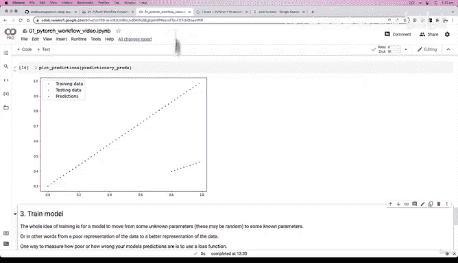
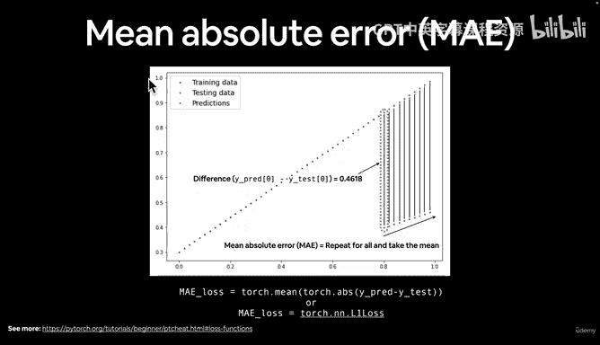
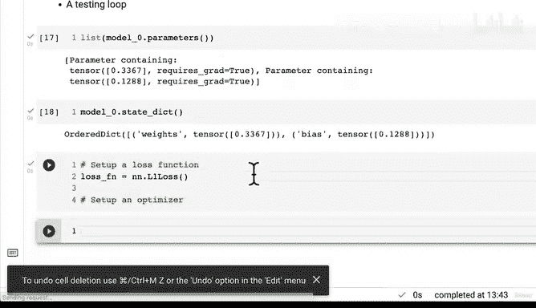
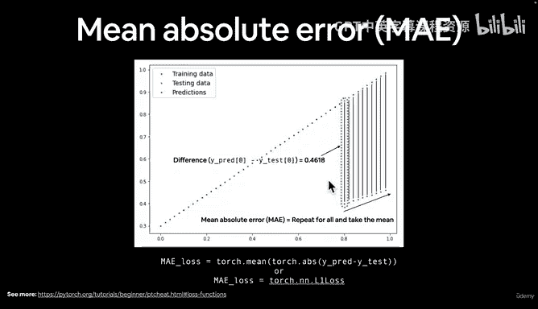
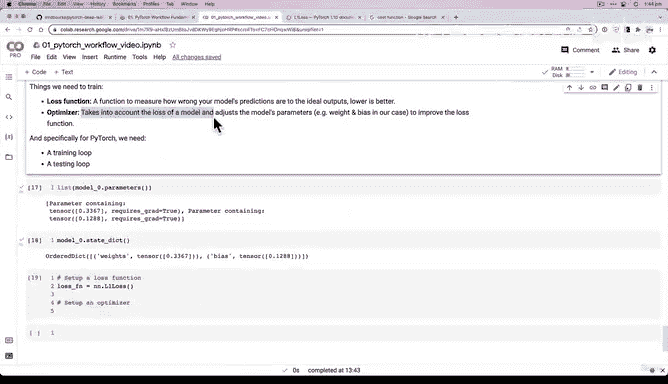
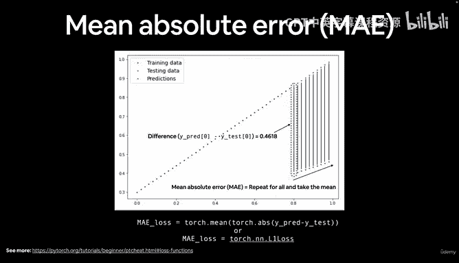
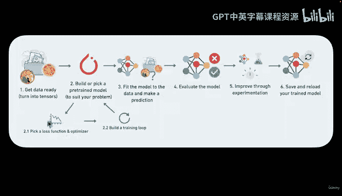
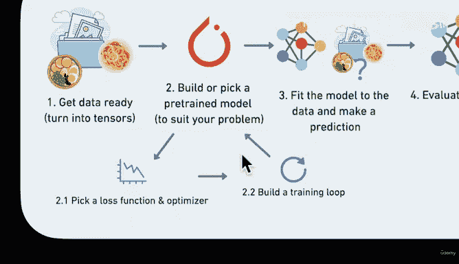
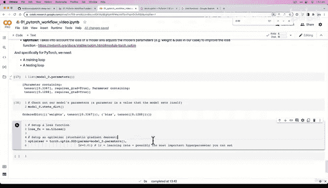
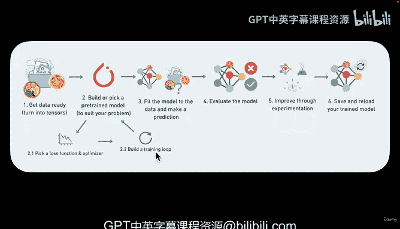

# 48：配置优化器与损失函数 🧠⚙️


在本节课中，我们将学习如何为PyTorch模型配置两个核心组件：**损失函数**和**优化器**。它们是训练循环的心脏，负责衡量模型预测的好坏，并指导模型参数进行调整以提升性能。

上一节我们介绍了模型参数的概念，本节中我们来看看如何通过损失函数和优化器来优化这些参数。

## 损失函数：衡量模型的“错误”程度

损失函数（Loss Function）的核心作用是量化模型预测值与真实值之间的差距。我们的训练目标就是最小化这个差距。

在PyTorch中，损失函数位于 `torch.nn` 模块下。针对不同类型的问题（如回归、分类），需要选择不同的损失函数。

以下是PyTorch中一些常见的损失函数：
*   **L1Loss / MAE**：用于回归问题，计算平均绝对误差。
*   **MSELoss**：用于回归问题，计算均方误差。
*   **BCELoss**：用于二分类问题，计算二元交叉熵。
*   **CrossEntropyLoss**：用于多分类问题，计算交叉熵。

对于我们的线性回归示例，我们将使用 **L1Loss**，它等同于**平均绝对误差（MAE）**。其计算公式可以表示为：



**MAE = mean( | y_pred - y_true | )**



在代码中，我们可以这样设置损失函数：

```python
import torch.nn as nn





# 设置损失函数为平均绝对误差 (L1Loss)
loss_fn = nn.L1Loss()
```





## 优化器：指导模型参数更新





优化器（Optimizer）的作用是根据损失函数计算出的“错误”程度，来调整模型的参数（如权重和偏置），目标是找到一组能使损失值最小的参数。

优化器位于 `torch.optim` 模块中。最常用的是**随机梯度下降（SGD）**及其改进版本**Adam**。

以下是设置优化器时需要考虑的关键点：
*   **参数（params）**：需要优化器来调整的模型参数，通常通过 `model.parameters()` 获取。
*   **学习率（lr）**：这是最重要的超参数之一。它决定了优化器每次更新参数的步长大小。
    *   学习率太小：收敛速度慢。
    *   学习率太大：可能导致无法收敛或震荡。

在代码中，我们可以这样设置优化器：

```python
import torch.optim as optim

# 设置优化器为随机梯度下降 (SGD)
# 需要传入要优化的模型参数和学习率
optimizer = optim.SGD(params=model.parameters(), lr=0.01)
```

## 损失函数与优化器如何协同工作

损失函数和优化器在训练过程中紧密配合：
1.  **前向传播**：模型根据当前参数做出预测。
2.  **计算损失**：损失函数计算预测值与真实值之间的误差。
3.  **反向传播**：计算损失相对于每个模型参数的梯度（即，每个参数对总误差的“贡献度”）。
4.  **参数更新**：优化器利用这些梯度信息，按照学习率指定的步长，更新模型参数以降低损失。

这个过程会循环往复，直到模型性能达到满意水平或训练轮次结束。

## 总结

本节课中我们一起学习了：
1.  **损失函数**的作用是衡量模型预测的错误程度，PyTorch在 `torch.nn` 中提供了多种选择。
2.  **优化器**的作用是根据损失函数的反馈来更新模型参数，PyTorch在 `torch.optim` 中提供了多种算法。
3.  对于回归问题，常用 **L1Loss（MAE）** 或 **MSELoss** 作为损失函数。
4.  **SGD（随机梯度下降）** 是一种基础且常用的优化器。
5.  **学习率（lr）** 是优化器的一个关键超参数，控制着参数更新的步长。





现在，我们已经准备好了损失函数和优化器。下一节，我们将把这些组件整合起来，构建一个完整的**训练循环**，亲眼见证模型如何从随机参数开始学习。