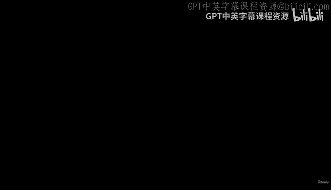
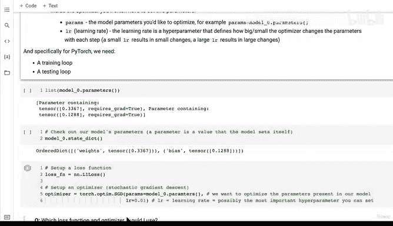
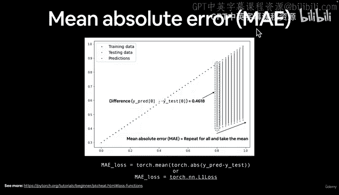
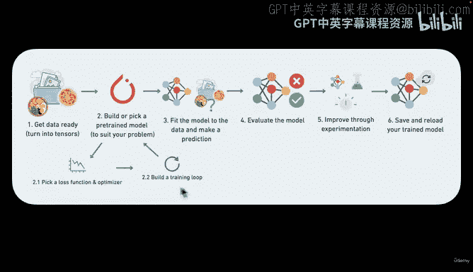
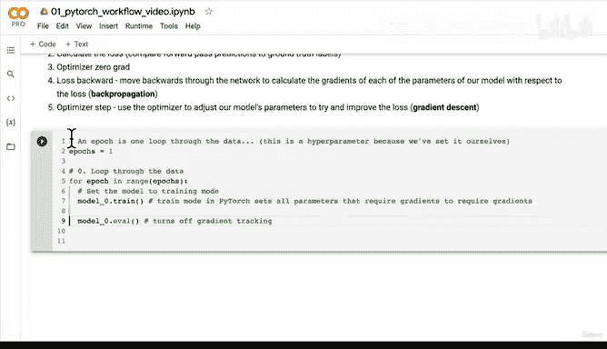

# 49：PyTorch训练流程步骤与原理 🚀



在本节课中，我们将要学习PyTorch模型训练的核心流程，包括前向传播、损失计算、反向传播和参数优化。我们将一步步构建一个完整的训练循环，并理解其背后的数学原理。

---

## 概述



上一节我们设置了损失函数和优化器。本节中，我们将把这些组件整合起来，构建一个完整的训练循环。这个循环将反复调整模型参数，以最小化预测误差。

---

## 训练循环的核心步骤





一个典型的PyTorch训练循环包含以下关键步骤。以下是每个步骤的简要说明：

1.  **前向传播**：数据通过模型的`forward`方法，生成预测。
2.  **计算损失**：将模型的预测结果与真实标签进行比较，计算误差。
3.  **反向传播**：计算损失相对于每个模型参数的梯度。
4.  **优化器步骤**：优化器根据计算出的梯度更新模型参数。

---

## 步骤详解与代码实现

### 1. 设置训练轮次

首先，我们需要定义训练轮次（epoch）。一个epoch代表模型完整遍历一次训练数据。

```python
epochs = 1  # 这是一个超参数，由我们设定
```

### 2. 设置模型为训练模式

PyTorch模型有两种主要模式：训练模式和评估模式。在训练开始前，我们需要将模型设置为训练模式。

```python
model_0.train()  # 设置模型为训练模式
```

训练模式会确保模型的所有参数都启用梯度追踪（`requires_grad=True`），这是反向传播计算梯度所必需的。

### 3. 构建训练循环

现在，我们进入核心的训练循环。以下是循环内每一步的代码实现：

```python
for epoch in range(epochs):
    # 1. 前向传播 (Forward Pass)
    y_pred = model_0(X_train)

    # 2. 计算损失 (Calculate Loss)
    loss = loss_fn(y_pred, y_train)

    # 3. 优化器梯度清零 (Zero Grad)
    optimizer.zero_grad()

    # 4. 反向传播 (Loss Backward / Backpropagation)
    loss.backward()

    # 5. 优化器步骤 (Optimizer Step / Gradient Descent)
    optimizer.step()
```

---

## 核心概念解析

### 前向传播与反向传播

*   **前向传播**：数据从输入层流向输出层，模型根据当前参数进行计算并做出预测。
*   **反向传播**：这是一个算法，用于计算损失函数相对于每个模型参数的**梯度**。你可以将其理解为找出每个参数对总误差“贡献”了多少，以及应该朝哪个方向调整才能减少误差。

### 梯度与梯度下降

*   **梯度**：在数学上，梯度是一个向量，指向函数值增长最快的方向。在机器学习中，我们关注的是损失函数的梯度。
*   **梯度下降**：优化器（如SGD）使用的算法。其核心思想是沿着损失函数梯度的**反方向**更新参数，因为这是使损失函数值下降最快的方向。

**直观比喻**：想象你站在一座山上（损失值很高），目标是走到山谷底部（损失值为0）。梯度告诉你山坡最陡的方向（上升最快）。梯度下降则让你朝相反的方向（下降最快）迈出一步。学习率（`lr`）决定了这一步迈多大。

**公式表示（参数更新）**：
`新参数 = 旧参数 - 学习率 * 梯度`

---

## 优化器与损失函数的选择

上一节我们介绍了优化器和损失函数的基本角色。这里补充一些选择经验：

*   **回归问题**（如本课预测房价）：常使用**L1损失**（`torch.nn.L1Loss`）或**MSE损失**，配合**SGD优化器**（`torch.optim.SGD`）。
*   **分类问题**（如图片是猫还是狗）：常使用**交叉熵损失**（如`torch.nn.BCELoss`），配合**Adam优化器**（`torch.optim.Adam`）可能效果更好。

具体选择需要根据问题和经验进行调整。

---

## 总结

本节课中我们一起学习了构建PyTorch训练循环的完整流程。我们了解了**前向传播**如何做出预测，**损失函数**如何衡量误差，**反向传播**如何计算梯度，以及**优化器**如何利用梯度下降算法更新模型参数以降低损失。



记住这个核心循环：`前向传播 -> 计算损失 -> 梯度清零 -> 反向传播 -> 优化器更新`。在接下来的课程中，我们将实际运行这个循环，观察模型是如何从随机预测一步步学习到数据规律的。