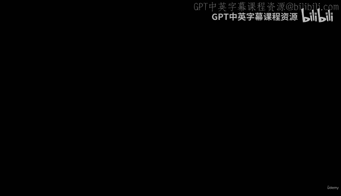
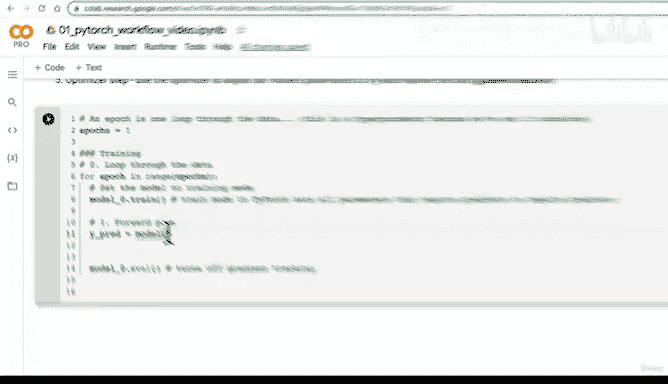
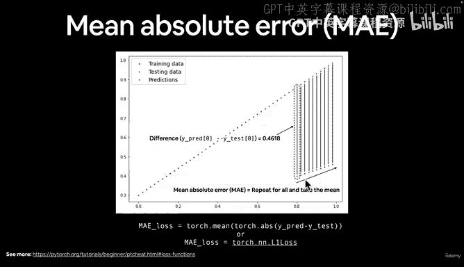
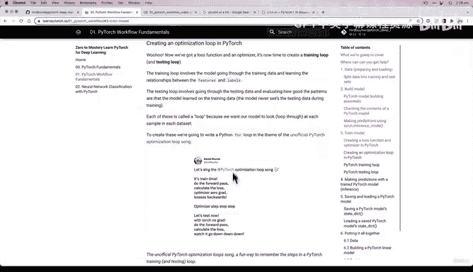
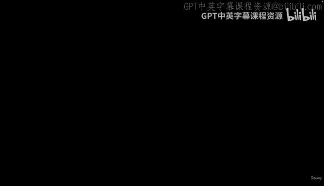
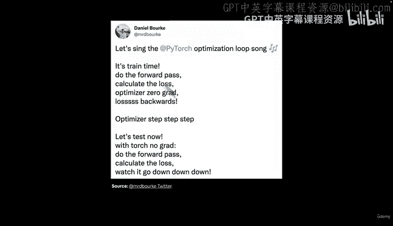
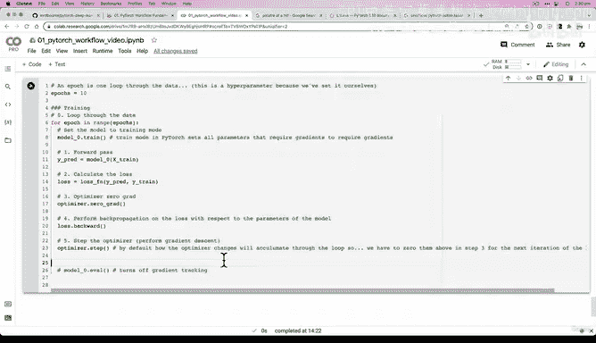

# 50：编写PyTorch训练循环代码 🧠



在本节课中，我们将学习如何编写一个完整的PyTorch训练循环。我们将一步步地实现前向传播、损失计算、梯度清零、反向传播和优化器更新这五个核心步骤。

---

## 概述

训练循环是模型学习的核心。它通过重复执行一系列步骤，使模型能够从数据中学习并改进其预测能力。我们将从零开始构建一个训练循环，并理解每个步骤的作用。

上一节我们讨论了训练循环背后的重要概念，本节中我们来看看如何用代码实现它。

---

## 训练循环的五个核心步骤



以下是构建一个PyTorch训练循环需要执行的五个主要步骤：

1.  **前向传播**：将训练数据通过模型的`forward`方法，生成预测值。
2.  **计算损失**：使用损失函数计算模型预测值与真实标签之间的误差。
3.  **梯度清零**：将优化器中累积的梯度归零，为新一轮的反向传播做准备。
4.  **反向传播**：计算损失相对于模型每个参数的梯度。
5.  **优化器更新**：根据计算出的梯度，使用优化算法（如梯度下降）更新模型参数。



---

## 代码实现

现在，让我们用代码实现上述步骤。假设我们已经定义了一个名为`model_0`的模型、一个损失函数`loss_fn`和一个优化器`optimizer`。

```python
# 1. 前向传播：模型根据训练数据X_train做出预测
y_pred = model_0(X_train)

# 2. 计算损失：比较预测值(y_pred)和真实标签(y_train)
loss = loss_fn(y_pred, y_train)

# 3. 梯度清零：防止梯度在循环中累积
optimizer.zero_grad()

# 4. 反向传播：计算损失关于模型参数的梯度
loss.backward()

# 5. 优化器更新：根据梯度调整模型参数
optimizer.step()
```

---

## 步骤详解与过渡

我们已经写下了训练循环的代码框架。接下来，让我们更深入地理解每个步骤，特别是容易混淆的梯度清零步骤。

### 1. 前向传播

前向传播是模型进行预测的过程。代码`y_pred = model_0(X_train)`调用了模型的`forward`方法，输入训练数据`X_train`，输出预测结果`y_pred`。

### 2. 计算损失

损失函数量化了模型预测的“错误”程度。我们使用平均绝对误差（MAE，在PyTorch中为`L1Loss`）来计算`y_pred`和`y_train`之间的差距。其公式为：
`loss = mean(|y_pred - y_train|)`

### 3. 梯度清零 (`optimizer.zero_grad()`)

这个步骤至关重要。在默认情况下，PyTorch优化器计算的梯度会在每次`.backward()`调用时进行**累积**。这意味着如果不手动清零，第二次循环的梯度会加到第一次的梯度上，以此类推。
这通常不是我们想要的行为，因为每次迭代我们都希望基于当前批次的损失来独立地更新参数。因此，在每次反向传播之前，我们需要调用`optimizer.zero_grad()`将梯度重置为零。

### 4. 反向传播 (`loss.backward()`)

反向传播是深度学习的引擎。`loss.backward()`这个调用会从最终的损失值开始，利用链式法则，自动计算损失函数相对于模型中每一个可训练参数的梯度。这些梯度指明了参数应该如何调整才能减小损失。

### 5. 优化器更新 (`optimizer.step()`)



优化器（如SGD、Adam）根据上一步计算出的梯度来更新模型参数。例如，在随机梯度下降中，更新规则是：
`parameter = parameter - learning_rate * parameter.grad`
这就是“梯度下降”发生的地方，模型由此向更优的方向迈出一步。



---

## 实践与总结

本节课中我们一起学习了如何构建一个PyTorch训练循环。我们实现了五个核心步骤：前向传播、计算损失、梯度清零、反向传播和优化器更新。理解这个循环是掌握模型训练的关键。



为了巩固知识，建议你尝试自己动手编写这个循环，并观察模型的输出。在下一节课中，我们将为这个训练循环添加评估步骤，并观察模型在整个训练过程中的表现变化。

记住这个训练循环的口诀，它能帮助你回忆步骤顺序：“前向传播，计算损失，梯度清零，反向传播，优化更新”。

---



**额外练习**：
1.  在不看笔记的情况下，独立重写上面的训练循环代码。
2.  尝试搜索并观看关于“反向传播”和“梯度下降”原理的讲解视频，加深对这两个核心概念的理解。