# 51：逐步解析训练循环步骤 🚀

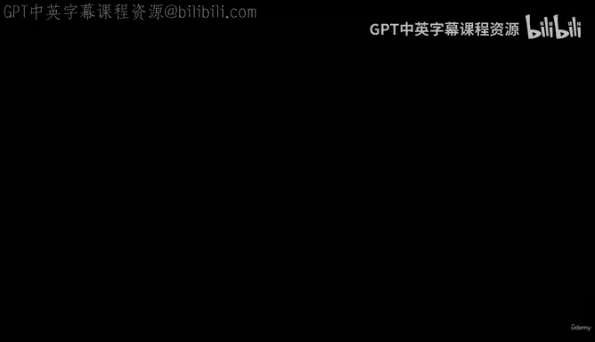

在本节课中，我们将详细解析PyTorch训练循环的每一步。我们将回顾之前视频中介绍的内容，并深入理解每个步骤背后的原理，为后续的测试环节做好准备。

## 概述 📋

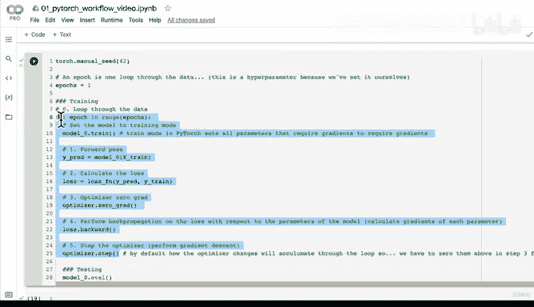

训练循环是深度学习模型学习的核心过程。它涉及将数据多次（通过多个“轮次”）传递给模型，并基于模型的预测误差调整其内部参数。我们将逐步拆解这个过程，确保你理解每个环节的作用。

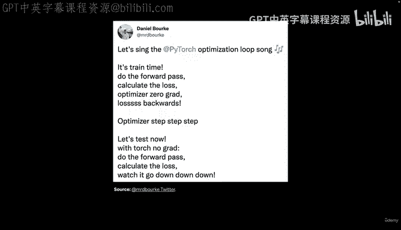

## 训练循环步骤详解 🔄

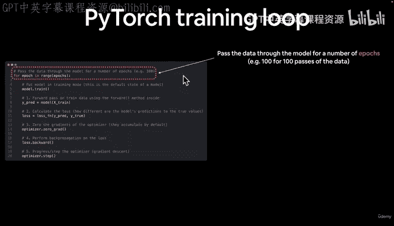

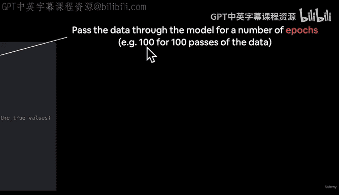

上一节我们介绍了训练循环的整体概念，本节中我们来看看每个具体步骤。

### 1. 设置模型为训练模式

在开始训练循环之前，我们需要将模型设置为训练模式。这是通过调用 `model.train()` 实现的。

```python
model.train()
```

此操作会设置模型参数的一系列后台配置，特别是启用梯度跟踪，这是后续优化步骤所必需的。PyTorch为我们自动处理了许多此类设置。

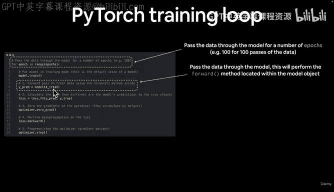

### 2. 前向传播

在训练循环中，我们对训练数据执行前向传播。这是模型在训练数据上学习模式的关键步骤。

```python
y_pred = model(X_train)
```

前向传播会调用我们在模型类中定义的 `forward` 方法。因为我们的线性回归模型是 `nn.Module` 的子类，所以需要自定义前向传播逻辑。从技术上讲，前向传播意味着数据从网络输入层流向输出层。

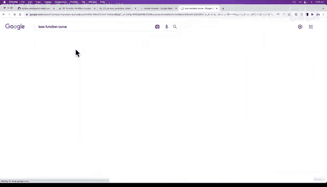

### 3. 计算损失值

接下来，我们计算损失值，以衡量模型预测的错误程度。

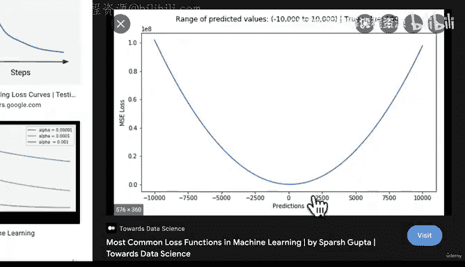

```python
loss = loss_fn(y_pred, y_train)
```

损失值取决于你使用的损失函数、模型的输出类型以及真实标签。这一步的核心是将模型在训练数据上的预测结果与理想值（即训练标签）进行比较。

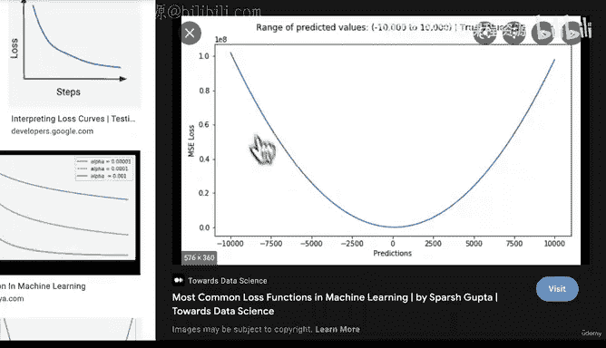

### 4. 优化器梯度归零

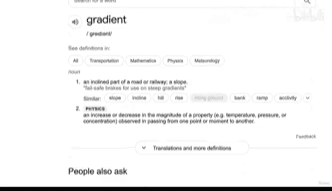

在每次训练步骤开始时，我们需要将优化器中的梯度归零。

```python
optimizer.zero_grad()
```

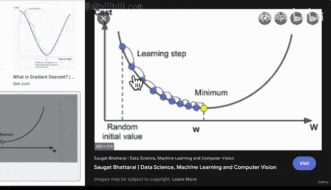

这样做的原因是，优化器计算的梯度会随时间累积。在每个训练步骤（或轮次）中，我们希望梯度从零开始重新计算，以确保当前步骤的更新只基于当前批次的误差。梯度累积的具体原因涉及PyTorch内部的计算优化。

### 5. 损失反向传播

这是训练循环中的关键步骤，我们通过调用 `loss.backward()` 来执行反向传播。

```python
loss.backward()
```

反向传播会计算模型中每个设置了 `requires_grad=True` 的参数的梯度。我们之前设置 `requires_grad=True` 正是为了让PyTorch能够跟踪这些参数的梯度。

为了理解梯度，我们可以将其想象成一个损失函数曲线（例如均方误差MSE或平均绝对误差MAE）。我们的目标是找到这个曲线的最低点（即损失最小）。梯度表示了曲线在某一点的斜率或陡峭程度。

以下是反向传播与梯度下降的核心概念：

*   **梯度**：一个多变量函数的导数，表示函数在该点的变化率和方向。
*   **梯度下降**：通过计算梯度，我们沿着梯度的**相反方向**更新参数，以逐步逼近损失函数的最低点。
*   **学习率**：一个超参数，定义了优化器在每次更新参数时的步长大小。步长太大会越过最低点，步长太小则收敛过慢。

### 6. 优化器执行参数更新

最后一步是让优化器根据计算出的梯度更新模型参数。

```python
optimizer.step()
```

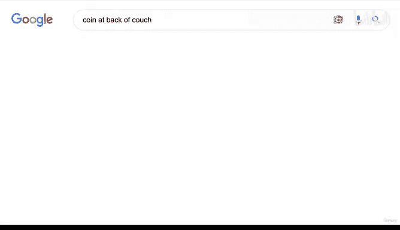

优化器执行一步“下降”，尝试调整参数以使损失值降低。它使用我们之前设置的学习率来决定这一步的幅度。

## 步骤总结与顺序 📝

以下是训练循环中六个核心步骤的总结，以及它们的关键顺序：

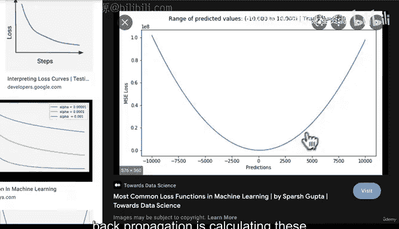

1.  **设置模式**：`model.train()`
2.  **前向传播**：计算预测 `y_pred = model(X)`
3.  **计算损失**：`loss = loss_fn(y_pred, y_true)`
4.  **梯度归零**：`optimizer.zero_grad()`
5.  **反向传播**：`loss.backward()`
6.  **参数更新**：`optimizer.step()`

**顺序至关重要**：必须先进行前向传播才能计算损失；必须在反向传播之后，优化器才能根据新梯度执行更新。一个常见的记忆口诀是：“前向传播，计算损失，优化器归零，损失反向传播，优化器更新”。

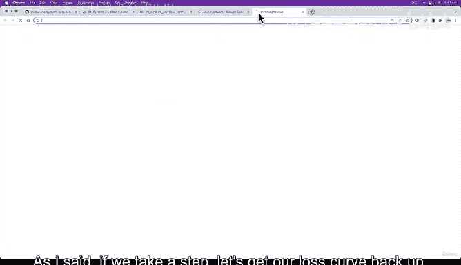

## 核心概念回顾 🎯

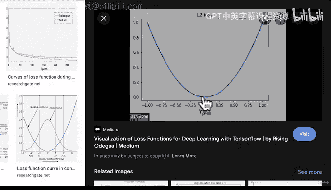

本节课中我们一起学习了训练循环的完整步骤：

*   **训练循环**：模型通过多个轮次（epoch）在数据上学习的过程。
*   **前向传播**：数据通过网络得到预测结果。
*   **损失函数**：量化模型预测与真实值之间的差异。
*   **反向传播**：计算损失函数相对于每个模型参数的梯度。
*   **梯度下降**：利用梯度信息，沿反方向更新参数以最小化损失。
*   **优化器与学习率**：优化器执行参数更新，学习率控制更新的步长。

理解这些步骤是构建和训练有效神经网络模型的基础。在接下来的课程中，我们将一步步执行这个循环，并观察模型的参数是如何随着每个步骤而发生变化的。