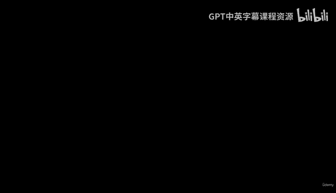
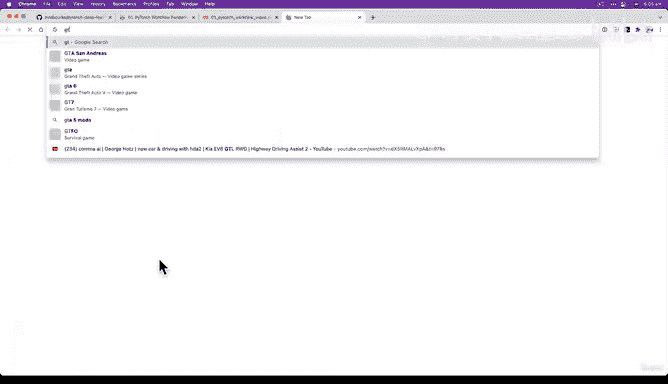
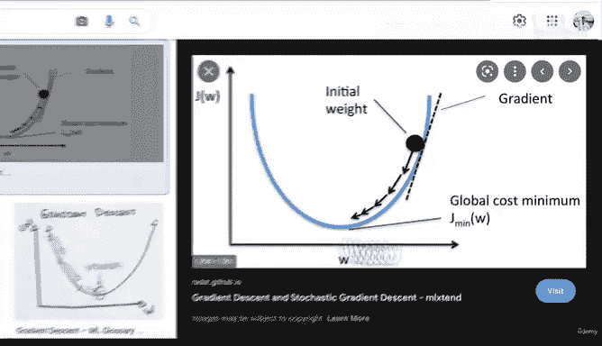
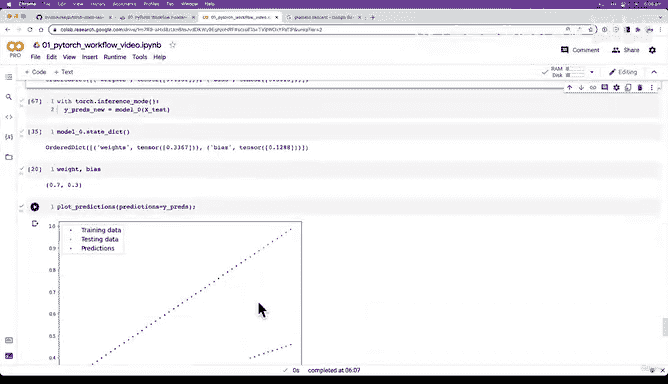

# 52：逐轮次运行训练循环与效果观察 🧠



在本节课中，我们将深入探讨PyTorch训练循环的核心机制。我们将手动执行多个训练轮次，直观地观察模型参数如何更新、损失值如何下降，以及模型的预测能力如何逐步提升。

---

## 概述

上一节我们介绍了训练循环的基本结构。本节中，我们将手动逐轮次运行这个循环，并观察每一步中模型参数、损失值和预测结果的变化。这是理解模型如何“学习”的关键一步。

## 训练循环的核心步骤回顾

训练循环的核心步骤可以概括为以下公式和代码：

**核心公式：** `参数_新 = 参数_旧 - 学习率 * 梯度`

**核心代码流程：**
```python
# 1. 前向传播计算预测值
y_pred = model(X_train)

# 2. 计算损失（预测值与真实值的差距）
loss = loss_fn(y_pred, y_train)

# 3. 将优化器的梯度归零
optimizer.zero_grad()

# 4. 反向传播计算梯度
loss.backward()

# 5. 根据梯度更新参数（梯度下降）
optimizer.step()
```

## 初始化模型与优化器

首先，我们重新实例化模型，以确保从随机的初始参数开始。我们同时设置损失函数和优化器。

以下是关键设置：
*   **模型：** `LinearRegressionModel`
*   **损失函数：** `L1Loss` (即MAE)
*   **优化器：** `SGD`，学习率设为0.01

初始的模型参数（权重和偏置）是随机值，因此最初的预测会非常不准确。

## 手动执行训练轮次并观察

现在，让我们手动执行多个训练轮次，并打印出每一步的变化。

以下是每个训练轮次后我们需要观察的内容列表：
*   **损失值：** 衡量模型预测的错误程度，值越低越好。
*   **模型参数：** 即权重和偏置，观察它们是否向真实值（本例中已知）靠近。
*   **预测结果：** 通过绘图直观对比预测值（红点）与真实值（绿点）的接近程度。

执行几轮后，我们观察到：
1.  损失值从初始的较高值开始持续下降。
2.  模型的权重和偏置参数逐步调整，向真实值逼近。
3.  预测结果的红点逐渐向代表真实值的绿线靠拢。

这个过程展示了**梯度下降**在起作用：优化器根据损失函数计算出的梯度，反复调整参数，以最小化损失。

## 梯度下降可视化 🎯



为了更直观地理解，我们可以将梯度下降想象成下山的过程。

> 我们从一个随机的初始权重（山腰某点）开始。通过计算损失函数的梯度（最陡的下山方向），优化器引导参数朝着损失最低的山谷（最优解）移动。每一步的步长由学习率控制。



## 挑战与下一步

我们仅手动运行了约10个轮次，模型预测已有明显改善。

**给你的挑战：**
修改代码，让训练循环自动运行100个轮次。观察损失值能降到多低，并可视化最终的预测结果，看看红点是否几乎与绿线重合。

通过这个练习，你将巩固对训练循环和梯度下降的理解。

---

## 总结



本节课中我们一起学习了如何逐轮次运行训练循环。我们看到了在反向传播和梯度下降的驱动下，模型的损失值如何降低，参数如何优化，预测能力如何逐步提升。这是训练任何深度学习模型的核心过程。在下一课中，我们将引入测试循环，学习如何评估训练好的模型在未见数据上的表现。