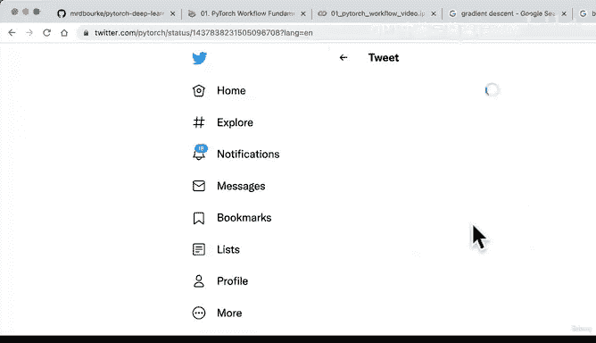
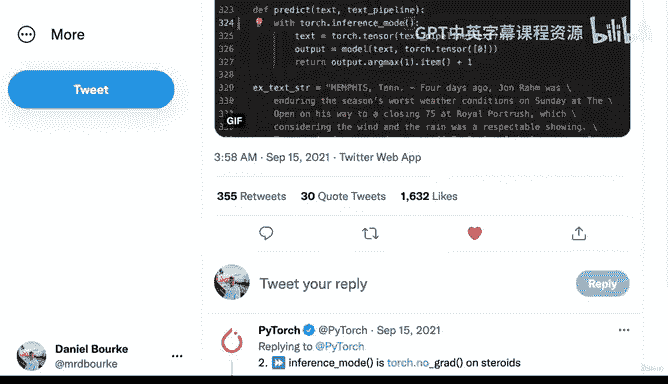
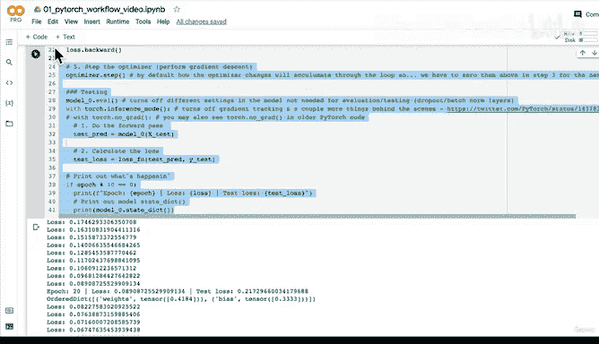

# 53：编写测试循环代码与逐步解析 🧪

在本节课中，我们将学习如何为PyTorch模型编写测试循环代码，并详细解析其每一步的作用。上一节我们介绍了训练循环，本节中我们来看看如何评估模型在未见过的数据上的表现。


## 概述

测试循环用于评估训练好的模型在测试数据集上的性能。与训练循环不同，测试循环不涉及模型参数的更新，其主要目的是验证模型从训练数据中学到的模式是否能泛化到新数据上。

## 测试循环代码解析

以下是测试循环的核心步骤及其作用。

### 1. 设置模型为评估模式

在测试开始前，需要将模型切换到评估模式。

```python
model.eval()
```

此方法会关闭模型中某些在评估或测试时不需要的设置，例如Dropout层和BatchNorm层。这些层在训练和评估时的行为不同。

### 2. 启用推理模式

接下来，我们使用`torch.inference_mode()`上下文管理器。





```python
with torch.inference_mode():
    # 测试代码
```

此模式会关闭梯度追踪以及其他一些后台操作，从而加速推理代码的执行。在旧版PyTorch代码中，你可能会看到`torch.no_grad()`，它实现类似功能，但`inference_mode`是更优、更快的方式。

### 3. 执行前向传播

在推理模式下，我们对测试数据进行前向传播以获取预测结果。

```python
test_preds = model(X_test)
```

这里，`X_test`代表测试特征数据。模型利用从训练数据中学到的参数来对这些新数据进行预测。

### 4. 计算测试损失

使用与训练时相同的损失函数，计算模型预测与测试数据真实标签之间的差异。

```python
test_loss = loss_fn(test_preds, y_test)
```

这个`test_loss`值衡量了模型在未见过的测试数据上的表现。理想情况下，我们希望测试损失尽可能低，这表明模型具有良好的泛化能力。

### 5. 打印输出结果

为了监控测试过程，我们可以定期（例如每10个训练周期）打印出损失和模型参数等信息。

```python
if epoch % 10 == 0:
    print(f"Epoch: {epoch} | Test loss: {test_loss:.5f}")
```

## 核心概念回顾

以下是测试循环中涉及的核心概念总结：

*   **`model.eval()`**：切换模型至评估模式，关闭Dropout等训练专用层。
*   **`torch.inference_mode()`**：关闭梯度追踪，优化推理速度。
*   **前向传播**：模型根据输入数据计算输出，公式为 `y_pred = model(X)`。
*   **测试损失**：衡量模型预测与测试集真实值的差异，公式为 `loss = loss_fn(y_pred, y_test)`。

## 总结



本节课中我们一起学习了如何构建PyTorch模型的测试循环。我们了解到，测试循环的核心在于**评估**而非学习，因此需要关闭梯度计算和模型中的特定训练层。通过定期计算测试损失，我们可以监控模型在未知数据上的泛化能力，这是判断模型是否过拟合或欠拟合的关键。在下一节课中，我们将探讨如何进一步优化模型，使其预测结果更加准确。