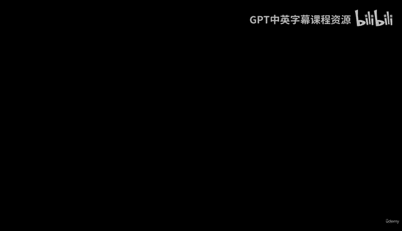
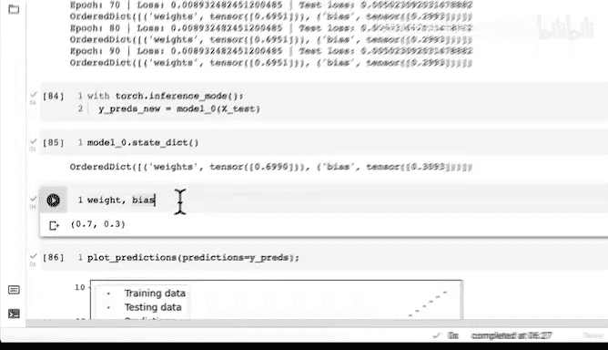
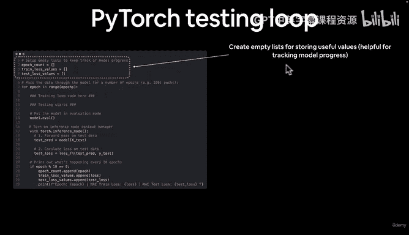
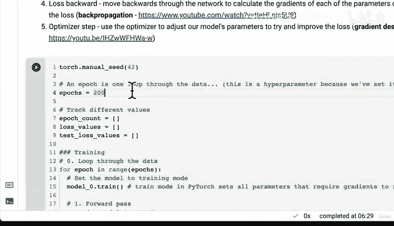
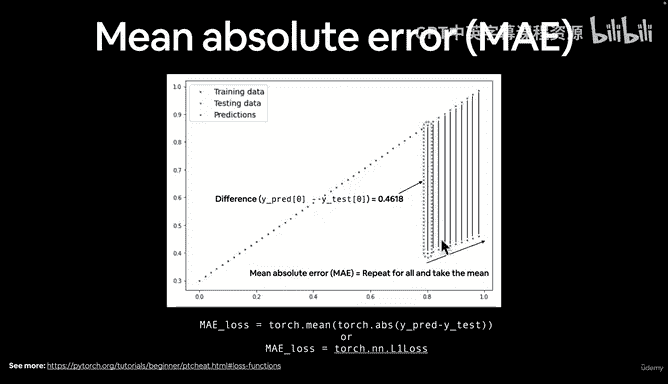
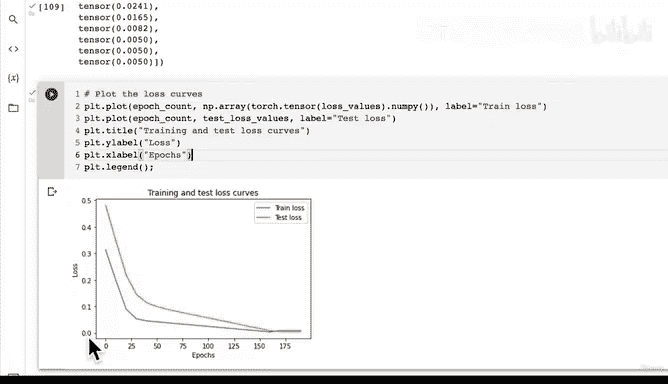
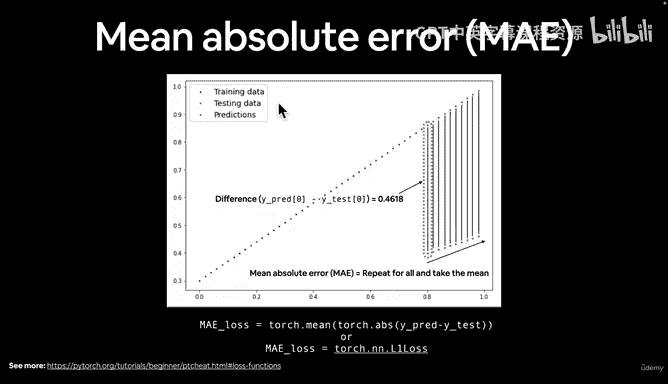
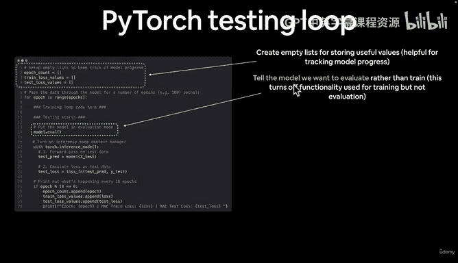
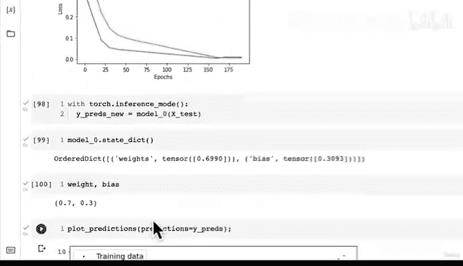

#  54：逐步解析测试循环流程 📊



在本节课中，我们将深入解析 PyTorch 深度学习中的测试循环流程。我们将回顾如何训练模型、评估其性能，并可视化训练过程中的关键指标，例如损失曲线。

---

## 概述

上一节我们训练了一个模型来预测红点和绿点，并取得了不错的效果。本节中，我们将详细拆解测试循环的每一步，学习如何跟踪模型性能，并可视化训练与测试损失的变化。

---

## 回顾训练过程

我们之前训练模型 100 个周期，预测结果显著改善。为了进一步优化，我们可以继续训练模型。模型会从上次训练结束时的参数开始，尝试进一步改进。

**核心代码：训练循环**
```python
for epoch in range(num_epochs):
    model.train()
    y_pred = model(X_train)
    loss = loss_fn(y_pred, y_train)
    optimizer.zero_grad()
    loss.backward()
    optimizer.step()
```





这是深度学习的核心步骤：训练和评估模型。我们已成功应用这些步骤来预测数据点。

---

## 延长训练周期

为了将红点与绿点对齐，我们可以将训练周期增加到 200 个。重新运行训练代码，模型将从已优化的参数开始，进一步减少损失。

训练后，损失值从约 0.02 降至 0.008，测试损失从 0.0056 降至 0.005，提升了近 10 倍。模型参数接近理想值（权重 ~0.7，偏差 ~0.3）。



**理想参数公式：**
\[
y = 0.7x + 0.3
\]

模型预测结果非常接近目标，虽然仍有微小误差，但已足够展示训练效果。



---

## 测试循环详解

现在，让我们用图文并茂的方式解析测试循环。测试循环用于评估模型在未见数据上的性能。

以下是测试循环的关键步骤：

1.  **创建空列表存储指标**：用于跟踪模型进度，比较不同实验的结果。
2.  **设置模型为评估模式**：关闭训练特有的功能（如 Dropout 和 Batch Normalization）。
3.  **启用 Torch 推理模式**：禁用梯度跟踪，提升推理性能。
4.  **将测试数据传入模型**：调用模型的 `forward` 方法进行预测。
5.  **计算测试损失**：衡量模型在测试集上的预测误差。
6.  **打印并记录指标**：监控训练过程，记录周期数、训练损失和测试损失。

**测试循环核心代码：**
```python
model.eval()
with torch.inference_mode():
    test_pred = model(X_test)
    test_loss = loss_fn(test_pred, y_test)
```

---

## 可视化损失曲线

跟踪损失值有助于直观理解模型的学习过程。我们绘制了训练损失和测试损失随周期变化的曲线。





**绘图代码：**
```python
import matplotlib.pyplot as plt
plt.plot(epoch_count, loss_values, label="Train Loss")
plt.plot(epoch_count, test_loss_values, label="Test Loss")
plt.legend()
plt.show()
```



理想情况下，损失曲线应随时间下降。如果训练损失和测试损失同步下降且接近，说明模型收敛良好。这是我们追求的“完美下降曲线”。

---

## 总结

本节课我们一起学习了测试循环的完整流程。我们回顾了如何通过延长训练周期来优化模型，详细解析了测试循环的每一步，并学会了通过绘制损失曲线来监控模型性能。

记住核心循环的步骤：设置模型模式、进行前向传播、计算损失、记录指标。这些步骤是构建和评估所有深度学习模型的基础。

---

**附：PyTorch 优化循环口诀**
```
for epoch in range(num_epochs):
    model.train()
    # 前向传播
    # 计算损失
    # 反向传播
    # 优化器步进
    model.eval()
    with torch.inference_mode():
        # 测试前向传播
        # 计算测试损失
    # 打印状态
```



建议您亲自运行代码，尝试调整参数，并查阅额外资料加深理解。我们下节课再见！