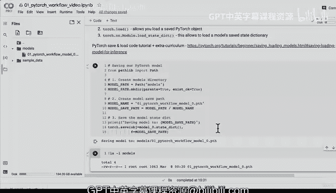

# 55：保存与加载模型 🚀


在本节课中，我们将学习如何保存和加载训练好的 PyTorch 模型。这是将你的工作成果持久化、与他人分享或在未来项目中复用的关键一步。

## 概述

在上一节中，我们训练了一个模型并评估了其预测效果。然而，如果我们的开发环境（如 Google Colab）断开连接，所有代码和训练好的模型都会丢失。本节将介绍三种核心方法来解决这个问题：`torch.save()`、`torch.load()` 和 `torch.nn.Module.load_state_dict()`。

## 保存模型的三种核心方法

以下是 PyTorch 中用于保存和加载模型的三个主要方法：

1.  **`torch.save()`**
    *   此方法允许你将 PyTorch 对象以 Python 的 pickle 格式保存到磁盘。序列化（serializing）即保存的过程。

2.  **`torch.load()`**
    *   此方法用于加载一个已保存的 PyTorch 对象。反序列化（deserializing）即加载的过程。

3.  **`torch.nn.Module.load_state_dict()`**
    *   此方法至关重要，它允许你加载一个模型的已保存状态字典（state dictionary）。

## 理解状态字典（State Dict）

在深入代码之前，我们需要理解什么是“状态字典”。PyTorch 的一个优点是，它将模型所有可学习的参数（如权重和偏置）存储在一个简单的 Python 字典对象中，这就是状态字典。

你可以通过以下代码查看模型的状态字典：
```python
print(model_0.state_dict())
```
对于复杂模型，这个字典可能包含数百万个参数，但基本原理不变：它是一个映射了模型每一层到其参数张量的字典。

## 代码实现：保存模型

现在，让我们通过代码来实际保存我们的模型。我们将遵循推荐的做法：保存模型的状态字典，而非整个模型对象。

首先，我们需要导入必要的库并创建用于保存模型的目录。

```python
import torch
from pathlib import Path

# 1. 创建模型保存目录
MODEL_PATH = Path("models")
MODEL_PATH.mkdir(parents=True, exist_ok=True)

# 2. 创建模型保存路径
MODEL_NAME = "01_pytorch_workflow_model_0.pth"
MODEL_SAVE_PATH = MODEL_PATH / MODEL_NAME

# 3. 保存模型的状态字典
print(f"正在保存模型到: {MODEL_SAVE_PATH}")
torch.save(obj=model_0.state_dict(), f=MODEL_SAVE_PATH)
```
执行以上代码后，你的模型状态字典就会被保存到指定的 `.pth` 文件中。你可以刷新文件浏览器来确认文件已生成。

## 挑战与总结

本节课我们一起学习了保存 PyTorch 模型的基础知识。我们介绍了三种核心方法，并重点实现了通过保存状态字典来持久化模型。

**你的挑战是：** 在下一节课开始前，请尝试阅读 PyTorch 官方文档中关于“保存和加载整个模型”的部分，并思考与仅保存状态字典相比，其优缺点各是什么。



在下一节中，我们将学习如何使用 `torch.load()` 将保存的模型加载回来，并验证其功能是否完好。