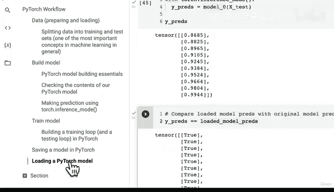

# 56：加载PyTorch模型代码实现 🚀


在本节课中，我们将学习如何加载一个已保存的PyTorch模型。我们将使用之前保存的模型状态字典，创建一个新的模型实例，并将保存的参数加载进去，最后验证加载的模型是否与原始模型等效。

---

## 概述

上一节我们介绍了如何保存PyTorch模型的状态字典。本节中，我们来看看如何加载这个已保存的状态字典，并将其应用到新的模型实例中。

## 加载模型状态字典

为了加载已保存的模型状态字典，我们需要遵循以下步骤：

1.  创建一个与原始模型结构相同的新模型实例。
2.  使用 `torch.load()` 方法加载保存的状态字典文件。
3.  使用模型的 `load_state_dict()` 方法将加载的状态字典应用到新模型实例上。

以下是具体实现代码：

```python
# 1. 创建一个新的模型实例
loaded_model_0 = LinearRegressionModel()

# 2. 加载保存的状态字典
loaded_model_0.load_state_dict(torch.load(f=MODEL_SAVE_PATH))
```

运行上述代码后，如果状态字典的键与模型参数匹配成功，控制台会输出相应的成功信息。

## 验证加载的模型

加载模型后，我们需要验证其是否与原始模型具有相同的预测能力。为此，我们可以将两个模型都设置为评估模式，并对相同的测试数据进行预测，然后比较预测结果。

以下是验证步骤：

1.  将原始模型和加载的模型都设置为评估模式。
2.  在推理模式下，使用测试数据 `X_test` 进行预测。
3.  比较两个模型的预测结果 `y_preds` 是否相等。

```python
# 将模型设置为评估模式
model_0.eval()
loaded_model_0.eval()

# 在推理模式下进行预测
with torch.inference_mode():
    y_preds = model_0(X_test)
    loaded_model_preds = loaded_model_0(X_test)

# 比较预测结果
print(y_preds == loaded_model_preds)
```

如果一切正确，比较结果应全部为 `True`，表明两个模型的预测完全一致。

## 总结



本节课中我们一起学习了PyTorch模型加载的核心流程。我们首先创建了一个新的模型实例，然后使用 `torch.load()` 和 `load_state_dict()` 方法加载了之前保存的模型状态字典。最后，我们通过比较预测结果验证了加载的模型与原始模型是等效的。掌握模型的保存与加载是部署和复用模型的关键步骤。