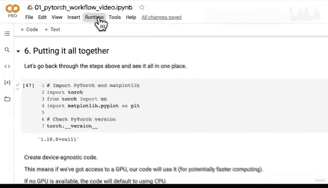
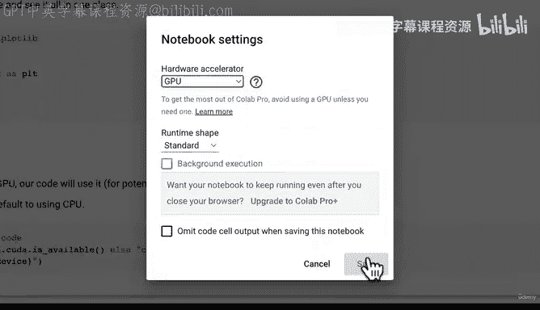
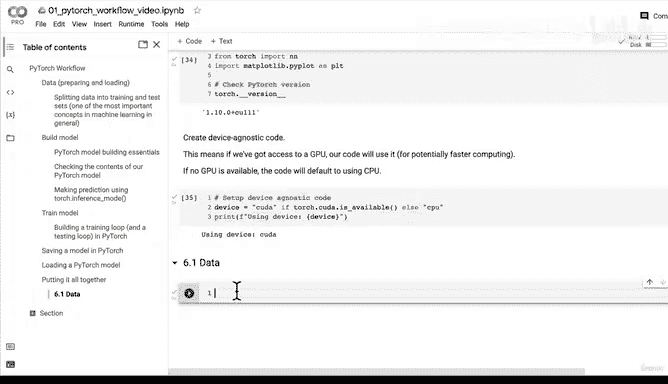

# 57：配置设备无关代码实践环境 🚀


在本节课中，我们将学习如何配置设备无关的代码实践环境。我们将回顾之前学过的PyTorch工作流程，并重点介绍如何编写能够在GPU和CPU上无缝运行的代码。

## 概述

在之前的视频中，我们已经学习了PyTorch工作流程的多个步骤，包括数据处理、模型构建、训练和评估等。本节课，我们将把这些步骤整合起来，并引入设备无关代码的概念，以确保我们的代码能够在不同的硬件环境中高效运行。

## 回顾PyTorch工作流程

上一节我们介绍了PyTorch的基本工作流程，本节中我们来看看如何将这些步骤整合到一个完整的实践中。

首先，我们回顾一下已经学过的步骤：

1. 数据准备：将数据转换为张量。
2. 模型构建：使用PyTorch的`nn`模块构建模型。
3. 损失函数和优化器：选择合适的损失函数和优化器。
4. 训练循环：编写训练和测试循环。
5. 模型评估：通过可视化方法评估模型性能。
6. 模型保存与加载：保存训练好的模型以便后续使用。

## 配置设备无关代码

现在，我们将重点介绍如何配置设备无关的代码环境。设备无关代码意味着无论是否有GPU可用，我们的代码都能正常运行。如果有GPU，代码将利用GPU进行加速计算；如果没有GPU，代码将默认使用CPU。

以下是配置设备无关代码的步骤：

1. 导入必要的库。
2. 检查GPU是否可用。
3. 设置设备变量，根据可用性选择GPU或CPU。

### 代码实现

首先，我们导入所需的库：

```python
import torch
from torch import nn
import matplotlib.pyplot as plt
```

接下来，我们检查PyTorch的版本，以确保代码兼容性：

```python
print(torch.__version__)
```

然后，我们配置设备无关代码：

```python
device = "cuda" if torch.cuda.is_available() else "cpu"
print(f"Using device: {device}")
```

这段代码会检查CUDA（NVIDIA的GPU编程框架）是否可用。如果可用，设备设置为`cuda`（即GPU），否则设置为`cpu`。



## 在Google Colab中使用GPU



如果你使用Google Colab，可以通过以下步骤启用GPU：

1. 点击菜单栏中的“运行时”。
2. 选择“更改运行时类型”。
3. 在“硬件加速器”下拉菜单中选择“GPU”。
4. 保存设置并重新启动运行时。

重启后，运行所有代码单元格，设备变量将自动设置为`cuda`（如果GPU可用）。

## 总结

本节课中，我们一起学习了如何配置设备无关的代码实践环境。我们回顾了PyTorch的工作流程，并重点介绍了如何编写能够在GPU和CPU上无缝运行的代码。通过配置设备无关代码，我们可以确保模型在不同硬件环境中都能高效运行，为后续的深度学习实践打下坚实基础。



在接下来的课程中，我们将使用这个设备无关的环境，重新构建并训练模型，进一步巩固所学知识。