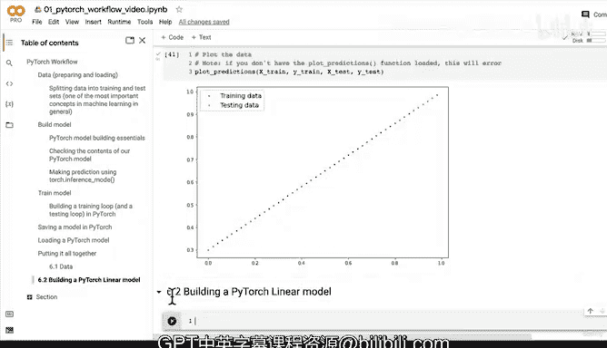

# 58：全流程整合（第一部分）：数据准备 📊


在本节课中，我们将学习如何为线性回归模型准备一个简单的数据集。我们将从零开始创建数据，并将其拆分为训练集和测试集，为后续构建和训练模型打下基础。

---

## 创建数据

上一节我们设置了设备无关的代码。本节中，我们来看看如何创建用于模型训练的数据。

我们将使用线性回归公式来生成数据。线性回归的基本公式是：

**y = weight * x + bias**

这个公式你可能也见过 `y = mx + c` 或 `y = mx + b` 等形式。虽然变量名不同，但它们描述的是同一个数学关系。

以下是生成数据的代码：

```python
# 定义权重和偏置
weight = 0.7
bias = 0.3

# 创建特征值 x，范围从 0 到 1，步长为 0.02
start = 0
end = 1
step = 0.02
X = torch.arange(start, end, step).unsqueeze(dim=1)

# 根据公式生成标签 y
y = weight * X + bias
```

在这段代码中，`weight` 和 `bias` 是我们希望模型最终能够学习到的真实参数。我们创建了一个从 0 到 1 的等间隔向量作为特征 `X`，并通过公式计算出对应的标签 `y`。使用 `.unsqueeze(dim=1)` 是为了将一维张量转换为二维张量，以避免后续出现维度不匹配的问题。

---

## 拆分数据

数据创建好后，我们需要将其拆分为训练集和测试集。这是机器学习中的一个标准步骤，用于评估模型在未见过的数据上的表现。

以下是拆分数据的步骤：

首先，确定训练集的比例。我们使用 80% 的数据进行训练，剩下的 20% 用于测试。这个比例可以根据数据量和具体问题进行调整。

```python
# 设置训练集比例
train_split = int(0.8 * len(X))

# 拆分数据
X_train, y_train = X[:train_split], y[:train_split]
X_test, y_test = X[train_split:], y[train_split:]
```

拆分后，我们可以检查一下数据集的尺寸。按照 80/20 的比例，训练样本大约有 40 个，测试样本大约有 10 个。在实际项目中，数据量会大得多，但拆分比例通常是相似的。

---

## 可视化数据

数据准备完成后，将其可视化是一个好习惯。这能帮助我们直观地理解数据的分布和关系。

以下是绘制数据的说明：

我们可以使用一个预先定义好的绘图函数 `plot_predictions` 来可视化我们的训练数据（蓝色点）和测试数据（绿色点）。

```python
plot_predictions(train_data=X_train,
                 train_labels=y_train,
                 test_data=X_test,
                 test_labels=y_test)
```

如果运行代码时出现错误，提示找不到 `plot_predictions` 函数，那是因为该函数定义在之前的单元格中。你需要确保已经运行过包含该函数定义的单元格，或者将函数定义代码复制到当前笔记本中再运行。

绘制出的图表将显示一系列蓝色点（训练数据）和绿色点（测试数据）。我们的目标是构建一个模型，能够根据蓝色点学习规律，并准确预测绿色点的位置。

---

## 本节总结

本节课中我们一起学习了机器学习流程的第一步：数据准备。

我们使用线性回归公式手动创建了一个合成数据集，并将其按 80/20 的比例拆分成了训练集和测试集。最后，我们通过可视化确认了数据的线性关系。



现在，我们已经拥有了结构清晰的训练数据和测试数据。在下一节中，我们将进入流程的下一步：**构建一个 PyTorch 线性模型**来尝试拟合这些数据。你可以先尝试自己构建一个模型，我们下节课再见。