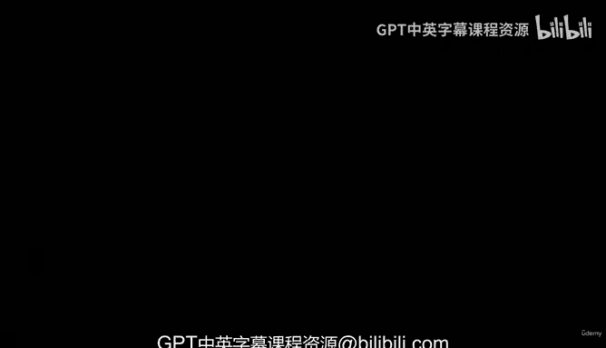
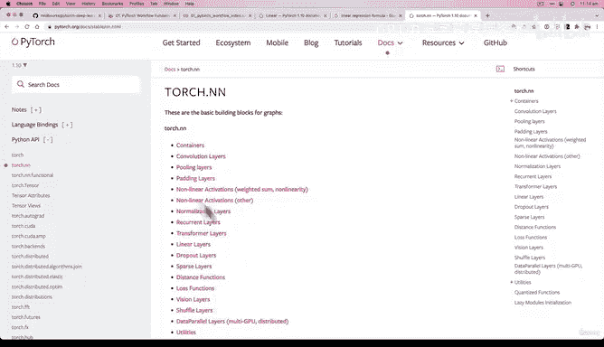

# 59：全流程整合（第二部分）：模型构建 🧱



在本节课中，我们将学习如何构建一个PyTorch线性模型。我们将使用`torch.nn`模块中的预构建层来简化模型创建过程，并理解其背后的工作原理。

---

上一节我们创建了一些模拟的线性数据。本节中，我们来看看如何构建一个适合该问题的模型。

我们将构建一个PyTorch线性模型。虽然你可以按照之前“构建模型”章节的步骤手动完成，但这里我们将介绍一种更高效的方法：利用`torch.nn`模块的强大功能。

我们将通过子类化`nn.Module`来创建一个线性模型。许多PyTorch模型都采用这种方式。

以下是创建模型的代码：

```python
class LinearRegressionModelV2(nn.Module):
    def __init__(self):
        super().__init__()
        self.linear_layer = nn.Linear(in_features=1, out_features=1)

    def forward(self, x: torch.Tensor) -> torch.Tensor:
        return self.linear_layer(x)
```

让我们逐步解析这段代码：
*   `nn.Linear`：我们使用这个层来构建线性回归模型，因为它实现了线性回归公式 `y = weight * x + bias`。
*   `in_features=1, out_features=1`：这表示模型接受一个特征（x）作为输入，并输出一个特征（y）。这取决于我们的数据形状（`X_train` 和 `Y_train` 都是单值对应）。
*   `forward` 方法：我们定义了模型的前向计算，即简单地将输入 `x` 传递给线性层。

`nn.Linear` 层在内部为我们创建并管理了权重（weight）和偏置（bias）参数。这是PyTorch的一个核心概念：你通常初始化的是包含参数的层，而不是直接初始化参数本身。

这个线性层也被称为线性变换、仿射层、全连接层或密集层（在TensorFlow中）。它们都实现了相同的基础数学公式。

现在让我们看看这个模型的实际效果：

```python
torch.manual_seed(42) # 设置随机种子以保证可复现性
model_1 = LinearRegressionModelV2()
print(model_1.state_dict())
```

运行代码后，你会看到模型的状态字典中包含了由`nn.Linear`层自动初始化的`weight`和`bias`参数。它们的初始值可能与我们手动初始化时略有不同，这是因为PyTorch内部使用了不同的随机初始化方式。

通过使用`nn.Linear`，我们有效地将之前手动初始化参数并编写前向计算公式的步骤，替换为使用一个预构建的层。这种模式是构建大多数PyTorch深度学习模型的标准方式。

`torch.nn`模块提供了许多预构建的层，例如卷积层、池化层、归一化层、循环层、Transformer层等。对于深度学习中的常见数学变换，PyTorch通常都有现成的实现。

---



本节课中我们一起学习了如何使用`torch.nn.Linear`层来构建一个线性回归模型。我们理解了通过子类化`nn.Module`并利用预构建层来简化模型创建过程，这是PyTorch中的标准做法。模型已经构建完成，下一步将是训练这个模型。