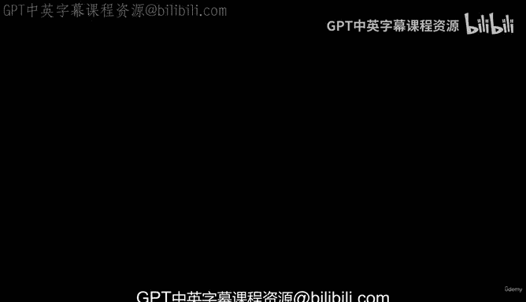
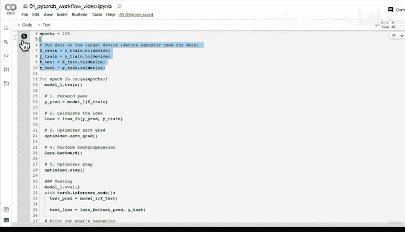

# 60：全流程整合（第三部分）模型训练 🚀

在本节课中，我们将学习如何将之前准备好的数据和模型结合起来，编写一个完整的PyTorch模型训练流程。我们将设置损失函数和优化器，并构建一个训练循环来优化我们的线性回归模型。



---

## 模型与设备设置

上一节我们使用 `torch.nn.Linear` 层构建了一个简单的PyTorch线性模型。现在，在编写训练代码之前，我们需要确保模型运行在正确的设备上。

为了编写设备无关的代码，我们首先检查并设置目标设备。如果GPU可用，我们将使用GPU（CUDA），否则将默认使用CPU。

```python
# 检查当前设备
device = "cuda" if torch.cuda.is_available() else "cpu"
print(f"Using device: {device}")

# 将模型发送到目标设备
model_1.to(device)

# 检查模型参数所在的设备
print(next(model_1.parameters()).device)
```

执行上述代码后，模型的参数将被转移到目标设备（例如GPU）的内存中，从而加速后续的计算过程。

---

## 设置损失函数与优化器

现在，让我们进入训练的核心环节。根据PyTorch工作流程，在准备好数据和模型后，我们需要选择损失函数和优化器。

*   **损失函数**：用于衡量模型预测值与真实值之间的误差。
*   **优化器**：根据损失函数的梯度来调整模型的参数，以减小误差。

对于我们的回归问题，我们选择L1损失函数（也称为平均绝对误差，MAE）。对于优化器，我们选择随机梯度下降（SGD），并为其设置一个学习率。学习率决定了优化器每次更新参数时的步长大小。

```python
# 设置损失函数
loss_fn = torch.nn.L1Loss()

# 设置优化器，并传入需要优化的模型参数
optimizer = torch.optim.SGD(params=model_1.parameters(), lr=0.01)
```

学习率的选择很重要：步长太大可能导致模型不稳定，步长太小则可能导致学习速度过慢。

---

## 构建训练与测试循环

接下来，我们将编写一个完整的训练循环。这个循环将重复多个轮次（epochs），在每个轮次中执行以下步骤：

以下是训练循环中的关键步骤：

1.  **前向传播**：将训练数据输入模型，计算预测值。
2.  **计算损失**：使用损失函数比较预测值与真实值。
3.  **梯度清零**：将优化器中累积的梯度归零，为新一轮计算做准备。
4.  **反向传播**：计算损失相对于每个模型参数的梯度。
5.  **优化器步进**：优化器根据计算出的梯度更新模型参数。

同时，我们也会在每个训练轮次中评估模型在测试集上的表现。

```python
torch.manual_seed(42) # 设置随机种子以获得可重现的结果
epochs = 200

# 将数据也转移到目标设备，确保所有张量都在同一设备上
X_train = X_train.to(device)
y_train = y_train.to(device)
X_test = X_test.to(device)
y_test = y_test.to(device)

for epoch in range(epochs):
    ### 训练步骤 ###
    model_1.train() # 将模型设置为训练模式
    # 1. 前向传播
    y_pred = model_1(X_train)
    # 2. 计算损失
    loss = loss_fn(y_pred, y_train)
    # 3. 梯度清零
    optimizer.zero_grad()
    # 4. 反向传播
    loss.backward()
    # 5. 优化器步进
    optimizer.step()

    ### 测试步骤 ###
    model_1.eval() # 将模型设置为评估模式
    with torch.inference_mode(): # 关闭梯度跟踪等以提升推理效率
        test_pred = model_1(X_test)
        test_loss = loss_fn(test_pred, y_test)

    # 每10个轮次打印一次损失
    if epoch % 10 == 0:
        print(f"Epoch: {epoch} | Train loss: {loss:.4f} | Test loss: {test_loss:.4f}")
```

运行上述代码，你将看到训练损失和测试损失随着轮次增加而逐渐下降，这表明模型正在从数据中学习。

---

## 模型评估与预测

训练完成后，我们可以检查模型学习到的参数，并与我们生成数据时使用的真实参数（权重 `weight=0.7`，偏置 `bias=0.3`）进行比较。

```python
# 查看模型学习到的最终参数
print(model_1.state_dict())
```

你会发现模型学习到的权重和偏置值非常接近真实值（例如 `weight ≈ 0.6968`, `bias ≈ 0.3025`）。这证明了我们的训练流程是有效的。在实际问题中，我们虽然不知道真实的参数，但模型会通过训练不断逼近能最好描述数据关系的参数。

最后，你可以使用之前定义的绘图函数，将模型的预测结果（红色点）与原始测试数据（绿色点）绘制在一起，直观地查看模型的拟合效果。

---

## 总结



本节课中我们一起学习了PyTorch模型训练的全流程。我们首先将模型和数据设置为设备无关，然后选择了合适的损失函数和优化器，接着构建了一个包含前向传播、损失计算、反向传播和参数更新的训练循环，并同时在循环中评估模型性能。最终，我们验证了模型能够有效地学习数据中的线性关系。恭喜你快速完成了一个完整模型的训练！