# 61：全流程整合（第四部分）：训练模型预测 🧠➡️📈

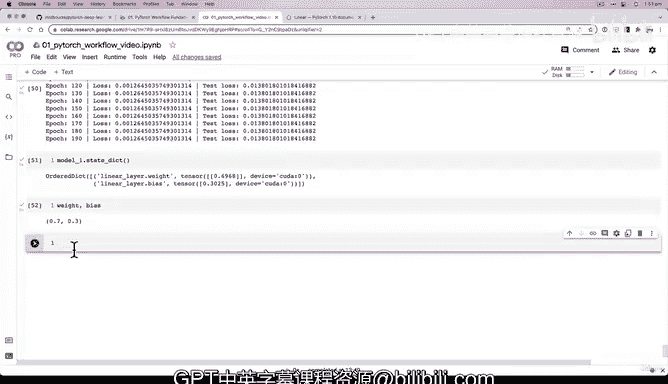

在本节课中，我们将学习如何评估训练好的神经网络模型，并利用它对新数据进行预测。我们将重点关注如何将模型切换到评估模式、进行预测，并可视化预测结果以评估模型性能。

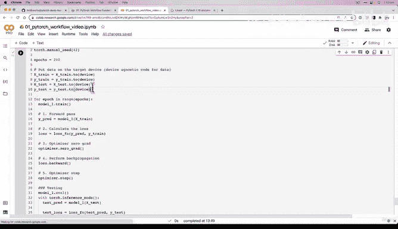

---

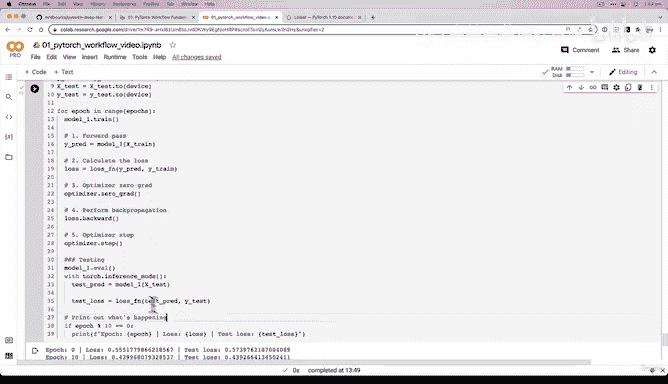

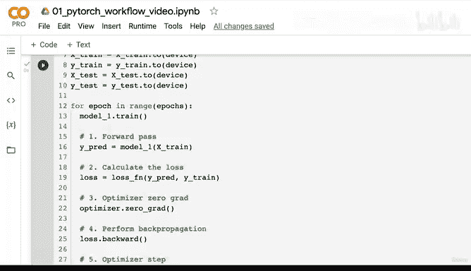

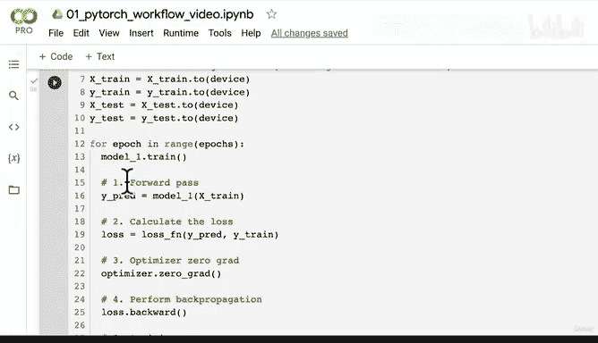

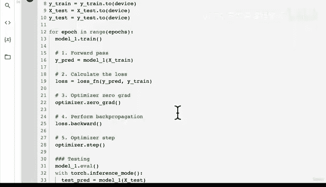

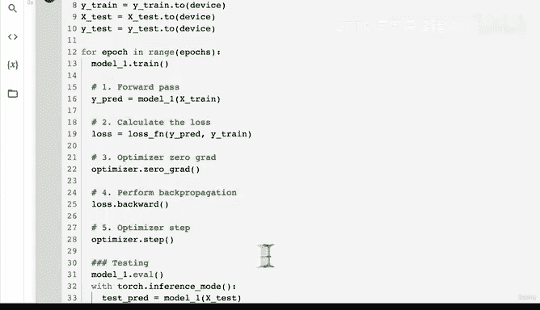

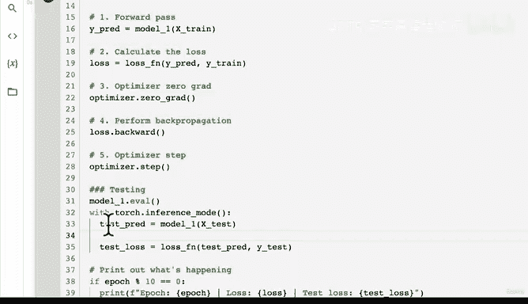

在上一节视频中，我们完成了一项非常激动人心的工作：训练了一个完整的神经网络。虽然之前理解这些步骤花费了我们大约一个小时，但我们在一个视频中就完成了编码。现在，让我们回顾一下一个训练周期（epoch）内的核心优化循环步骤。

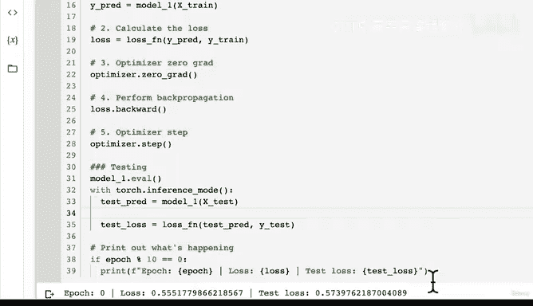

以下是PyTorch非官方的优化循环“歌曲”所描述的步骤：

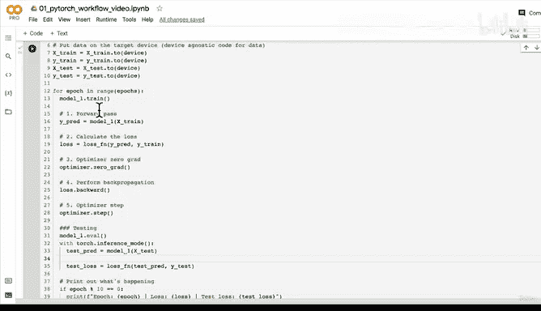

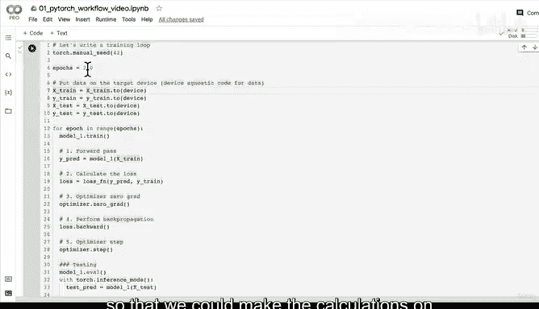

1.  执行前向传播（`forward pass`）。
2.  计算损失（`calculate the loss`）。
3.  优化器梯度归零（`optimizer.zero_grad()`）。
4.  执行反向传播（`loss.backward()`）。
5.  优化器更新参数（`optimizer.step()`）。

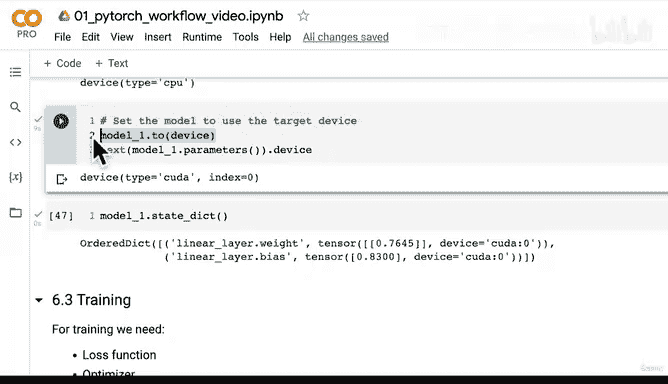

在测试或推理阶段，我们使用`torch.inference_mode()`，执行前向传播并计算损失，然后打印结果。这个循环会为每一个`epoch`重复执行。

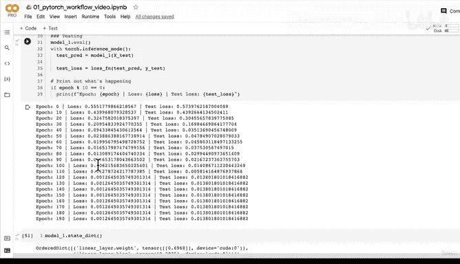

我们之前还编写了设备无关的代码，确保计算在与模型相同的设备（CPU或GPU）上进行，因为模型本身也使用了设备无关的代码。

---

上一节我们介绍了模型的训练过程，本节中我们来看看如何评估模型并做出预测。我们已经观察了训练损失和测试损失，知道模型的损失在下降。但这在实际预测中意味着什么？这才是我们最关心的。我们也查看了模型参数，它们已经非常接近理想参数。

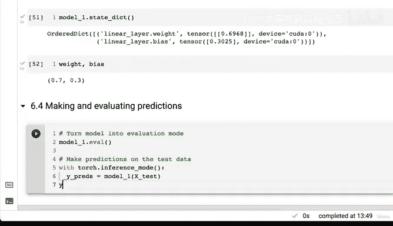

在上节课结束时，我给大家布置了一个挑战：进行预测并绘制结果图。希望你已经尝试过了。现在，让我们一起看看具体怎么做。

首先，将模型切换到评估模式。这是因为每当进行预测或推理时，我们都希望模型处于评估模式；而训练时，则希望模型处于训练模式。

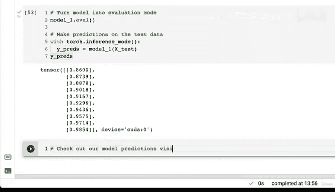

接着，在测试数据上进行预测。我们使用训练数据训练模型，而在模型从未见过的测试数据上评估其性能（除了预测时）。

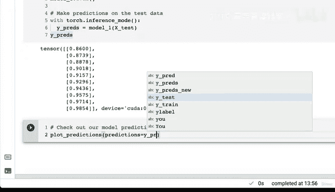

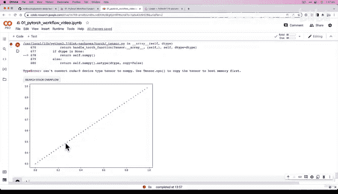

使用`torch.inference_mode()`，在进行推理或预测时启用推理模式。我们将预测结果赋值给`y_preds`。

让我们看看`y_preds`是什么样子。很好，我们得到了一个张量，并且它显示仍在CUDA设备上。这是因为之前我们将`model1`和测试数据都设置到了目标设备上，因此预测结果也在CUDA设备上。

现在，引入我们的`plot_predictions`函数来可视化模型预测。数据探索者的座右铭是：可视化、可视化、再可视化。

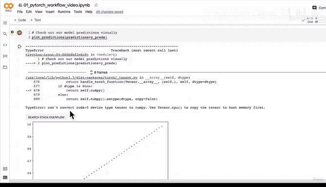

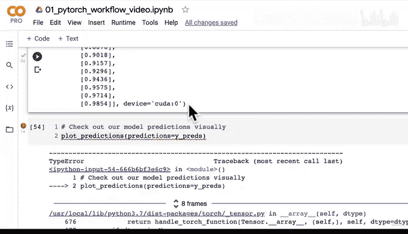

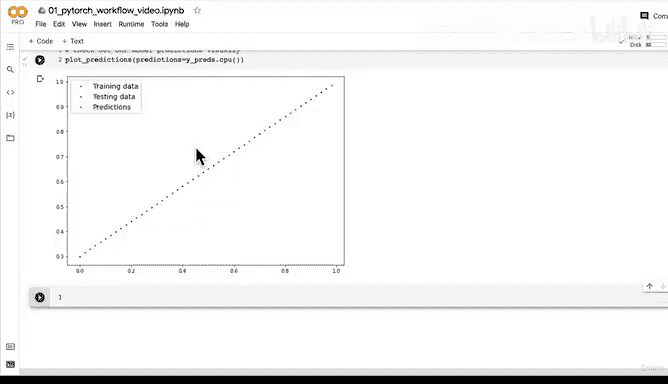

我们遇到了一个错误：`TypeError: can‘t convert cuda device type tensor to numpy`。这是因为`plot_predictions`函数使用`matplotlib`库，而`matplotlib`是基于NumPy和CPU工作的，但我们的预测张量在GPU（CUDA）上。错误信息提示我们：使用`tensor.cpu()`先将张量复制到主机内存。

对预测张量调用`.cpu()`方法后，再绘图。看！结果非常棒。红色圆点代表的预测值几乎完全覆盖在绿色圆点代表的测试数据之上。这非常令人兴奋。你的具体数值可能不完全相同，这完全没问题，但趋势应该非常相似。多亏了反向传播和梯度下降的力量，我们模型的随机参数已经更新到尽可能接近理想参数，现在的预测结果看起来相当不错。

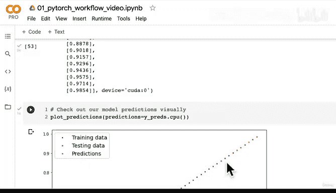

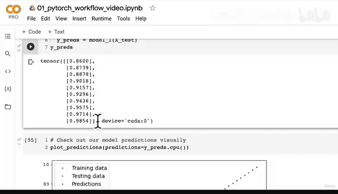

但我们还没有结束。如果现在笔记本断开连接，训练好的模型就会丢失，这显然不理想。

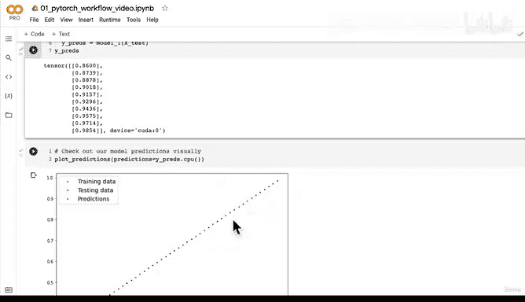

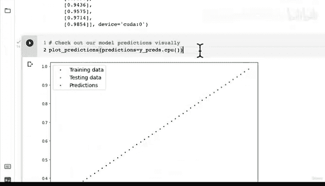

---

因此，在下一部分（P62），我们将进入第26.5节：保存和加载训练好的模型。

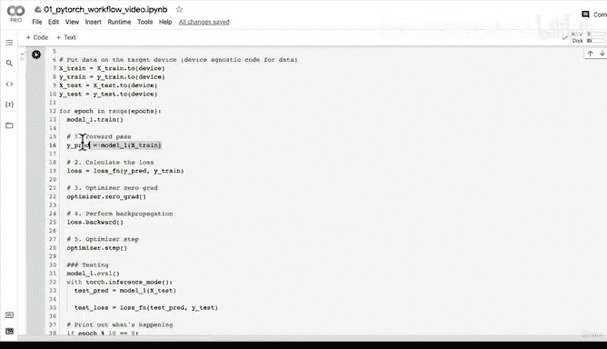

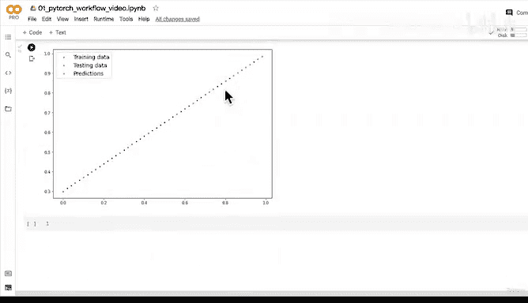

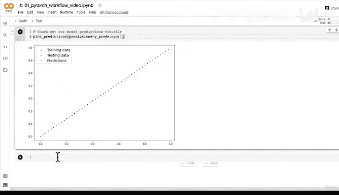

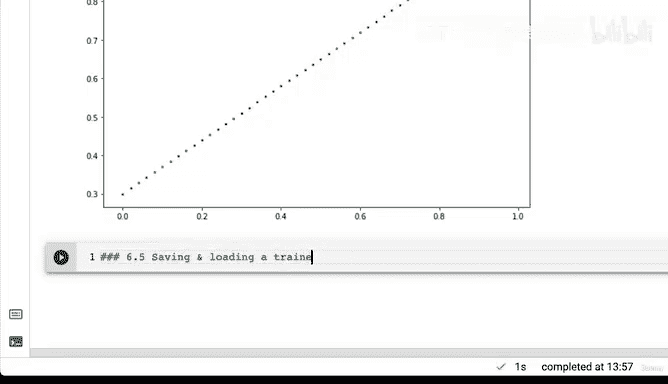

这里我也给你一个挑战：参考之前关于“在PyTorch中保存模型”和“加载PyTorch模型”的代码，尝试保存`model1`的状态字典（`state_dict`），然后再将其加载回来，并得到类似的可视化结果。去试试吧，我们下个视频见。

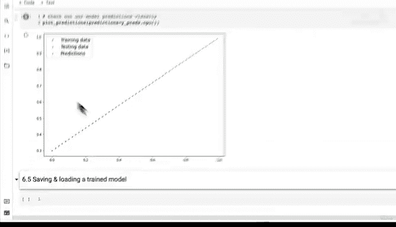

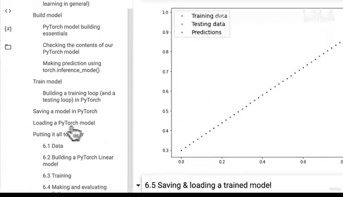

---

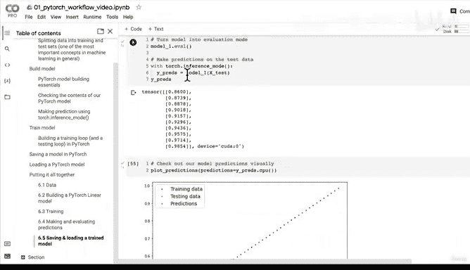

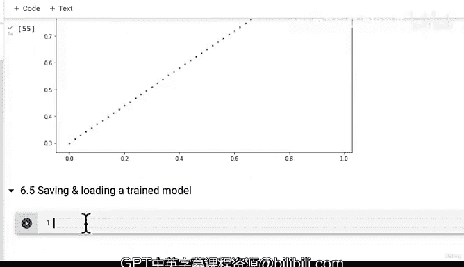

本节课中我们一起学习了如何将训练好的模型切换到评估模式、在测试集上进行预测，并通过可视化来直观评估模型的性能。我们还解决了因数据设备（CPU/GPU）不一致导致的绘图错误，为模型的持久化保存做好了准备。