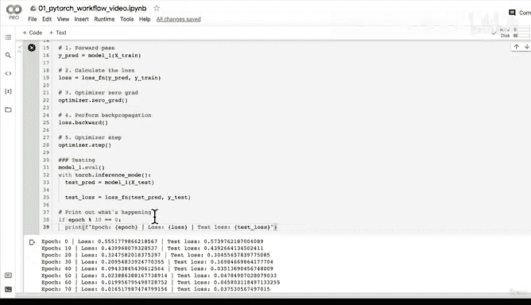
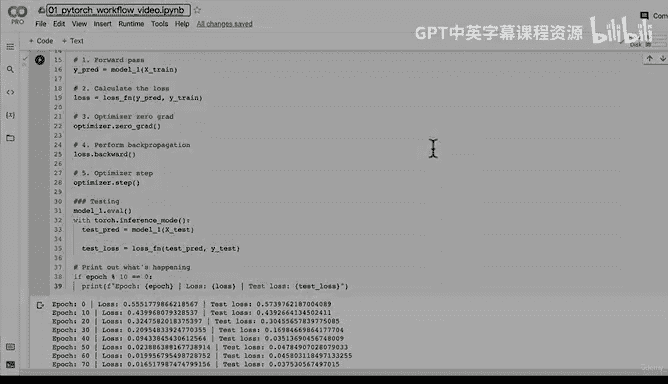

# 62：模型保存与加载 🚀


在本节课中，我们将学习PyTorch工作流程的最后一步：如何保存和加载训练好的模型。保存模型至关重要，它能让我们保留训练成果，并在未来无需重新训练即可使用模型进行预测。

上一节我们成功训练了一个线性回归模型并获得了不错的预测结果。本节中，我们将把训练好的模型保存到文件中，然后再将其加载回来，验证加载后的模型与原始模型功能一致。

## 创建模型保存目录

首先，我们需要导入必要的库并创建一个用于保存模型的目录。

```python
from pathlib import Path

# 1. 创建模型保存目录
MODEL_PATH = Path("models")
MODEL_PATH.mkdir(parents=True, exist_ok=True)
```

以下是代码步骤解析：
*   我们导入 `Path` 库来处理文件路径。
*   定义模型保存的目录路径为 `"models"`。
*   使用 `.mkdir(parents=True, exist_ok=True)` 创建目录。`exist_ok=True` 确保即使目录已存在也不会报错。

## 定义模型保存路径

接下来，我们为模型文件定义一个具体的保存路径和文件名。

```python
# 2. 定义模型保存路径
MODEL_NAME = "01_pytorch_workflow_model_1.pth"
MODEL_SAVE_PATH = MODEL_PATH / MODEL_NAME
```

以下是关键点说明：
*   PyTorch模型通常保存为 `.pt` 或 `.pth` 扩展名的文件。
*   我们使用 `Path` 对象的 `/` 操作符来组合目录路径和文件名，形成完整的保存路径 `MODEL_SAVE_PATH`。

## 保存模型状态字典

在PyTorch中，推荐保存模型的 `state_dict`，而不是整个模型对象。`state_dict` 是一个Python字典，包含了模型的所有可学习参数（如权重和偏置）。

```python
# 3. 保存模型的状态字典
print(f"正在保存模型到: {MODEL_SAVE_PATH}")
torch.save(obj=model_1.state_dict(), f=MODEL_SAVE_PATH)
```

以下是具体操作：
*   `model_1.state_dict()` 获取我们训练好的 `model_1` 的参数。
*   `torch.save()` 函数将这个状态字典保存到指定的文件路径 `MODEL_SAVE_PATH`。
*   保存后，你可以在 `models` 文件夹下找到名为 `01_pytorch_workflow_model_1.pth` 的文件。

## 加载已保存的模型

现在，我们来加载刚才保存的模型。这需要创建一个新的模型实例，然后将保存的参数加载进去。

```python
# 4. 加载模型
# 首先，创建一个模型的新实例（其结构必须与保存的模型相同）
loaded_model_1 = LinearRegressionModelV2()

# 然后，将保存的状态字典加载到这个新实例中
loaded_model_1.load_state_dict(torch.load(f=MODEL_SAVE_PATH))

# 将加载的模型放到目标设备上（例如GPU），以保持设备一致性
loaded_model_1.to(device)
```

以下是加载步骤解析：
*   `LinearRegressionModelV2()` 实例化了一个全新的、未经训练的模型。
*   `torch.load(MODEL_SAVE_PATH)` 从磁盘加载保存的状态字典。
*   `loaded_model_1.load_state_dict(...)` 将加载的参数赋予新模型。
*   `.to(device)` 确保模型在正确的设备（CPU/GPU）上运行。

## 验证加载的模型

最后，我们必须验证加载的模型是否与原始模型完全一致。我们通过比较它们的预测结果来进行验证。

```python
# 5. 评估加载的模型，确保其功能与保存前一致
loaded_model_1.eval()
with torch.inference_mode():
    loaded_model_1_preds = loaded_model_1(X_test)

# 检查加载模型的预测结果是否与原始模型的预测结果相同
print(torch.allclose(y_preds, loaded_model_1_preds))
# 输出应为：tensor(True)
```

以下是验证过程：
*   将模型设置为评估模式 (`loaded_model_1.eval()`)。
*   在推理模式下 (`torch.inference_mode()`) 对测试数据 `X_test` 进行预测。
*   使用 `torch.allclose()` 比较原始模型预测结果 `y_preds` 和加载模型预测结果 `loaded_model_1_preds`。如果输出为 `True`，则证明两个模型的预测在数值上几乎完全相同，加载成功。





本节课中我们一起学习了PyTorch模型保存与加载的完整流程。我们了解了保存模型的 `state_dict` 是推荐做法，掌握了从创建保存目录、定义路径、保存模型到加载并验证模型的全套操作。这是将机器学习模型投入实际应用的关键一步，确保你的训练成果得以持久化和复用。恭喜你完成了整个PyTorch基础工作流程的学习！