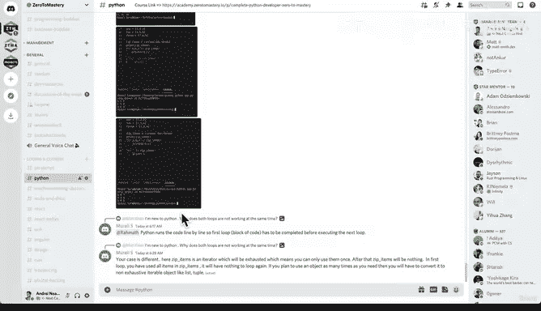

# 63：应对冒名顶替综合征 🧠

在本节课中，我们将暂时离开技术内容，探讨一个在学习过程中普遍存在的心理现象——冒名顶替综合征。我们将了解它的本质，并学习如何将其转化为学习的动力。

---

## 什么是冒名顶替综合征？

冒名顶替综合征是一种认为自己能力不足、不配获得成功，并担心被他人视为“骗子”的心理状态。在学习新技能，尤其是像深度学习这样复杂的领域时，这种感觉尤为常见。

上一节我们介绍了神经网络的基础，本节中我们来看看在学习旅程中可能遇到的心理挑战。

你可能会看着行业专家，心想：“我永远也达不到那种水平。”这种感觉是学习过程中的一个正常症状。它仅仅意味着你还没有到达那个阶段，而掌握任何有价值的技能都需要时间和努力。

**公式：冒名顶替综合征 ≈ 学习过程中的正常症状**

---

## 将挑战转化为动力

记住你第一天上学或第一天上班时的感受。那是一种陌生的、充满不确定性的体验。但随着时间的推移，通过重复和实践，你会逐渐变得舒适，积累经验，那种冒名顶替的感觉也会慢慢消退。

存在冒名顶替综合征的感觉其实是件好事。它意味着你正在做一些有价值、有挑战性的事情。不要将其视为负面情绪，而应将其视为一种鼓励，证明你正在学习，正在突破自己的极限。

---

## 一个重要的学习练习：教学相长

为了巩固所学知识，我建议我们进行一个简短的练习。暂停观看课程，然后前往我们的 Discord 社区。

以下是利用社区进行学习的具体步骤：

1.  **访问 Discord 服务器**：如果你还没加入，现在就去。
2.  **找到相关频道**：进入例如“编程与课程”板块下的“Python”频道。
3.  **帮助他人**：浏览其他学员提出的问题，尝试运用你目前所学的知识去解答。

即使你对自己的知识还没有100%的把握，尝试向他人解释你刚刚学会的内容，这个过程本身对你的学习就极为有益。如果你从不尝试教学、解释或展示所学，你将永远停留在初学者的阶段。

**核心概念**：`教 = 学` 的最有效方式之一。

在我们的社区里， motto 是保持友善，不评判他人。我们都是初学者，都在学习的过程中。请勇敢地回答问题，要记住，除了尤达大师，没有人是完美的。

---

## 总结

本节课我们一起学习了如何认识和应对冒名顶替综合征。我们了解到它是学习过程中的自然现象，可以通过实践和时间的积累来克服。更重要的是，我们介绍了一个强大的学习工具——通过帮助他人来巩固自己的知识。记住，感到不足恰恰说明你走在了正确的、有挑战性的道路上。继续前进，我们下节课再见！