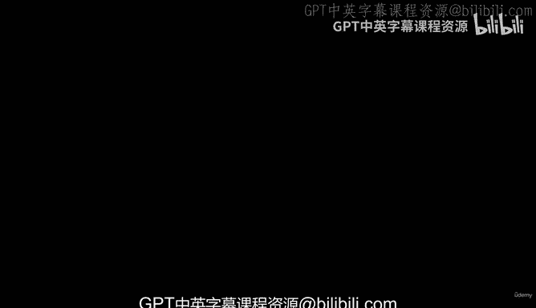
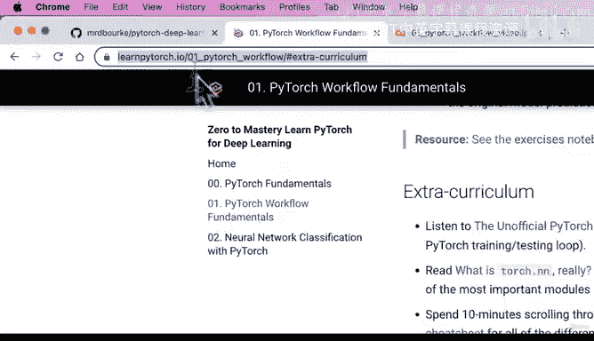
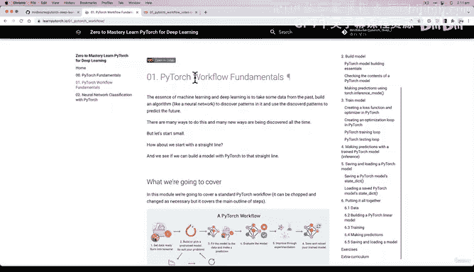
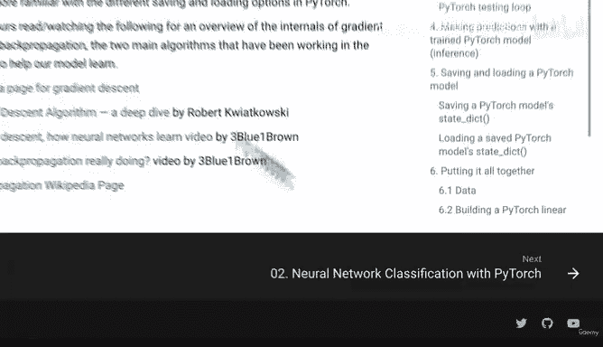
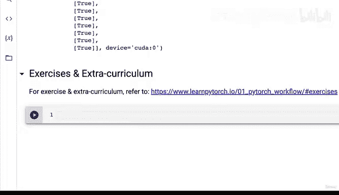

# 64：PyTorch工作流练习与拓展 📚

在本节课中，我们将回顾PyTorch工作流的核心步骤，并介绍如何通过练习和拓展资源来巩固所学知识。我们将重点了解课程提供的练习模板、解决方案以及额外的学习材料。

---

## 课程概述

上一节我们完成了PyTorch工作流的构建，包括保存和加载训练好的模型。本节我们将进入练习与拓展环节，介绍如何利用课程提供的资源进行实践和深入学习。

以下是本节内容的要点：

1.  **练习与拓展资源介绍**：了解在哪里可以找到练习和拓展材料。
2.  **练习内容概览**：介绍基于第01节代码设计的练习题。
3.  **练习模板与解决方案**：说明如何获取练习模板和参考答案。
4.  **核心工作流回顾**：总结PyTorch工作流的所有关键步骤。

---

## 练习与拓展资源介绍

所有练习和拓展材料都包含在课程的书本版本中。访问地址是 `learnpytorch.io`。在第01节“PyTorch工作流基础”部分，你可以找到相关材料。

在每小节的末尾，目录中会列出“练习”和“拓展课程”部分。我在整个01系列视频中提到过许多概念，例如梯度下降和反向传播。因此，那里提供了大量资源供深入学习。

拓展资源包括：
*   PyTorch官方关于加载和保存模型的文档。
*   PyTorch速查表。
*   Jeremy Howard撰写的一篇帮助深入理解`torch.nn`的文章。
*   一个非官方的PyTorch优化之歌，内容很有趣。

---

## 练习内容概览

这里的练习全部基于我们在第01节中编写的代码。练习中没有任何我们未曾涵盖的内容。如果有，我会在练习本身中添加说明。

一个示例练习是：使用线性回归公式创建一个直线数据集，然后通过子类化`nn.Module`来构建一个模型。

---

## 练习模板与解决方案

对于这些练习，有一个练习笔记本模板。该模板链接在课程材料中，同时也位于PyTorch深度学习的GitHub仓库中。

进入仓库后，导航至 `extras/exercises` 目录，你会找到所有按章节编号的模板。例如，`pytorch_workflow_exercises.ipynb` 对应本章练习。

如果你想完成这些练习，可以点击此笔记本并在Google Colab中打开。你可以将其保存到自己的Google Drive中并开始编写代码。笔记本中包含了你应该完成的任务说明。当然，你也可以参考文本版本的练习说明。

如果你想查看一些解决方案示例，请注意，我强烈建议你先自己尝试完成练习。你可以使用我们在这里提供的书本（其中包含所有视频代码），也可以使用我提供的众多笔记本来帮助你完成练习。

完成尝试后，你可以回到 `extras` 文件夹，在那里可以找到 `solutions`（解决方案）。例如，`extras/solutions/01_pytorch_workflow_exercises_solutions.ipynb` 就是第01节的解决方案示例。所有额外的资源和解决方案也包含在课程的书本版本中。

---

## 核心工作流回顾

至此，第01节“PyTorch工作流”就结束了。我们基本上走完了PyTorch工作流的所有步骤：
1.  准备数据，并将其转换为张量。
2.  构建或选择模型。
3.  选择损失函数和优化器。
4.  构建训练循环。
5.  将模型拟合到数据。
6.  进行预测。
7.  评估模型。
8.  通过实验进行改进（例如训练更多轮次）。
9.  保存并重新加载训练好的模型。

---

## 课程总结

本节课中，我们一起学习了如何利用课程提供的练习和拓展资源来巩固PyTorch工作流知识。我们介绍了练习模板的获取方式、练习内容的核心思想，并回顾了完整的PyTorch模型开发流程。实践是掌握深度学习的关键，请务必尝试完成提供的练习。我们下个章节再见。