# 65：PyTorch机器学习分类导论 🧠

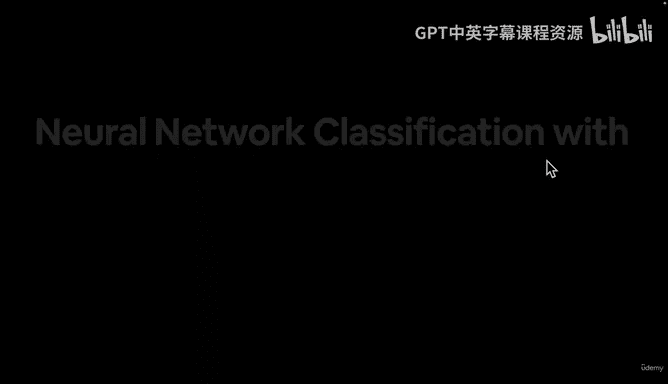

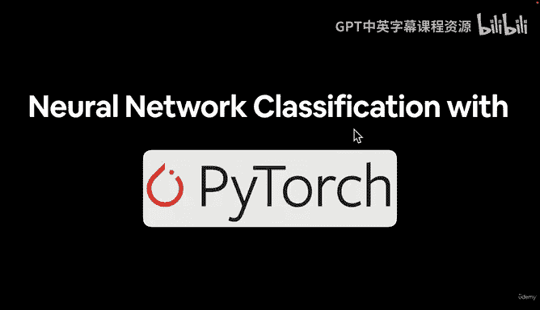

在本节课中，我们将学习机器学习中的核心问题之一：分类。我们将探讨什么是分类问题，它与回归问题的区别，以及如何使用PyTorch构建神经网络来解决分类任务。

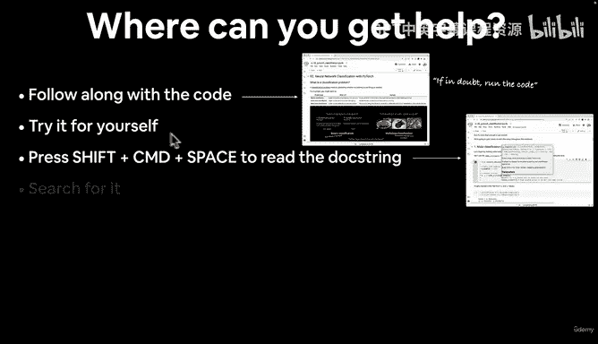

## 概述

分类是预测一个事物属于哪个类别的问题，而回归是预测一个数值。掌握这两个问题，就掌握了机器学习中最主要的两种任务。本节课将重点介绍分类问题的基础知识、不同类型以及我们将要构建的模型架构。

## 如何获取帮助

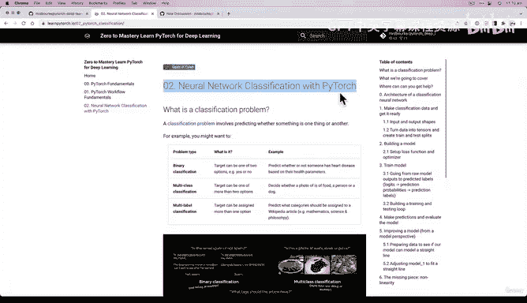

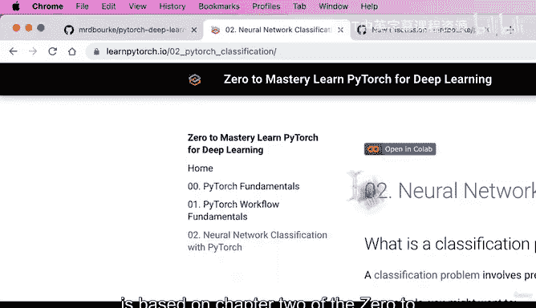

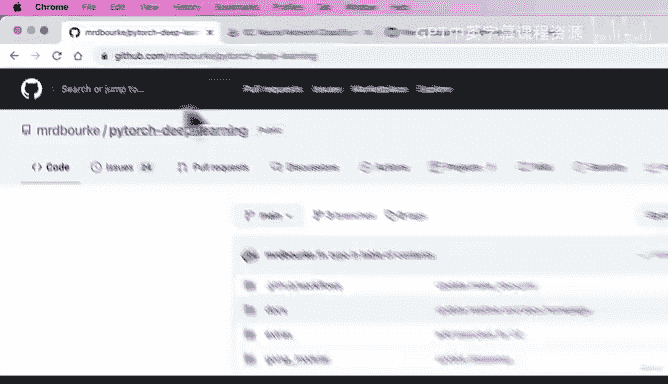

在学习过程中，如果遇到困难，可以遵循以下步骤：

*   首先，尽量跟随代码操作，亲自运行和编写代码，这是最重要的学习方式。
*   如果遇到问题，可以按 `Shift + Command + Space`（Mac）或 `Ctrl + Space`（Windows）查看函数的文档字符串。
*   如果仍然无法解决，将错误信息复制到搜索引擎中查找答案，通常会找到Stack Overflow或PyTorch官方文档等资源。
*   最后，如果问题依然存在，可以在课程GitHub仓库的讨论区提问，注明视频编号和时间戳，以便获得帮助。

## 什么是分类问题

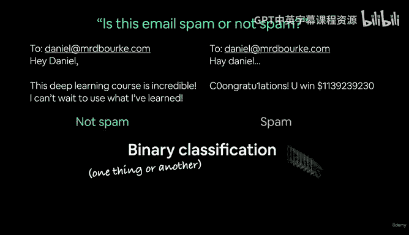

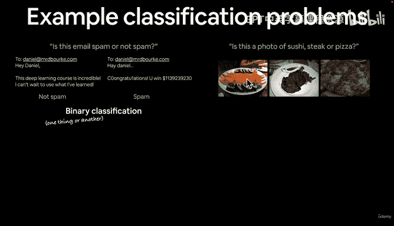

分类是机器学习的主要问题之一。你可能每天都在与机器学习驱动的分类问题打交道。

以下是分类问题的几个例子：

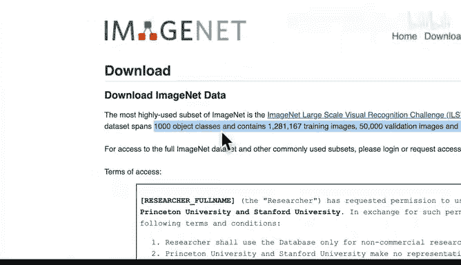

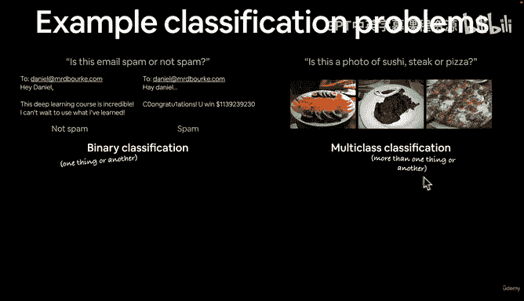

*   **垃圾邮件过滤**：判断一封电子邮件是垃圾邮件还是非垃圾邮件。这属于**二元分类**，因为结果只有两种可能（是或否，通常用0和1表示）。
*   **图像识别**：判断一张照片是寿司、牛排还是披萨。这属于**多类别分类**，因为类别数量超过两个（例如，ImageNet数据集包含1000个类别）。
*   **文章标签**：为一篇维基百科文章自动分配多个相关标签（如“深度学习”、“人工神经网络”）。这属于**多标签分类**，因为一个样本可以同时拥有多个标签。

## 二元分类与多类别分类

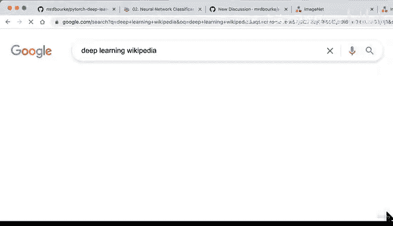

让我们更深入地理解二元分类和多类别分类的区别。

*   **二元分类**：模型在两种可能性中做出选择。例如，训练一个模型来区分照片中是狗还是猫。
*   **多类别分类**：模型在多种可能性中做出选择。例如，在区分狗和猫的基础上，再加入鸡的照片，模型就需要在狗、猫、鸡三个类别中进行判断。

## 本节内容安排

上一节我们介绍了回归问题，本节中我们来看看分类问题的构建方法。我们将按照以下步骤进行：

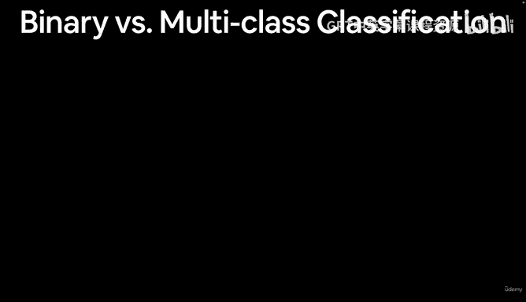

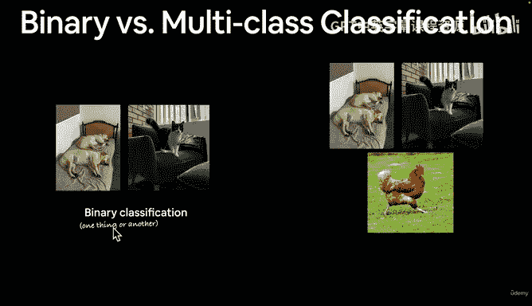

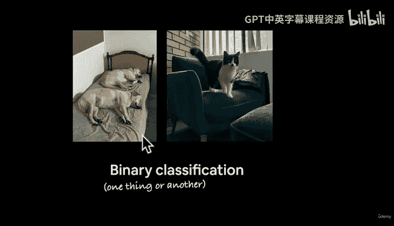

*   学习神经网络分类模型的架构。
*   了解分类模型的输入和输出形状（特征和标签）。
*   创建用于查看、拟合和预测的自定义数据。
*   为神经网络分类创建一个模型（与回归模型略有不同）。
*   为分类模型设置损失函数和优化器。
*   重建训练循环和评估（测试）循环。
*   学习如何保存和加载模型。
*   利用线性（直线）的威力。
*   探索不同的分类评估方法。

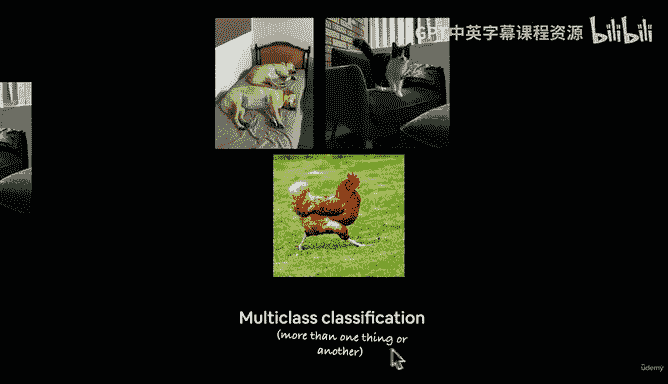

我们将通过编写大量代码来实践这些概念，就像厨师烹饪菜肴一样，一步步构建出我们的分类模型。

在下一节开始编码之前，我们将进一步探讨分类模型的输入和输出具体是什么样子。

## 总结

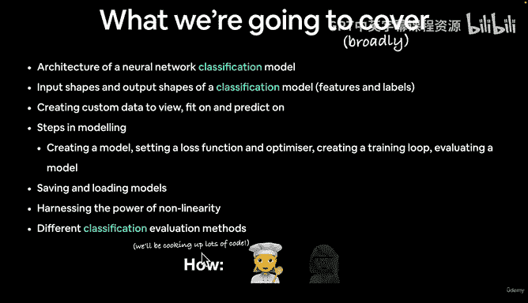

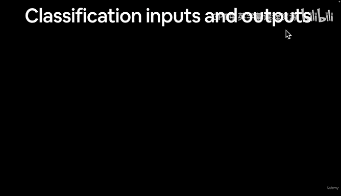

本节课我们一起学习了机器学习分类问题的基本概念。我们了解了分类与回归的区别，认识了二元分类、多类别分类和多标签分类，并概述了使用PyTorch构建分类模型的完整流程。下一节，我们将深入探讨分类模型的输入与输出。