# 66：分类问题的输入与输出形状示例 🍕📊

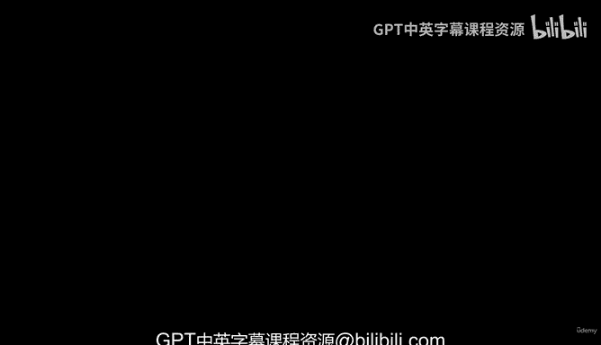

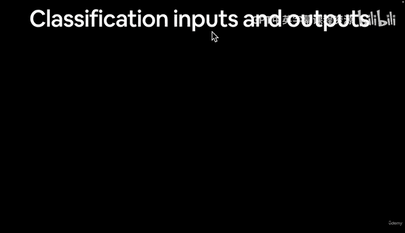

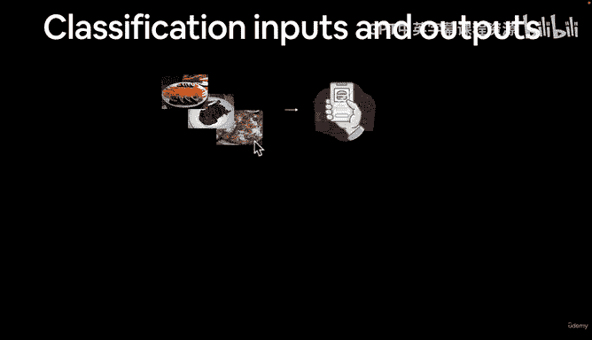

在本节课中，我们将学习分类问题中数据的输入与输出形状。我们将以构建一个名为“Food Vision”的食物图像分类器为例，具体探讨如何将图像转换为数值表示（张量），以及模型如何输出预测概率。

---

上一节我们简要介绍了什么是分类问题。本节中，我们来看看一个具体分类任务（如食物图像分类）的输入和输出数据具体是什么样子。

假设我们有一些精美的食物照片，并试图构建一个“Food Vision”系统来识别照片中的食物。这个过程可以分解为三个部分：**输入**、**机器学习算法**和**输出**。

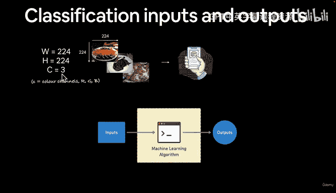

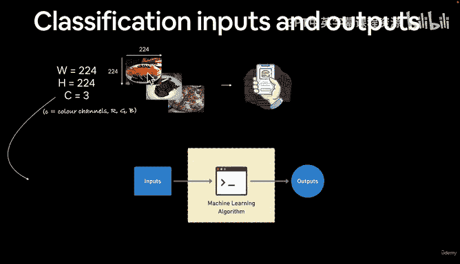

对于输入，我们需要以某种数值形式表示这些图像。一种常见的方法是将每张图片调整为224像素宽、224像素高的正方形。图像在计算机中通常由宽度、高度和颜色通道三个维度表示。颜色通道通常指红、绿、蓝（RGB）三色，每个像素点都由这三个通道的数值组合成最终颜色。

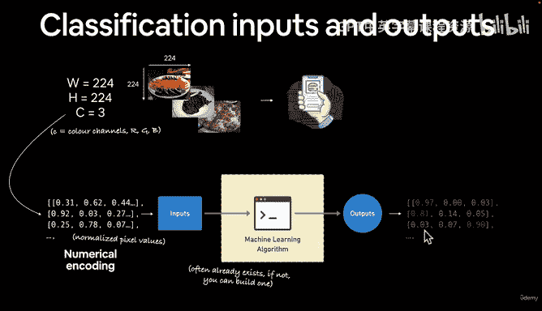

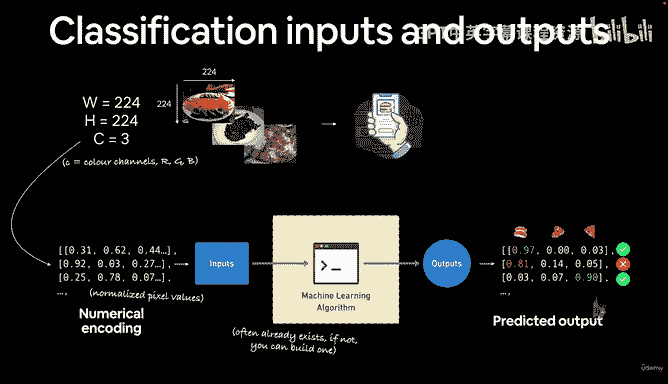

因此，一张图片的数值编码（即像素值）可以表示为一个三维张量。我们将这个数值张量输入到机器学习算法中。算法可以是现成的，我们也可以使用PyTorch为特定问题构建一个。

对于输出，在“Food Vision”例子中，我们希望模型能告诉我们图片中是寿司、牛排还是披萨。机器学习模型的输出通常不是绝对的类别，而是**预测概率**，即一个介于0和1之间的数值，表示模型对每个类别的置信度。例如，模型可能输出 `[0.01, 0.05, 0.94]`，分别对应寿司、牛排和披萨的概率，其中披萨的概率最高。

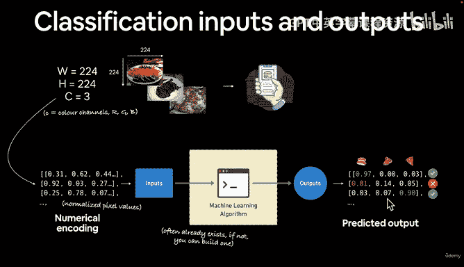

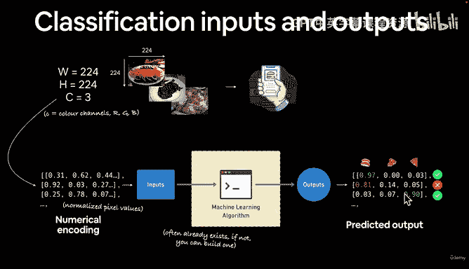

我们的目标是将这些数值概率转换回人类可读的标签（如“披萨”）。这个过程需要模型通过观察大量样本进行训练，并不断调整算法和数据以提高预测准确性。

---

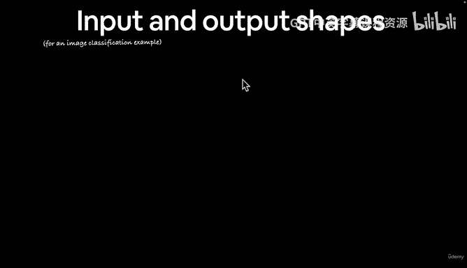

现在，让我们从张量形状的角度来具体分析。我们以构建“Food Vision”为例。

输入是一张图像，我们将其调整为宽224、高224。经过数值编码后，它成为机器学习算法的输入。算法输出预测概率，数值越接近1，表示模型对该类别的预测信心越高。

以下是输入和输出张量的典型形状：

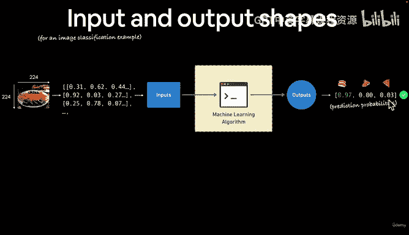

**输入张量形状**
输入图像被表示为一个四维张量，其形状通常为：
`[batch_size, color_channels, height, width]`

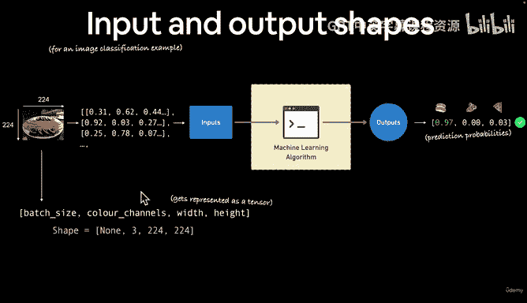

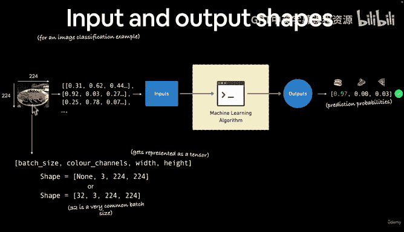

*   **batch_size**：模型一次处理的图像数量。设为 `None` 表示该维度可变，训练时代码会自动填充。`32` 也是一个非常常见且高效的批次大小。
*   **color_channels**：颜色通道数。对于RGB图像，该值为 `3`。
*   **height**：图像高度，例如 `224`。
*   **width**：图像宽度，例如 `224`。

因此，一个具体的输入张量形状可能是 `[32, 3, 224, 224]`，代表一次处理32张224x224的RGB图像。

> **注意**：张量中维度（颜色通道、宽、高）的顺序可能存在不同约定。在PyTorch中，默认顺序是 `[color_channels, height, width]`，但代码可以调整这个顺序。

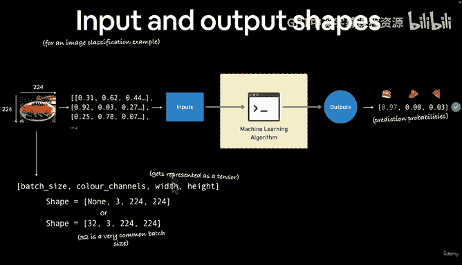

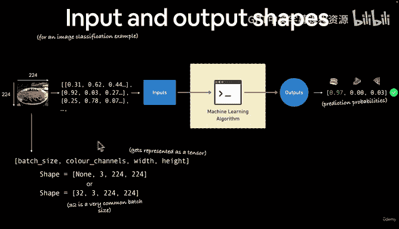

**输出张量形状**
输出是一个二维张量，其形状为：
`[batch_size, num_classes]`

*   **batch_size**：与输入对应的批次大小。
*   **num_classes**：分类问题的类别总数。在我们的例子中有3类食物，所以 `num_classes` 为 `3`。

因此，对于批次大小为32的输入，对应的输出形状为 `[32, 3]`，即模型为32张图片中的每一张都输出了3个类别的预测概率。

> **提示**：输入和输出的具体形状会根据你处理的问题而变化。例如，对于猫狗二分类，输出形状可能是 `[batch_size, 2]` 或 `[batch_size, 1]`。但核心原则不变：将数据编码为数值表示作为输入，输出则是基于类别的预测概率。

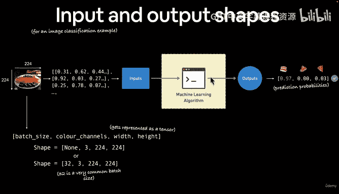

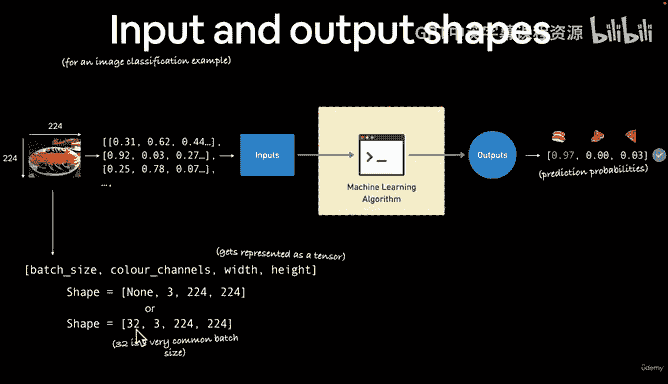

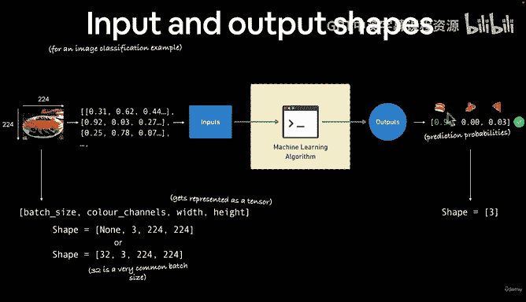

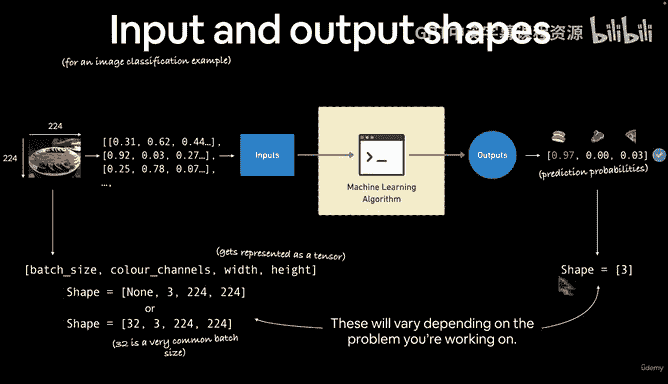

---

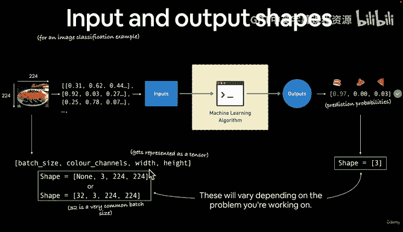

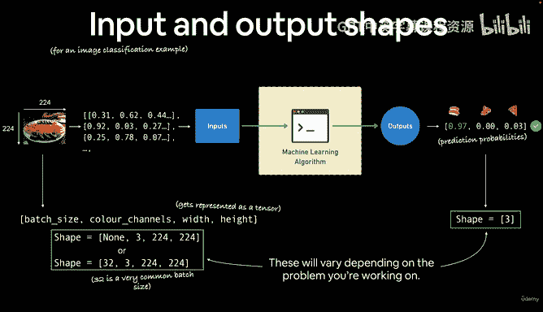

本节课中，我们一起学习了分类问题中输入与输出数据的形状。我们了解到图像输入通常被表示为 `[batch_size, color_channels, height, width]` 形状的张量，而模型输出则是 `[batch_size, num_classes]` 形状的预测概率张量。理解这些形状是使用PyTorch构建和调试模型的重要基础。

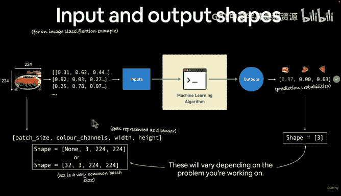

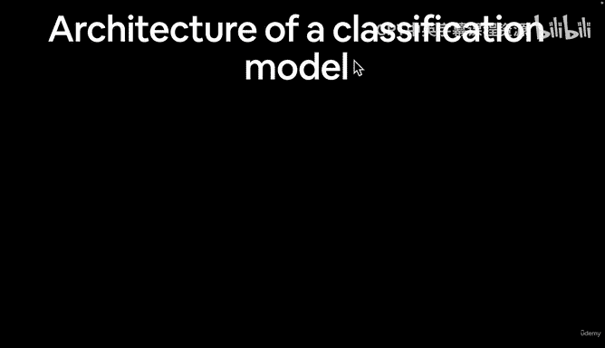

在下一节视频中，我们将在动手编写代码之前，先讨论分类模型的整体架构。