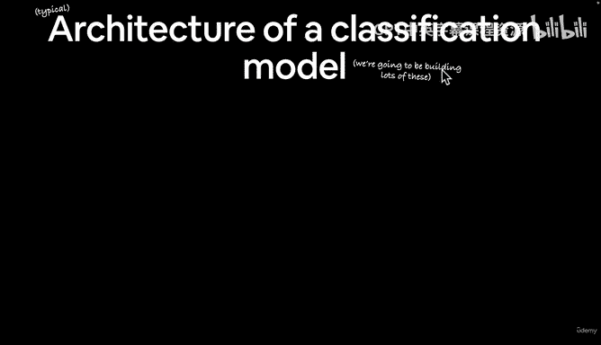
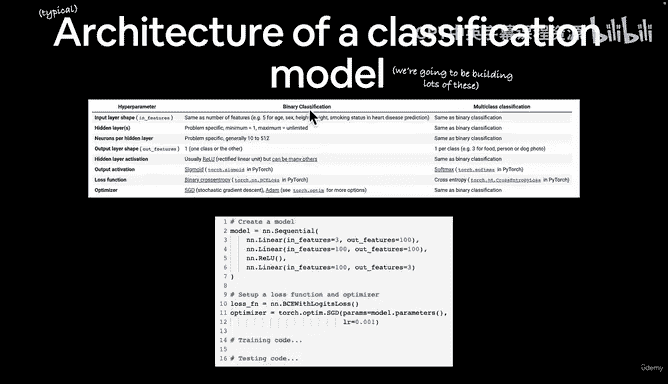
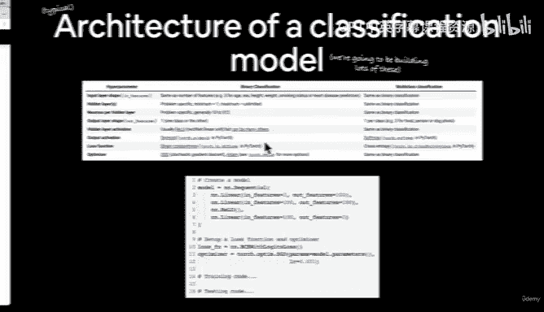
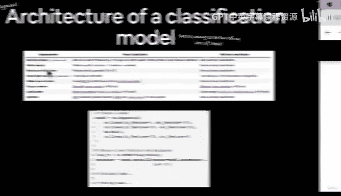
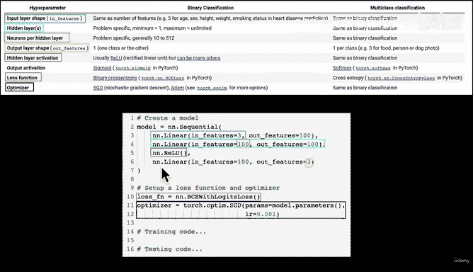
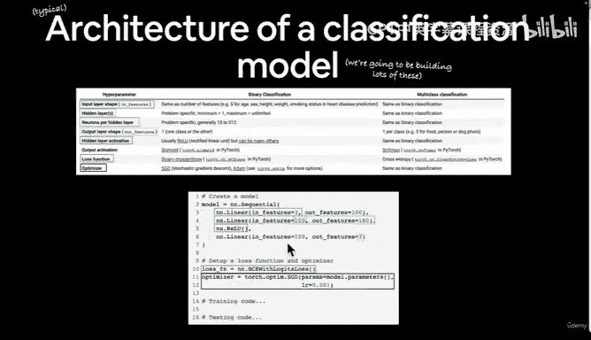
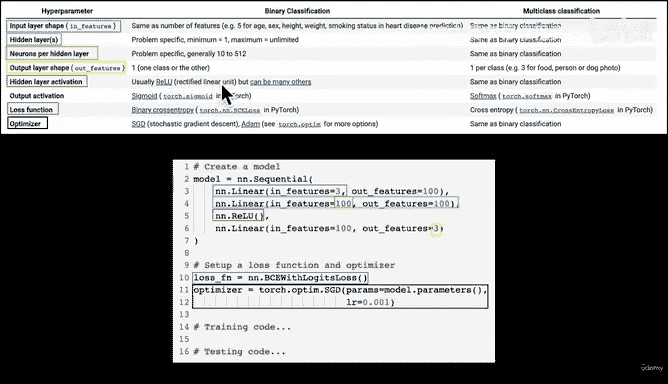
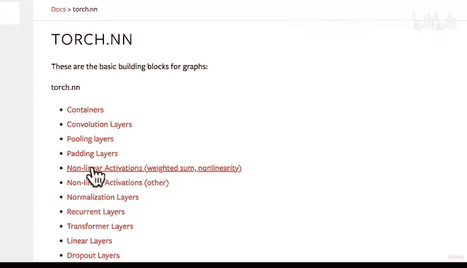
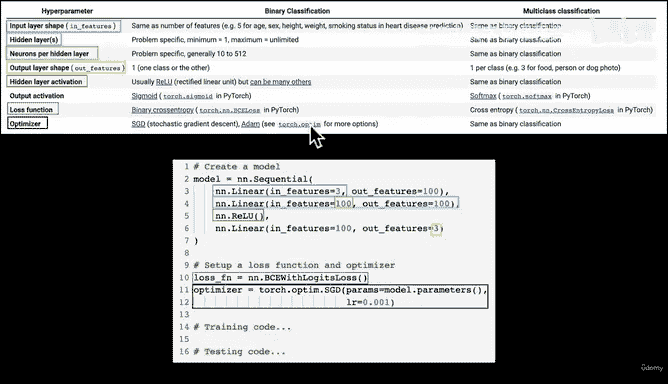
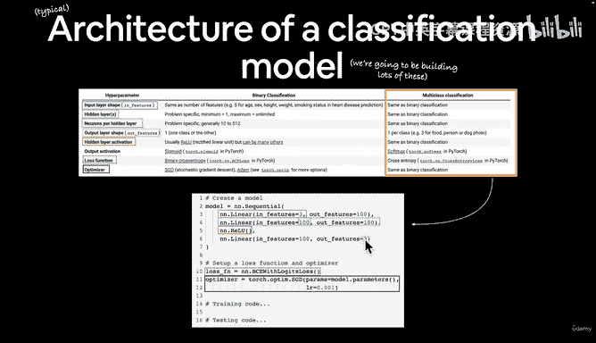

#  67：分类神经网络典型架构概览 🧠

在本节课中，我们将要学习分类神经网络的典型架构。我们将了解其核心组成部分，包括输入层、隐藏层、输出层以及相关的激活函数和损失函数。

欢迎回来。在上一个视频中，我们看了一些分类模型的输入和输出示例。主要结论是，分类模型（尤其是神经网络）的输入需要是某种数值表示形式，而输出通常是某种预测概率。

那么，让我们来讨论分类模型的典型架构。请注意，这目前只是页面上的文字，但我们后续会构建不少这样的模型。

我们这里有一些超参数，包括二分类和多分类。这两种问题类型在我们处理的问题上有一些相似之处，但也存在一些差异。顺便提一下，所有这些内容都来自本课程的书籍版本，其中包含了“什么是分类问题”和“分类神经网络的架构”部分。因此，所有这些文本都可以在 learnptorge.io 的第 2 节中找到。

让我们回到正题。

## 输入层形状

输入层形状通常由 `in_features` 参数决定，如上图所示。它等于特征的数量。

例如，如果我们想预测某人是否患有心脏病，我们可能有五个输入特征，比如年龄（一个数字，例如 28）、性别（男性）、身高（180 厘米，或者更接近 177 厘米）、体重（取决于饮食，大约 75 公斤）和吸烟状况（0 或 1）。我们希望使用数值表示，所以性别可以是 0 代表男性，1 代表女性；身高和体重就是数字本身。这些数字可以更大或更小，非常灵活。这是一个超参数，因为我们需要为每个特征决定其数值。

在我们的图像预测问题中，我们可以设置 `in_features = 3`，代表颜色通道的数量。

## 隐藏层

接下来是隐藏层，即图中的蓝色圆圈。每个隐藏层都是一个 `nn.Linear` 层，通常与 `nn.ReLU` 等激活函数结合使用。在 PyTorch 中，你会看到 `nn.something` 这样的语法来表示一个层。PyTorch 的 `torch.nn` 模块中有许多不同类型的层。

基本上，这里面的所有内容都是神经网络中的一层。如果我们看一个神经网络的结构图：

回想一下，所有这些层都是某种数学运算：输入层、隐藏层。你可以拥有任意数量的隐藏层。例如，ResNet 架构中，有些模型有 50 层。看看这个，这只是 34 层的版本。实际上还有 ResNet-152，它有 152 层。我们目前还没到那个阶段，但正在积累工具以达到那个水平。

让我们回到这里。每个隐藏层的神经元数量由 `out_features` 参数决定，即图中的绿色方块。回到我们的神经网络示意图，这些就是神经元，每个小圆圈代表一个神经元，包含一些参数。如果我们有 100 个神经元，那会是什么样子？我们会有一个相当大的图形。这就是为什么我喜欢用代码教学，因为你可以根据需要灵活定制。在幕后，PyTorch 会为我们创建这 100 个小圆圈，每个圆圈内部都包含某种数学运算。

## 输出层形状

接下来是输出层形状，即我们有多少个输出特征。对于二分类问题，输出特征数量是 1（一个类别或另一个）。对于多分类问题，你可能有三个输出特征，每个类别一个。例如，如果你正在构建一个食物、人物或狗的图片分类模型，输出特征就是三个。

## 隐藏层激活函数

隐藏层激活函数，我们还没有详细讨论过。`ReLU`（修正线性单元）是其中之一，但 PyTorch 还有许多其他非线性激活函数。我们稍后会看到这些。我在这里只是埋下伏笔。我们已经见过线性线是什么样子，但我想让你想象一下非线性线是什么样子。这对于我们的分类问题来说将是一个强大的工具。

## 输出层激活函数

我们这里没有列出输出激活函数，但稍后也会看到。对于二分类，通常是 `Sigmoid`；对于多分类，通常是 `Softmax`。目前这些只是名称，我们还没有具体学习。我喜欢在实际遇到时再讲解，但这只是我们将要涵盖内容的一个概览。

## 损失函数

损失函数的作用是什么？它衡量我们模型的预测与理想预测之间的差异程度。

以下是常见的损失函数选择：
*   对于二分类，我们可能使用 PyTorch 中的 `BCELoss`（二元交叉熵损失）。
*   对于多分类，我们可能使用 `CrossEntropyLoss`（交叉熵损失）。

## 优化器

优化器，例如 `SGD`（随机梯度下降），我们之前已经见过。另一个常见选项是 `Adam` 优化器。当然，`torch.optim` 包中还有更多选项。

这是一个多分类问题的示例网络。我们还没有实际见过 `nn.Sequential`，但你可以想象，`Sequential` 代表按顺序执行这些步骤。多分类之所以有三个输出特征，是因为它要区分多个类别。例如，对于食物、人物或狗的分类，输出特征就是三个。

回到我们的食物视觉问题，输入可能是寿司、牛排或披萨的图片。因此，我们会有三个输出特征，每个图像类别对应一个预测概率。我们有三个类别：寿司、牛排和披萨。

我认为我们已经讨论了足够多的内容，也看了足够多的幻灯片文字。在下一个视频中，让我们开始编写代码吧。我们 Google Colab 见。

---

**总结**

本节课中，我们一起学习了分类神经网络的典型架构。我们介绍了输入层形状、隐藏层、输出层形状、激活函数（如 `ReLU`、`Sigmoid`、`Softmax`）、损失函数（如二元交叉熵和交叉熵）以及优化器（如 `SGD` 和 `Adam`）。这些是构建有效分类模型的基础组件。在接下来的课程中，我们将通过实际编码来应用这些概念。