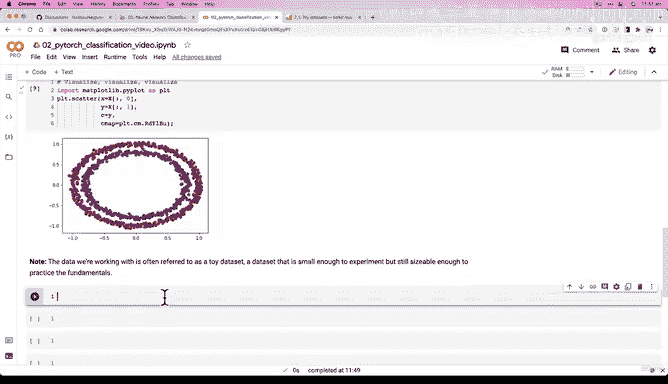

#  68：使用 PyTorch 进行神经网络分类 🧠


在本节课中，我们将学习如何使用 PyTorch 构建一个神经网络来解决分类问题。我们将从零开始，创建一个玩具数据集，探索数据，并理解分类问题的基本输入和输出结构。


---

## 概述

分类问题是预测某个事物属于哪一类别的问题，例如判断一封邮件是否为垃圾邮件，或识别一张图片是猫还是狗。本节课，我们将专注于一个简单的二元分类问题，并使用 PyTorch 构建模型来学习数据中的模式。

---

## 第一步：创建数据

所有机器学习问题都始于数据。我们无法让算法学习不存在的数据模式。因此，我们的第一步是准备数据。在本例中，我们将使用 `scikit-learn` 库创建一个自定义的玩具数据集。

以下是创建数据集的代码：

```python
from sklearn.datasets import make_circles

# 设置样本数量
n_samples = 1000

# 生成圆形数据集
X, y = make_circles(n_samples=n_samples,
                    noise=0.03,
                    random_state=42)
```

我们导入了 `scikit-learn` 库中的 `make_circles` 函数来生成数据。我们创建了 1000 个样本，并添加了一点噪声以增加随机性。`random_state` 参数用于确保结果的可重复性。

---

## 第二步：探索数据

在构建模型之前，我们需要了解数据的基本情况。让我们先查看数据的前几个样本。

以下是查看数据样本的代码：

```python
# 查看前5个特征样本
print("First 5 samples of X:")
print(X[:5])

# 查看前5个标签样本
print("\nFirst 5 samples of y:")
print(y[:5])
```

输出显示，每个样本有两个特征（X1 和 X2）和一个标签（0 或 1）。这是一个二元分类问题，因为标签只有两种可能的值。

---

## 第三步：可视化数据

数字表格难以直观展示数据模式。因此，我们使用图形来可视化数据，以便更好地理解其结构。

以下是可视化数据的代码：

```python
import matplotlib.pyplot as plt

# 创建散点图
plt.scatter(X[:, 0], X[:, 1], c=y, cmap=plt.cm.RdYlBu)
plt.title("Toy Dataset: Circles")
plt.xlabel("Feature X1")
plt.ylabel("Feature X2")
plt.show()
```

可视化结果显示，数据由两个同心圆组成，红色点代表一类，蓝色点代表另一类。我们的目标是构建一个模型，能够根据特征（X1, X2）预测样本属于红色类还是蓝色类。

---

## 第四步：理解问题结构

现在我们已经有了数据，接下来需要明确问题的输入和输出形状，并考虑如何将数据划分为训练集和测试集。

输入形状是特征的数量，输出形状是类别的数量。对于我们的数据集：
- **输入形状**：每个样本有 2 个特征。
- **输出形状**：有 2 个类别（0 和 1）。

在下一节中，我们将讨论如何划分数据，并开始构建神经网络模型。

---

## 总结



本节课中，我们一起学习了如何创建和探索一个用于分类的玩具数据集。我们使用 `scikit-learn` 生成了数据，通过可视化的方式理解了数据的结构，并明确了分类问题的输入和输出形状。在接下来的课程中，我们将基于这些数据构建一个神经网络模型。