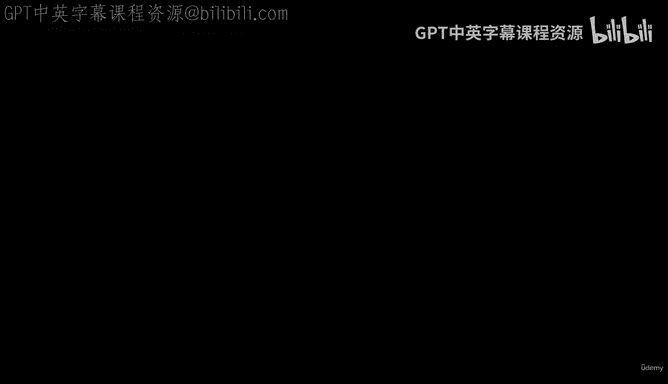
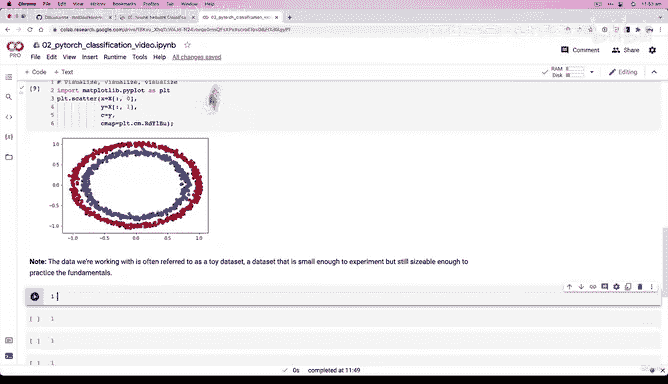
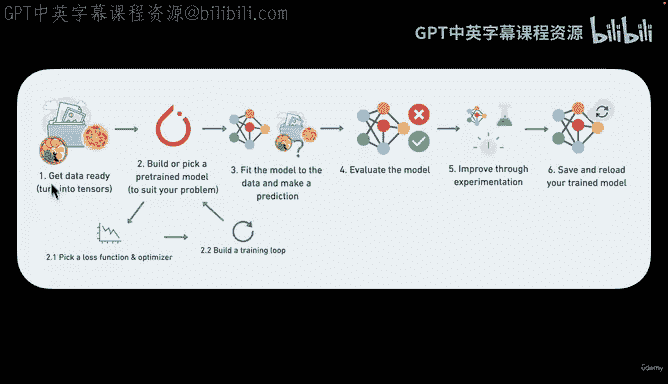
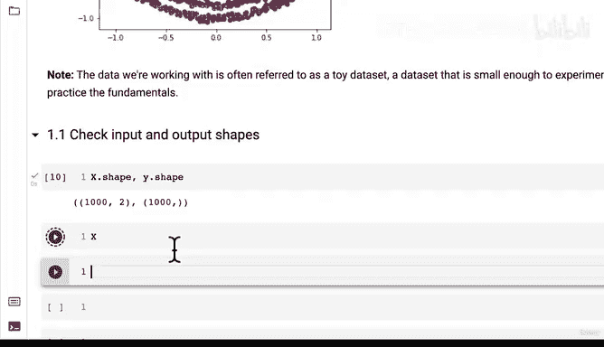
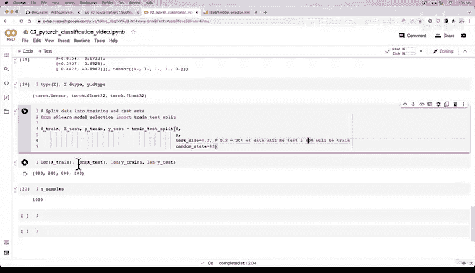
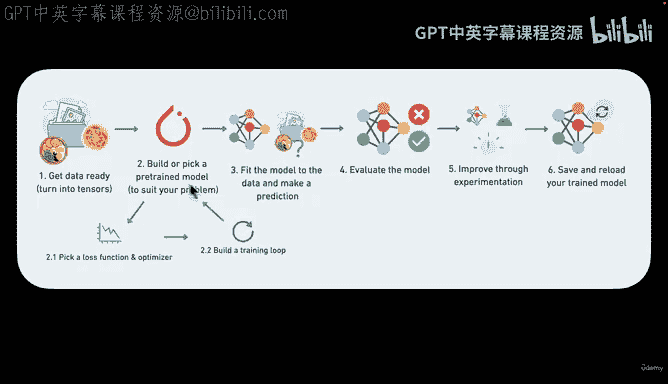
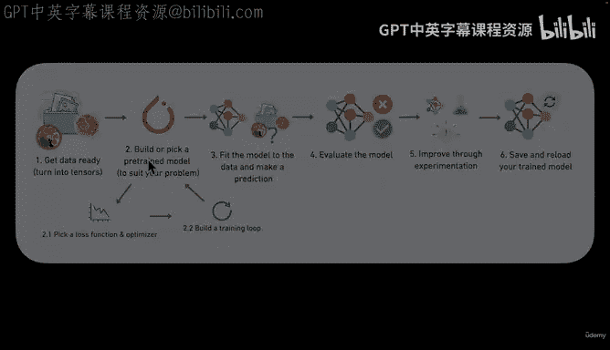

# 69：数据张量化与训练测试集划分 🧠📊





在本节课中，我们将学习如何将数据转换为PyTorch张量，并将其划分为训练集和测试集。这是构建神经网络模型前至关重要的数据准备步骤。



---

## 1.1 检查输入与输出形状 🔍

上一节我们创建了用于分类的模拟数据。本节中，我们首先需要检查数据的输入和输出形状。在机器学习中，张量的输入和输出形状至关重要，因为形状不匹配是导致错误的常见原因。

以下是检查数据形状的代码：




```python
print(f"X的形状: {X.shape}")
print(f"y的形状: {y.shape}")
```

运行上述代码，我们可以看到`X`的形状为`(1000, 2)`，表示有1000个样本，每个样本有2个特征。而`y`的形状为`(1000,)`，表示有1000个对应的标签（标量值）。

为了更清晰地理解，我们可以查看第一个样本的特征和标签：

```python
X_sample = X[0]
y_sample = y[0]
print(f"第一个X样本的值: {X_sample}")
print(f"第一个y样本的值: {y_sample}")
print(f"一个X样本的形状: {X_sample.shape}")
print(f"一个y样本的形状: {y_sample.shape}")
```

输出显示，一个`X`样本包含两个特征值，而一个`y`样本是一个单独的标签数字。这明确了我们的任务：**使用两个特征（X）来预测一个标签（y）**。

---

## 1.2 将数据转换为张量并划分训练/测试集 ⚙️➗

现在我们已经了解了数据形状，接下来需要将NumPy数组转换为PyTorch张量，并创建训练集和测试集。这个流程适用于几乎所有数据集。

首先，确保导入PyTorch并检查版本：

```python
import torch
print(torch.__version__)
```

接着，将数据转换为PyTorch张量。默认情况下，NumPy数组是`float64`类型，而PyTorch的默认类型是`float32`，因此我们需要进行类型转换以避免后续错误。

```python
# 将特征X和标签y转换为PyTorch张量，并指定数据类型为torch.float32
X = torch.from_numpy(X).type(torch.float)
y = torch.from_numpy(y).type(torch.float)

# 查看转换后的前几个值
print(X[:5])
print(y[:5])
# 检查数据类型
print(f"X的数据类型: {X.dtype}")
print(f"y的数据类型: {y.dtype}")
```

数据成功转换为张量后，下一步是将其划分为训练集和测试集。我们将使用Scikit-learn库中的`train_test_split`函数来实现随机划分。

以下是划分数据的步骤：

1.  从`sklearn.model_selection`导入`train_test_split`。
2.  指定测试集的比例（例如20%）。
3.  设置`random_state`参数以确保每次划分结果一致，便于复现。

```python
from sklearn.model_selection import train_test_split

# 将数据划分为训练集和测试集
X_train, X_test, y_train, y_test = train_test_split(X,
                                                    y,
                                                    test_size=0.2, # 20%的数据作为测试集
                                                    random_state=42) # 设置随机种子以保证结果可复现
```

划分完成后，我们可以检查各数据集的样本数量：

```python
print(f"训练特征样本数: {len(X_train)}")
print(f"测试特征样本数: {len(X_test)}")
print(f"训练标签样本数: {len(y_train)}")
print(f"测试标签样本数: {len(y_test)}")
```

根据输出，1000个总样本被划分为800个训练样本和200个测试样本，这与我们设定的20%测试比例相符。

---

## 总结 📝

本节课中我们一起学习了数据准备流程中的两个核心步骤：
1.  **数据张量化**：将NumPy数组转换为PyTorch张量，并统一数据类型（`float32`）。
2.  **数据集划分**：使用`train_test_split`函数将数据随机划分为训练集和测试集，并设置`random_state`以确保结果可复现。







现在，我们的数据已经以张量的形式准备好，并被合理地划分为用于模型训练和评估的两部分。在下一节课中，我们将利用这些数据开始构建我们的神经网络模型。