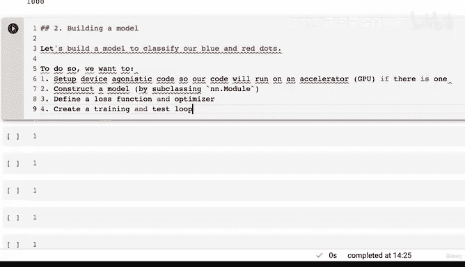
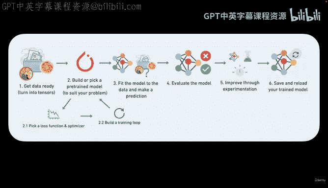
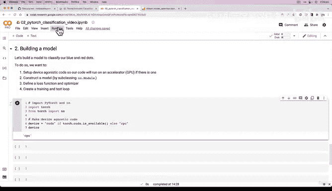
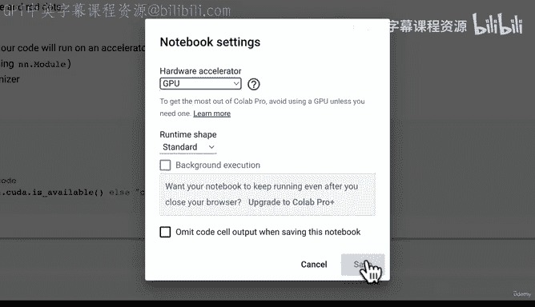
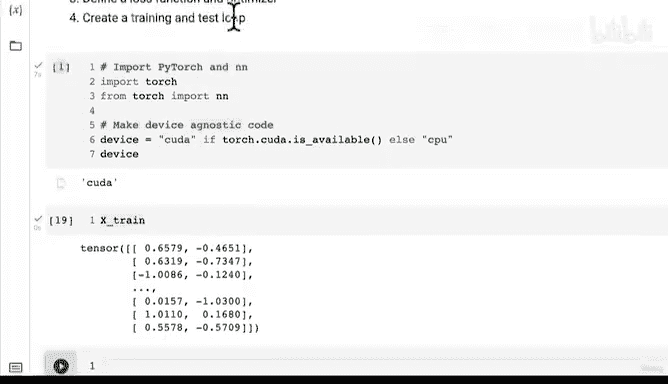

# 70：建模步骤规划与设备无关代码配置 🚀


## 概述

在本节课中，我们将开始构建一个用于分类红蓝圆点的PyTorch模型。我们将首先规划建模的核心步骤，并重点学习如何编写“设备无关”的代码，以确保我们的模型能在CPU或GPU上无缝运行。

## 从数据到模型

上一节我们完成了数据的准备，将数据分割为训练集和测试集。我们采用了80-20的比例，因此大约有800个样本用于训练，200个样本用于测试。训练集的目的是让模型学习数据中的模式，即代表红点和蓝点的模式。测试集则用于评估这些学习到的模式。

在开始构建模型之前，我需要重新连接我的笔记本环境。我们可以通过运行之前的所有单元格来实现，这不会花费太长时间，因为我们尚未进行任何大型计算。

现在，我们进入第二部分：**构建模型**。虽然步骤不少，但都是我们之前接触过的内容。我们将逐步分解。

## 建模步骤规划

我们的目标是构建一个模型来分类我们的蓝点和红点。为此，我们需要处理张量数据。

以下是构建模型的主要步骤：

1.  **设置设备无关代码**：养成编写此代码的习惯，以确保我们的代码能在加速器（如GPU）上运行。
2.  **构建模型**：通过子类化 `nn.Module` 来构造我们的模型。正如我们在上一节所见，所有PyTorch模型都应继承自 `nn.Module`。
3.  **定义损失函数和优化器**：选择适合我们问题的损失函数和优化算法。
4.  **创建训练和测试循环**：这部分内容可能会在下一节重点展开，本节课我们专注于模型构建。

所有这些步骤都遵循一个通用的机器学习工作流程：选择或构建一个适合你问题的模型，选择损失函数和优化器，然后构建训练循环。

## 实施设备无关代码

让我们开始第一步。首先导入必要的库。



```python
import torch
from torch import nn
```



接下来，我们设置设备无关代码。这意味着代码会自动检测是否有可用的GPU（CUDA），并优先使用它进行计算；如果没有，则回退到CPU。

```python
# 设置设备
device = "cuda" if torch.cuda.is_available() else "cpu"
print(f"Using device: {device}")
```

运行这段代码后，如果当前环境没有设置GPU，`device` 变量将会是 `"cpu"`。

为了演示GPU的设置，我们可以更改运行环境。在运行时菜单中选择“更改运行时类型”，然后选择GPU并保存。这会重启运行时并重新连接。



重启后，我们需要重新运行之前定义数据（如 `X_train`）的单元格。我们可以选择“运行所有”或“运行之前”的单元格。



一旦环境重新连接并运行了设备设置代码，`device` 变量现在应该显示为 `"cuda"`，表明我们正在使用GPU。这样，我们就成功配置了设备无关的代码。

## 总结

本节课我们一起学习了构建PyTorch模型的初步规划，并重点实践了如何编写设备无关的代码。我们通过 `torch.cuda.is_available()` 来检测GPU可用性，并据此设置计算设备，这是确保代码在不同硬件环境下可移植性的重要一步。



在下一节中，我们将基于这个设备设置，正式开始构建我们的分类模型。