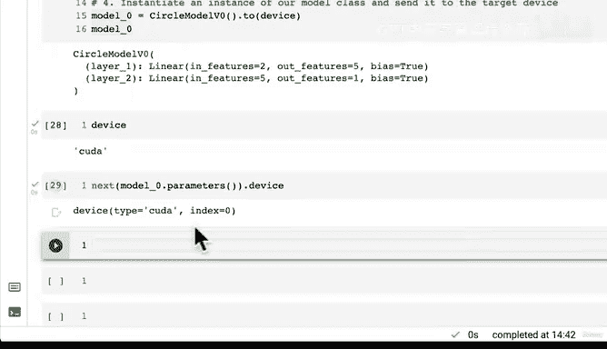

# 71：编写处理分类数据的小型神经网络 🧠


在本节课中，我们将学习如何构建一个能够处理分类数据的小型神经网络。我们将通过子类化 `nn.Module` 来创建模型，定义其前向传播过程，并将其部署到目标设备上。

---

## 概述

上一节我们设置了设备无关的代码，这为后续将模型和数据发送到目标设备（如GPU）奠定了基础。本节中，我们将具体构建一个用于分类的神经网络模型。

## 构建模型

现在我们已经设置了设备无关的代码，接下来让我们创建一个模型。我们将把这个过程分解为几个子步骤。

以下是构建模型的具体步骤：

1.  子类化 `nn.Module`。
2.  创建两个能够处理数据形状的 `nn.Linear` 层。
3.  定义一个 `forward` 方法，以描述模型的前向计算过程。
4.  实例化我们的模型类，并将其发送到目标设备。

### 1. 子类化 `nn.Module`

在 PyTorch 中，几乎所有模型都是通过子类化 `nn.Module` 来创建的，因为它为我们处理了许多幕后的重要工作。

### 2. 创建线性层

我们需要创建两个 `nn.Linear` 层，它们必须能够处理我们数据的形状。

首先，查看我们的训练数据 `X_train` 的形状。我们有 800 个训练样本，每个样本包含 2 个特征。因此，输入特征的数量是 2。

第一个线性层（`layer1`）的 `in_features` 应为 2。`out_features` 我们暂时设为 5。这个数字是任意的，可以理解为隐藏单元的数量。增加隐藏特征的数量，模型就有更多机会学习数据中的模式。

第二个线性层（`layer2`）的 `in_features` 必须与第一个层的 `out_features` 匹配，即 5。而它的 `out_features` 应设为 1，以匹配我们的目标 `y` 的形状（一个标量值）。

`nn.Linear` 层执行的函数可以用以下公式表示：
**`output = input * weight^T + bias`**

### 3. 定义前向传播方法

`forward` 方法定义了模型的前向计算或前向传播过程。它接收输入数据 `x`，并规定数据如何流经各层。

在我们的模型中，数据 `x` 首先进入 `layer1`，然后 `layer1` 的输出进入 `layer2`，最后 `layer2` 产生最终输出。

### 4. 实例化模型并发送到设备

创建模型类的一个实例，并利用之前设置的设备无关代码，将其参数发送到目标设备（如 GPU）上，以加速计算。

## 代码实现

让我们将上述步骤转化为代码。我们将模型命名为 `CircleModelV1`，因为我们的目标是分离红色和蓝色的圆圈数据点。

```python
import torch
from torch import nn

# 假设 device 已根据可用性设置为 “cuda” 或 “cpu”
device = torch.device("cuda" if torch.cuda.is_available() else "cpu")

class CircleModelV1(nn.Module):
    def __init__(self):
        super().__init__()
        # 创建两个线性层
        self.layer1 = nn.Linear(in_features=2, out_features=5)  # 从2个特征扩展到5个
        self.layer2 = nn.Linear(in_features=5, out_features=1)  # 从5个特征映射到1个输出

    def forward(self, x):
        # 定义前向传播：x -> layer1 -> layer2
        return self.layer2(self.layer1(x))

# 实例化模型并发送到目标设备
model_0 = CircleModelV1().to(device)

# 检查模型参数所在的设备
print(next(model_0.parameters()).device)  # 应输出 ‘cuda:0’ 或 ‘cpu’
```



## 总结

本节课中，我们一起学习了如何构建一个用于分类任务的小型神经网络。我们通过子类化 `nn.Module` 创建了模型类，定义了其层结构和前向传播逻辑，并最终将模型部署到了合适的计算设备上。这个过程是构建更复杂深度学习模型的基础。在下一节中，我们将对这个模型进行可视化，以更直观地理解其内部的数据流动。