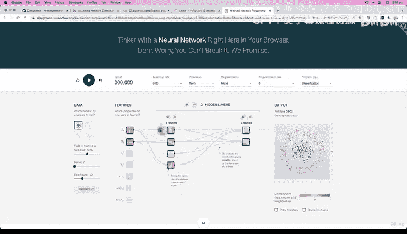
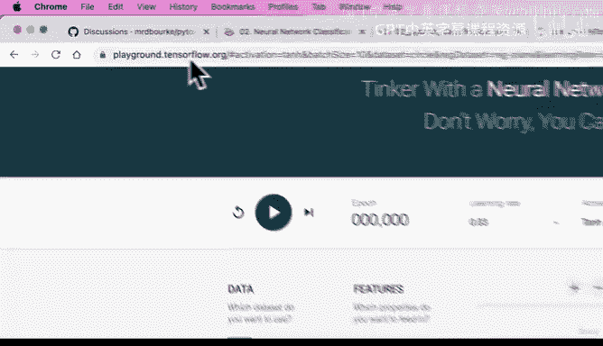
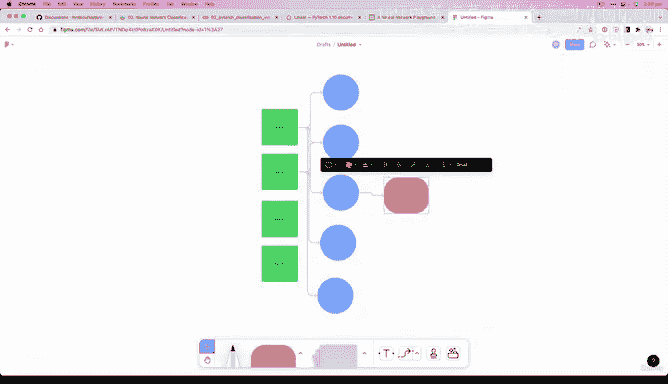

# 72：神经网络可视化 🧠


在本节课中，我们将学习如何将上一节创建的神经网络代码转化为直观的视觉表示。我们将通过一个在线工具来可视化网络结构，并理解其内部数据流动过程。

---




上一节我们介绍了如何用代码构建一个多层神经网络。本节中我们来看看如何将这个抽象的代码结构可视化，以便更好地理解其工作原理。

我们创建的第一个多层神经网络目前只是页面上的代码。然而，这确实是使用 PyTorch 构建机器学习模型的主要形式：创建若干层（可简单可复杂），然后在某种形式的前向传播计算中使用这些层。



为了让理解更直观，我们可以借助 TensorFlow Playground 这个工具。TensorFlow 是另一个类似于 PyTorch 的深度学习框架。这个工具允许你编写类似的代码来构建神经网络，将模型拟合到某种数据中以发现模式，然后将这些机器学习模型用于你的应用程序。

以下是访问地址：
> playground.tensorflow.org

这是一个可以在浏览器中训练的神经网络，非常酷。我们这里有一个数据集，它类似于我们正在处理的数据。例如，我们的“圆圈1”数据集，可以说它足够接近——它是圆形的，这正是我们想要的。

如果我们增加这里的神经元数量，现在有 5 个神经元。这里有两个特征 X1 和 X2。这让你想起了什么？这里有很多我们尚未涉及的内容，但暂时不必担心。我们只关注这里的神经网络结构。

我们有一些特征作为输入，还有 5 个隐藏单元。这正是我们刚刚构建的模型所发生的情况：我们传入 x1 和 x2 的值。回到我们的数据集，这些就是 x1 和 x2。我们将它们传入，所以有两个输入特征，然后将它们传递到一个隐藏层——一个包含 5 个神经元的单隐藏层。

我们刚刚构建了什么？查看我们的模型代码：
```python
# 一层：输入特征2，输出特征5
self.layer_1 = nn.Linear(in_features=2, out_features=5)
# 二层：输入特征5，输出特征1
self.layer_2 = nn.Linear(in_features=5, out_features=1)
```
这与我们在 Playground 中构建的模型完全相同。

现在，让我们暂时将激活函数切换回线性，因为我们目前坚持使用线性。我们稍后会研究不同形式的激活函数。也许我们已经将学习率设置为 0.01，这里有训练轮数（epochs），任务是分类。我们将尝试让这个神经网络拟合这些数据。让我们看看会发生什么。

测试损失大约在中间位置，0.5，即大约 50% 的损失。如果我们只有两个类别，损失为 50% 意味着什么？完美损失是 0，最差损失是 1。我们只是将 1 除以 2 得到 50%。但我们只有两个类别。这意味着如果我们的模型只是随机猜测，它将获得大约 0.5 的损失，因为你可以随机猜测任何数据点属于蓝色还是橙色（在本例中）。

在二分类问题中，如果每个类别（本例中的蓝点和橙点）的样本数量相同，随机猜测的正确率大约为 50%，就像抛硬币一样。抛硬币 100 次，你大约会得到 50/50 的结果，可能略有不同，但从长远来看大致如此。

我们刚刚拟合了 3000 个轮次，损失仍然没有任何改善。我想知道我们的神经网络是否也会出现这种情况。

为了以不同的方式绘制这个网络，我将使用一个名为 Figjam 的小工具，它只是一个我们可以在上面放置形状的白板，并且基于浏览器。所以这不会很花哨，它将是一个简单的图表。

假设这是我们的输入（用绿色表示，因为我最喜欢的颜色是绿色）。然后我们将有一些不同颜色的点。这里可以是一个蓝点（点 1），那里是另一个点（点 2）。我们正在这里构建一个神经网络，这正是我们刚刚构建的。让我们把这个标记为输入 X1，这样更有意义。然后复制这个作为 X2。接着我们会有某种形式的输出（用橙色表示）。

你可以想象这里的连接点：它们会连接起来。我们的输入将经过所有这些点。虽然画起来可能有点复杂，但这没关系。这就是我们所做的：这里有两个输入特征。如果我们想继续画这些连接，我们可以。所有这些输入特征都将经过我们刚刚绘制的所有隐藏单元（同样的箭头画了两次，这没关系）。但这就是前向传播计算中发生的情况。

当我们用代码实现时，可能会有点令人困惑。为什么？从这里看，我们似乎只有一个输入层、一个蓝色的单隐藏层和一个输出层。但实际上，这是完全相同的形状。你明白了要点：所有这些都连接到输出。不过，我们稍后会从计算角度看到这一点。

无论你处理什么数据集，你都必须构建某种形式的输入层。如果你有 10 个特征，这里可能有 10 个输入；如果你有 4 个特征，就有 4 个。然后，如果你想调整这些，你可以增加隐藏单元的数量或某一层的输出特征数量。需要记住的是，传入的层必须具有与这里传出的内容相似的形状。

在我们的案例中，我们只有一个输出，所以输出在这里。

这是一个视觉版本。我们使用了 TensorFlow Playground。你可以用它来探索和调整。例如，你可能想要 5 个隐藏层，每层 5 个神经元。这是一种有趣的探索方式。

**这里有一个挑战**：访问 playground.tensorflow.org，复制这个网络，看看它是否能拟合这类数据。你认为它会成功吗？我们将在接下来的几个视频中找出答案。



在下一个视频中，我将向你展示另一种创建我们刚刚构建的网络的方法，使用的代码甚至比之前更少。我们下个视频见。

---

本节课中我们一起学习了如何将神经网络代码可视化。我们利用 TensorFlow Playground 工具直观地看到了网络的结构（输入层、隐藏层、输出层）以及数据流动的方向。我们还理解了在二分类问题中 50% 损失的含义，并动手尝试了调整网络参数。可视化是理解复杂模型的有力工具，能帮助我们更好地设计和调试神经网络。