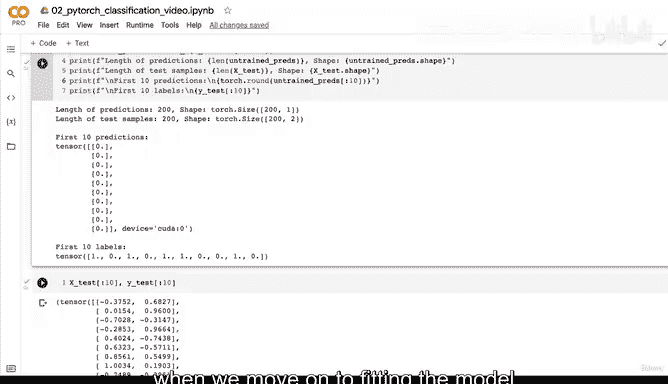
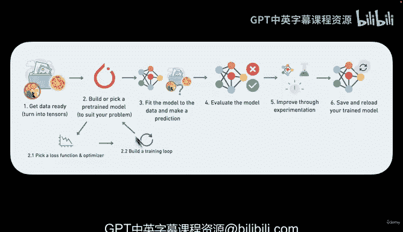

# 73：使用nn.Sequential重构模型与探索内部机制 🔍


在本节课中，我们将学习如何使用PyTorch的`nn.Sequential`模块来重构之前创建的神经网络模型，并深入探索模型内部的参数结构。我们将比较`nn.Sequential`与子类化`nn.Module`两种构建模型方式的异同，并理解模型初始化时随机参数的含义。

---

## 概述

上一节我们通过子类化`nn.Module`创建了一个名为`CircleModelV0`的简单神经网络。该模型包含两个线性层，用于处理我们的二分类圆形数据。本节中，我们将看看如何使用更简洁的`nn.Sequential`方法来构建相同的模型，并借此机会探索模型内部的权重和偏置参数。

## 使用nn.Sequential重构模型

`nn.Sequential`提供了一种按顺序堆叠层的简单方式来构建模型。对于结构简单的网络，这比子类化`nn.Module`更加便捷。

以下是使用`nn.Sequential`重构我们之前模型的代码：

```python
model_0 = nn.Sequential(
    nn.Linear(in_features=2, out_features=5),
    nn.Linear(in_features=5, out_features=1)
).to(device)
```

这段代码创建了一个与我们之前`CircleModelV0`功能完全相同的模型。第一层将2个输入特征映射到5个特征，第二层再将这5个特征映射到1个输出特征。

## 两种构建方式的对比

现在，让我们对比一下两种构建模型的方式。

*   **`nn.Sequential`**：优点是代码简洁，适用于按顺序执行各层的简单网络。它自动处理了前向传播的逻辑。
*   **子类化`nn.Module`**：优点是灵活性高。当网络需要更复杂的前向传播逻辑（例如跳跃连接、条件分支）时，必须使用这种方法。我们从子类化开始学习，是为了理解模型构建的基础原理。

实际上，我们也可以在子类化`nn.Module`的内部使用`nn.Sequential`来组织层，结合两者的优点：

```python
class CircleModelV0(nn.Module):
    def __init__(self):
        super().__init__()
        self.two_linear_layers = nn.Sequential(
            nn.Linear(in_features=2, out_features=5),
            nn.Linear(in_features=5, out_features=1)
        )

    def forward(self, x):
        return self.two_linear_layers(x)
```

这体现了PyTorch的灵活性：构建模型有多种途径，你可以根据复杂度和清晰度选择最适合的一种。

## 探索模型内部参数

构建好模型后，我们可以查看其内部的权重和偏置参数。这些参数在模型初始化时被随机设置，并将在后续的训练过程中通过优化器进行调整。

使用以下代码可以查看模型的状态字典：

```python
print(model_0.state_dict())
```

输出将显示类似以下的内容：

```
OrderedDict([('0.weight', tensor([[...]])),
             ('0.bias', tensor([...])),
             ('1.weight', tensor([[...]])),
             ('1.bias', tensor([...]))])
```

以下是关于这些参数的说明：

*   **`0.weight`**：对应第一层（索引0）的权重矩阵。其形状为`(5, 2)`，因为该层有5个神经元，每个神经元接收2个输入。`2 * 5 = 10`，所以共有10个权重值。
*   **`0.bias`**：对应第一层的偏置向量。其形状为`(5,)`，每个神经元有一个偏置。
*   **`1.weight` 和 `1.bias`**：对应第二层的权重（形状`(1, 5)`）和偏置（形状`(1,)`）。

这些随机初始化的参数是模型训练的起点。试想一下，如果我们的网络有50层，每层128个神经元，手动管理所有这些参数将是不可行的。PyTorch在幕后为我们自动创建并管理了这些参数，这正是其强大之处。

## 使用未训练模型进行预测

现在，让我们用这个尚未训练的模型在测试数据上进行预测，以观察其初始性能。

我们需要确保数据和模型在同一个设备上（例如CPU或GPU），并使用推理模式来禁用梯度计算以提升效率。

```python
model_0.eval()
with torch.inference_mode():
    untrained_preds = model_0(X_test)
```

查看前10个预测值和对应的真实标签：

```python
print(f"First 10 predictions:\n{torch.round(untrained_preds[:10])}")
print(f"First 10 test labels:\n{y_test[:10]}")
```

你可能会发现，预测值（经过四舍五入后可能全是0或1）与真实标签`y_test`（值为0或1）完全不匹配，甚至不在同一个范围内（原始预测值是浮点数）。这是因为模型的参数是随机的，它还没有从数据中学到任何规律。在二分类问题中，一个随机模型大约有50%的准确率，就像抛硬币一样。

这个练习的关键在于：**模型的预测需要与标签的格式（数据类型和形状）一致**。我们将在后续课程中通过损失函数、优化器和训练循环来调整模型参数，使其预测逐渐逼近真实标签。

---

## 总结

本节课中我们一起学习了：
1.  使用 **`nn.Sequential`** 快速构建顺序神经网络模型。
2.  对比了 **`nn.Sequential`** 与 **子类化`nn.Module`** 两种方法的适用场景与优劣。
3.  探索了模型内部的 **权重（weight）** 和 **偏置（bias）** 参数，理解了它们如何根据网络结构自动初始化。
4.  使用未训练的模型进行预测，观察到随机参数导致预测结果不准确，这引出了对模型训练的需求。





下一节，我们将为模型选择合适的损失函数和优化器，并构建一个完整的训练循环，开始让我们的模型从数据中学习。