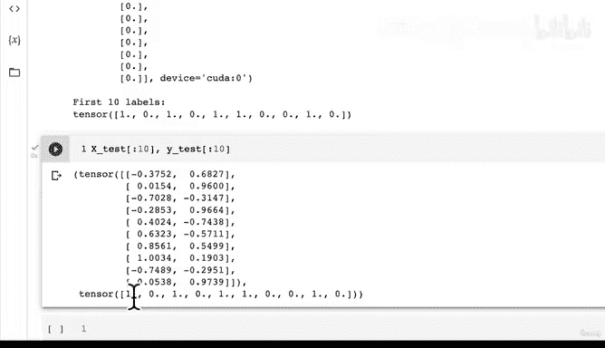
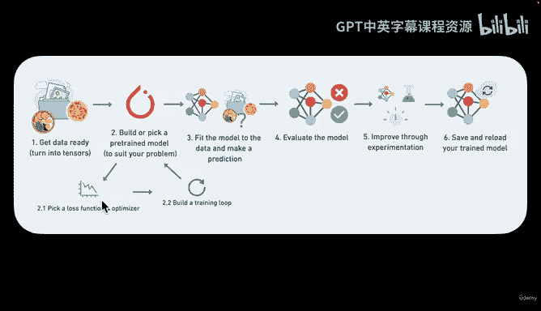

# 74：分类网络的损失函数、优化器与评估函数 🧠






在本节课中，我们将学习如何为分类神经网络选择合适的损失函数和优化器，并创建一个评估模型性能的准确率函数。上一节我们构建了一个简单的线性分类模型，本节我们将为其配备必要的训练组件。

## 设置损失函数与优化器

我们已经构建了模型。现在需要为其选择损失函数和优化器。损失函数衡量模型预测的错误程度，而优化器则根据损失来更新模型的参数。

损失函数和优化器的选择取决于具体问题。例如：
*   对于**回归问题**（预测数值），常用**平均绝对误差**或**均方误差**。
*   对于**分类问题**（预测类别），常用**二元交叉熵**或**交叉熵**。

我们当前处理的是二元分类问题，因此将使用二元交叉熵损失。

以下是PyTorch中一些常见的损失函数和优化器示例：

| 问题类型 | 损失函数 (PyTorch) | 优化器 (PyTorch) |
| :--- | :--- | :--- |
| 回归 | `nn.L1Loss()`, `nn.MSELoss()` | `torch.optim.SGD`, `torch.optim.Adam` |
| 二元分类 | `nn.BCEWithLogitsLoss()` | `torch.optim.SGD`, `torch.optim.Adam` |
| 多类分类 | `nn.CrossEntropyLoss()` | `torch.optim.SGD`, `torch.optim.Adam` |

## 实现损失函数：`BCEWithLogitsLoss`

我们将使用 `torch.nn.BCEWithLogitsLoss()`。这个损失函数将Sigmoid激活函数和二元交叉熵损失结合在一个类中，比单独使用Sigmoid层再计算BCE损失在数值上更稳定。

```python
# 设置损失函数
loss_fn = torch.nn.BCEWithLogitsLoss()
```

## 实现优化器：随机梯度下降

对于优化器，我们选择经典的随机梯度下降。我们需要告诉优化器要更新哪些参数（即模型的参数），并设置一个学习率。

```python
# 设置优化器
optimizer = torch.optim.SGD(params=model.parameters(), lr=0.1)
```

## 创建评估函数：准确率

对于分类问题，准确率是一个直观的评估指标。它表示模型预测正确的样本占总样本的比例。

准确率的计算公式可以表示为：
`准确率 = (正确预测的样本数 / 总样本数) * 100%`

以下是使用PyTorch实现准确率计算的函数：

```python
def accuracy_fn(y_true, y_pred):
    """计算预测准确率（百分比）"""
    correct = torch.eq(y_true, y_pred).sum().item()
    acc = (correct / len(y_pred)) * 100
    return acc
```

这个函数的工作原理是：
1.  使用 `torch.eq` 比较真实标签 `y_true` 和预测标签 `y_pred`，得到一个布尔值张量。
2.  对布尔值张量求和（`True` 计为1，`False` 计为0），得到正确预测的总数。
3.  将正确预测数除以总样本数，再乘以100，得到百分比形式的准确率。


## 总结

本节课中，我们一起学习了为分类模型配置核心训练组件：
1.  **损失函数**：我们选择了 `BCEWithLogitsLoss`，它专为二元分类设计，并内置了Sigmoid激活函数。
2.  **优化器**：我们使用了随机梯度下降优化器，它将根据损失自动调整模型参数。
3.  **评估函数**：我们创建了 `accuracy_fn` 函数，用于在训练过程中监控模型的预测准确率。

现在，我们已经拥有了模型、损失函数、优化器和评估指标。在接下来的课程中，我们将把这些组件整合到一个训练循环中，开始训练我们的分类模型。