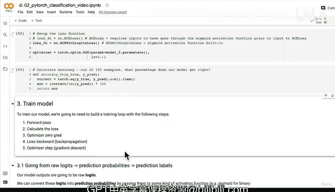

#  75：从模型逻辑值到预测概率与标签 📊➡️🎯


在本节课中，我们将学习如何将模型的原始输出（逻辑值）转换为预测概率，并最终得到预测标签。这是评估分类模型性能的关键步骤。

上一节我们讨论了分类模型的不同损失函数选项。本节中，我们来看看如何构建一个训练循环，并理解模型输出转换的具体过程。

## 概述：模型输出的转换流程

为了评估我们的模型，我们需要将模型的原始输出转换为可以与真实标签进行比较的格式。这个过程分为三个步骤：

1.  **逻辑值**：模型的原始输出。
2.  **预测概率**：通过激活函数（如Sigmoid）将逻辑值转换为概率值。
3.  **预测标签**：对概率值进行四舍五入或取最大值，得到最终的类别标签。

以下是实现这一流程的具体步骤。

## 1. 理解逻辑值

在机器学习和深度学习中，模型的原始输出被称为**逻辑值**。它尚未经过任何激活函数的处理。

```python
# 获取模型在测试数据上的原始输出（逻辑值）
with torch.inference_mode():
    y_logits = model_0(X_test.to(device))
```

逻辑值是模型线性层计算的结果。对于一个线性层，其背后的数学公式是：
**`y = x * W^T + b`**
其中 `W` 是权重，`b` 是偏置项。

## 2. 转换为预测概率

为了将逻辑值转化为易于解释的概率（通常在0到1之间），我们需要使用激活函数。

*   对于**二元分类**问题，我们使用 **Sigmoid** 激活函数。
*   对于**多类分类**问题，我们使用 **Softmax** 激活函数。

```python
# 使用Sigmoid函数将逻辑值转换为预测概率
y_pred_probs = torch.sigmoid(y_logits)
```

现在，`y_pred_probs` 中的每个值都代表了模型认为该样本属于类别1（例如“红点”）的概率。

## 3. 转换为预测标签

得到预测概率后，我们需要一个决策边界来将其转换为具体的类别标签。

对于二元分类，通常的规则是：
*   如果预测概率 **≥ 0.5**，则预测标签为 **1**。
*   如果预测概率 **< 0.5**，则预测标签为 **0**。

我们可以使用 `torch.round()` 函数自动实现这个四舍五入的过程。

```python
# 将预测概率四舍五入，得到预测标签
y_pred_labels = torch.round(y_pred_probs)
```

你也可以将步骤2和3合并为一行代码：

```python
y_pred_labels = torch.round(torch.sigmoid(model_0(X_test.to(device))))
```

为了验证我们分步计算的结果与合并计算的结果一致，可以进行如下检查：

```python
# 检查两种方式得到的预测标签是否相同
print(torch.eq(y_pred_labels.squeeze(), y_pred_labels_combined.squeeze()))
```
这里使用 `.squeeze()` 是为了移除张量中多余的维度，确保形状一致以便比较。

## 总结与下一节预告

本节课中我们一起学习了模型输出的完整转换流程：从**逻辑值**到**预测概率**，再到**预测标签**。理解这个过程对于正确计算损失和评估模型准确率至关重要。



目前，由于模型参数是随机初始化的，我们的预测结果还很差。但这为我们搭建训练循环做好了准备。下一节，我们将把这些步骤整合到完整的PyTorch训练与测试循环中，遵循“前向传播 -> 计算损失 -> 梯度清零 -> 反向传播 -> 优化器更新”的步骤，开始真正地训练我们的模型。