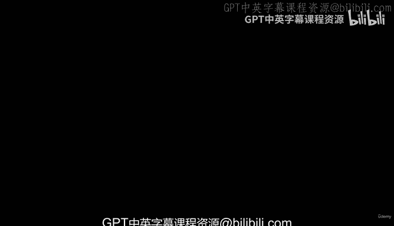
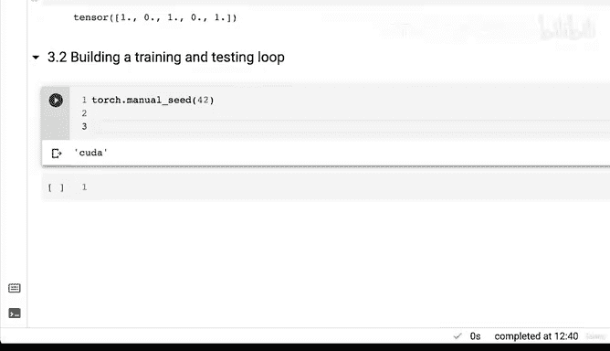
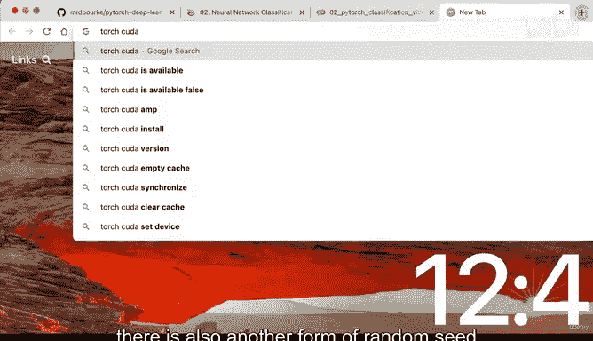
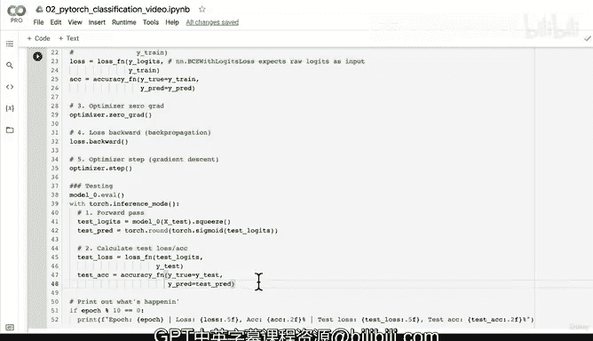

# 76：编写分类模型的训练、测试与优化循环 🚀



在本节课中，我们将学习如何为一个分类问题编写完整的训练、测试和优化循环。我们将从模型的前向传播开始，计算损失和准确率，然后通过反向传播和优化器步骤来更新模型参数。

---

## 概述

上一节我们介绍了如何将模型的原始输出（logits）通过激活函数（如sigmoid）转换为预测概率和标签。本节中，我们将把这些概念整合起来，编写一个完整的训练和测试循环，以训练我们的第一个分类模型。

---

## 设置环境与数据





首先，我们需要确保代码的可重复性，并将数据移动到正确的设备上（例如GPU）。

```python
import torch

# 设置随机种子以确保结果可重复
torch.manual_seed(42)
# 如果使用CUDA设备，也设置CUDA的随机种子
torch.cuda.manual_seed(42)

# 设置训练轮数
epochs = 100

# 将数据移动到目标设备（例如GPU）
X_train, y_train = X_train.to(device), y_train.to(device)
X_test, y_test = X_test.to(device)
```

---

## 构建训练与评估循环

以下是构建训练和评估循环的核心步骤。我们将逐步实现每个部分。

### 1. 前向传播与预测

在训练循环中，我们首先进行前向传播，获取模型的原始输出（logits），然后将其转换为预测标签。

```python
# 将模型设置为训练模式
model_0.train()

# 前向传播：获取logits（模型的原始输出）
y_logits = model_0(X_train).squeeze()

# 将logits转换为预测标签
# 1. 使用sigmoid将logits转换为预测概率
# 2. 使用round将概率四舍五入为0或1的标签
y_pred = torch.round(torch.sigmoid(y_logits))
```

### 2. 计算损失与准确率

接下来，我们计算损失和准确率。这里我们使用BCEWithLogitsLoss损失函数，它直接接受logits作为输入。

```python
# 计算损失
loss = loss_fn(y_logits, y_train)  # loss_fn是BCEWithLogitsLoss

# 计算准确率
acc = accuracy_fn(y_true=y_train, y_pred=y_pred)
```

### 3. 优化器步骤

优化器步骤包括梯度清零、反向传播和参数更新。

```python
# 梯度清零
optimizer.zero_grad()

# 反向传播：计算梯度
loss.backward()

# 优化器步骤：更新参数
optimizer.step()
```

### 4. 测试循环

在测试循环中，我们将模型设置为评估模式，并进行前向传播以计算测试损失和准确率。

```python
# 将模型设置为评估模式
model_0.eval()

with torch.inference_mode():
    # 前向传播：获取测试logits
    test_logits = model_0(X_test).squeeze()
    # 将logits转换为预测标签
    test_pred = torch.round(torch.sigmoid(test_logits))

    # 计算测试损失和准确率
    test_loss = loss_fn(test_logits, y_test)
    test_acc = accuracy_fn(y_true=y_test, y_pred=test_pred)
```

### 5. 打印结果

最后，我们打印每个epoch的训练和测试结果，以便监控模型的训练进度。

```python
if epoch % 10 == 0:
    print(f"Epoch: {epoch} | Loss: {loss:.5f} | Acc: {acc:.2f}% | Test Loss: {test_loss:.5f} | Test Acc: {test_acc:.2f}%")
```

---

## 完整代码示例

以下是完整的训练和测试循环代码：

```python
# 训练循环
for epoch in range(epochs):
    # 训练步骤
    model_0.train()
    y_logits = model_0(X_train).squeeze()
    y_pred = torch.round(torch.sigmoid(y_logits))
    loss = loss_fn(y_logits, y_train)
    acc = accuracy_fn(y_true=y_train, y_pred=y_pred)
    optimizer.zero_grad()
    loss.backward()
    optimizer.step()

    # 测试步骤
    model_0.eval()
    with torch.inference_mode():
        test_logits = model_0(X_test).squeeze()
        test_pred = torch.round(torch.sigmoid(test_logits))
        test_loss = loss_fn(test_logits, y_test)
        test_acc = accuracy_fn(y_true=y_test, y_pred=test_pred)

    # 打印结果
    if epoch % 10 == 0:
        print(f"Epoch: {epoch} | Loss: {loss:.5f} | Acc: {acc:.2f}% | Test Loss: {test_loss:.5f} | Test Acc: {test_acc:.2f}%")
```

---

## 总结



本节课中，我们一起学习了如何为一个分类模型编写完整的训练、测试和优化循环。我们从设置环境和数据开始，逐步实现了前向传播、损失计算、反向传播和参数更新等关键步骤。通过监控训练和测试的损失与准确率，我们可以评估模型的性能并优化其表现。在接下来的课程中，我们将进一步探讨如何改进模型和训练过程。