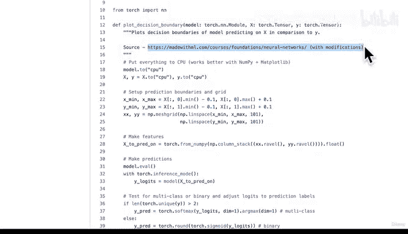
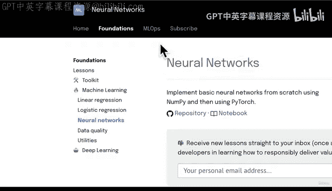
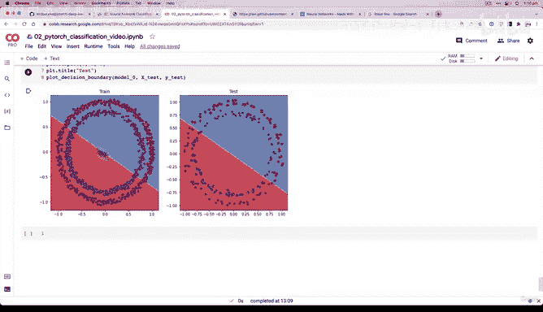

# 77：下载可视化模型预测的辅助函数 📥


在本节课中，我们将学习如何下载并使用一个名为 `plot_decision_boundary` 的辅助函数，以可视化我们模型的预测结果。这将帮助我们直观地理解模型为何表现不佳，并指导我们进行下一步的改进。

---

## 概述

在上节课中，我们编写了大量代码来训练一个二分类模型，但模型的准确率始终在 50% 左右徘徊，损失值也没有明显下降。这表明我们的模型并没有真正学习到数据中的模式。为了深入探究原因，我们需要将模型的预测结果可视化。

---

## 回顾上节课内容

上一节我们介绍了训练循环的完整代码，并讨论了二元交叉熵损失函数（`BCELoss`）和带 Logits 的二元交叉熵损失函数（`BCEWithLogitsLoss`）之间的区别。我们了解到，`BCELoss` 期望输入是经过 Sigmoid 函数处理后的预测概率，而 `BCEWithLogitsLoss` 则可以直接处理模型输出的原始 Logits。

我们的自定义准确率函数需要将预测概率转换为预测标签，以便与真实标签进行比较。然而，尽管代码结构正确，模型的表现却不尽如人意。

---

## 分析当前问题

运行训练循环后，我们发现损失值下降不明显，准确率也始终在 50% 左右。考虑到我们的数据集是平衡的（每个类别各有 500 个样本），这个结果意味着模型的表现和随机猜测差不多。

以下是数据分布的分析：

```python
# 检查数据集中每个类别的样本数量
circles.label.value_counts()
```

结果显示，我们确实有 500 个类别 0 的样本和 500 个类别 1 的样本。因此，模型需要超越简单的猜测才能取得更好的性能。

---

## 引入可视化工具

为了直观地理解模型为何失败，我们将引入一个名为 `plot_decision_boundary` 的辅助函数。这个函数能够绘制出模型在特征空间中所做的决策边界，让我们清楚地看到模型是如何尝试分割数据的。

这个函数来源于 Made With ML 课程，由 Goku Mohandas 创建，是一个极佳的机器学习学习资源。我们稍作修改以适配本课程。

---



## 下载辅助函数



我们将编写代码，从 GitHub 仓库下载 `helper_functions.py` 文件。如果文件已存在，则跳过下载。

以下是下载代码：

```python
import requests
import pathlib

# 检查 helper_functions.py 是否已存在
if pathlib.Path("helper_functions.py").is_file():
    print("helper_functions.py 已存在，跳过下载。")
else:
    print("正在下载 helper_functions.py...")
    # 获取文件的原始内容
    request = requests.get("https://raw.githubusercontent.com/mrdbourke/pytorch-deep-learning/main/helper_functions.py")
    # 将内容写入文件
    with open("helper_functions.py", "wb") as f:
        f.write(request.content)
    print("下载完成！")
```

运行这段代码后，`helper_functions.py` 文件将被下载到当前工作目录中。

---

## 导入并使用函数

下载完成后，我们可以从该文件中导入所需的函数。

```python
from helper_functions import plot_predictions, plot_decision_boundary
```

现在，我们可以使用 `plot_decision_boundary` 函数来可视化模型在训练集和测试集上的决策边界。

以下是可视化代码：

```python
import matplotlib.pyplot as plt

plt.figure(figsize=(12, 6))

# 绘制训练集的决策边界
plt.subplot(1, 2, 1)
plt.title("训练集")
plot_decision_boundary(model_0, X_train, y_train)

# 绘制测试集的决策边界
plt.subplot(1, 2, 2)
plt.title("测试集")
plot_decision_boundary(model_0, X_test, y_test)

plt.show()
```

运行这段代码将生成两个子图，分别展示模型在训练数据和测试数据上的决策边界。

---

## 解读可视化结果

可视化结果清晰地显示，我们的模型试图用一条直线来分割数据。然而，我们的数据是环形分布的，一条直线无法有效地将两个类别分开。这就是为什么模型的准确率始终在 50% 左右，损失值也无法下降的根本原因。

我们的模型仅由线性层构成，而线性层只能学习线性关系。要解决非线性问题（如环形数据），我们需要在模型中引入非线性激活函数。

---

## 挑战与思考

在进入下一节课之前，你可以尝试以下挑战：
- 将模型训练更长时间（例如 1000 个周期），观察准确率和损失值是否有改善。
- 思考为什么仅增加训练周期可能无法解决根本问题。

---



## 总结

本节课中我们一起学习了如何下载并使用 `plot_decision_boundary` 辅助函数来可视化模型的决策边界。通过可视化，我们发现了模型表现不佳的根本原因：它试图用线性决策边界来分割非线性数据。这为我们下一步改进模型指明了方向——我们需要引入非线性能力。

在下一节课中，我们将探讨如何通过添加非线性激活函数来增强模型的表达能力，使其能够学习更复杂的模式。