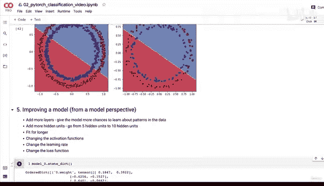
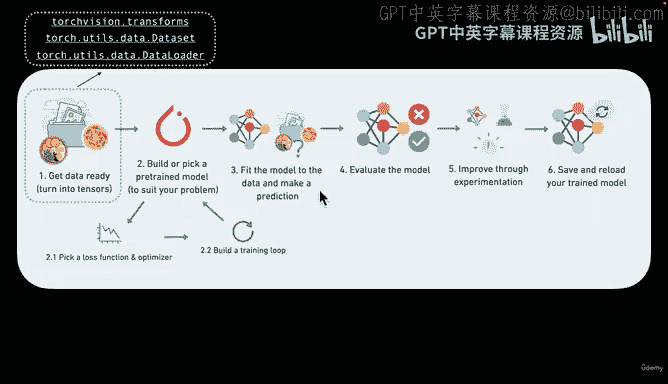
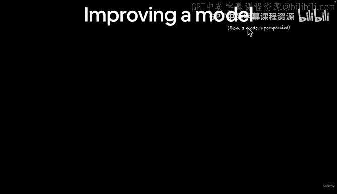
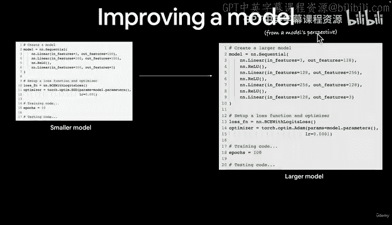
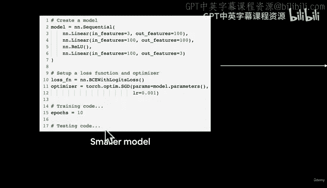
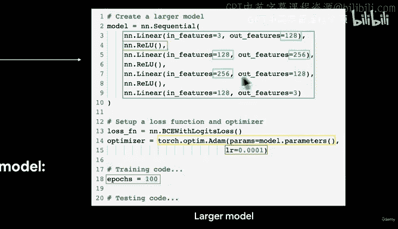
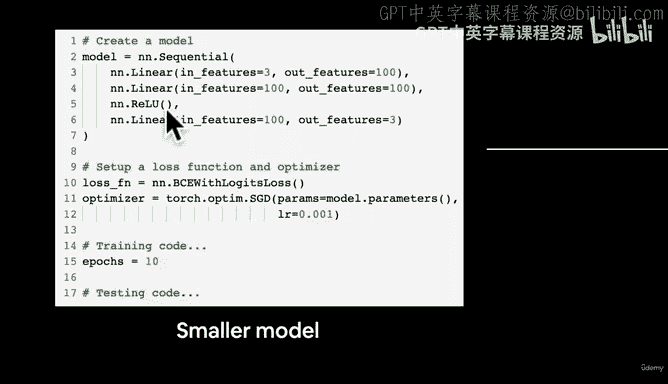
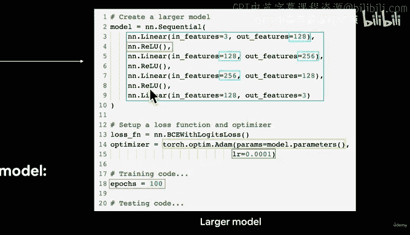
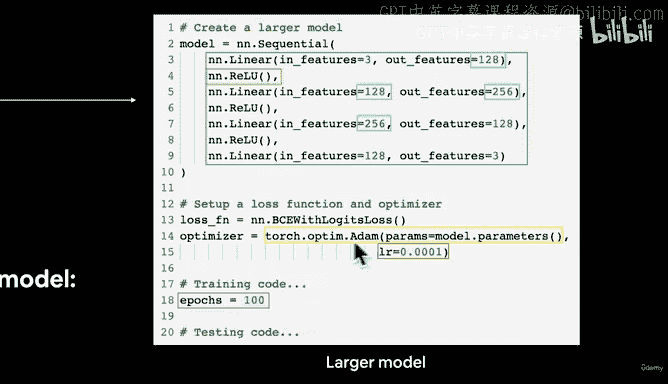
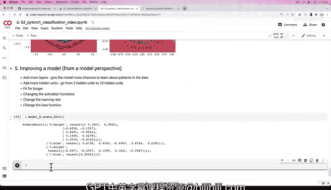

# 78：模型改进方案探讨 🚀

在本节课中，我们将探讨如何改进一个表现不佳的PyTorch模型。我们将从模型本身的角度出发，分析多种提升性能的策略，并理解其背后的原理。

## 概述

上一节我们构建了一个训练循环，并评估了模型在红蓝点分类任务上的表现。然而，我们的线性模型仅能绘制直线，可能无法有效分离非线性分布的数据。本节我们将系统地讨论模型改进的几种核心方法。

## 模型改进的核心策略

以下是几种从模型角度出发的改进方案。

### 1. 增加更多层
为模型提供更多学习数据模式的机会。当前模型（Model 0）仅有两层（输入层和输出层）。增加层数意味着增加模型参数的数量，使其能够学习更复杂的数据表示。

**代码示例：** 从2层结构扩展到包含多个隐藏层的深度网络。

### 2. 增加隐藏单元数量
隐藏单元是层内的神经元。当前模型中每层有5个隐藏单元。我们可以增加这个数量，例如从5个增加到10个或更多。这同样增加了模型的可学习参数，增强了其表示能力。

**公式/概念：** 更多参数 ≈ 更强的数据表示潜力（但需警惕过拟合）。

### 3. 延长训练时间
每个训练周期（epoch）是模型完整查看一次数据的机会。也许100个周期不足以让模型充分学习。我们可以尝试训练更长时间，例如1000个周期。

### 4. 更改激活函数
我们目前使用Sigmoid激活函数，这适用于二元分类问题。然而，在网络层之间还可以使用其他激活函数（例如ReLU），这可能会引入非线性，帮助模型学习更复杂的决策边界。

**提示：** `nn.ReLU()` 是一个常用的激活函数。

### 5. 调整学习率
学习率决定了优化器每次更新参数的步长。
*   学习率过小：模型学习速度极慢。
*   学习率过大：参数更新步伐太大，可能导致梯度爆炸（exploding gradient）或模型不稳定。

### 6. 更改优化器
我们目前使用随机梯度下降（SGD）。Adam是另一种在许多问题上表现良好的流行优化器，值得尝试。

### 7. 更改损失函数
对于当前的二元分类任务，Sigmoid配合二元交叉熵损失（BCEWithLogitsLoss）是标准且有效的选择，因此暂时可以保持不变。

## 改进方案实践思路

现在，让我们将上述策略与我们当前的实验流程结合起来看。

我们已完成数据准备、模型构建、训练循环和初步评估。现在处于“第5步：通过实验进行改进”。我们暂不需要使用TensorBoard等高级工具，而是先进行高层面的实验。

如果我们想构建一个更大的模型，可以综合运用多种策略：
*   **增加层数**：例如，构建一个包含6个线性层的模型。
*   **增加隐藏单元**：将各层的特征数从100逐步增加到128、256等。深度学习中对齐层间输入输出特征数至关重要。
*   **添加激活函数**：在部分线性层之间插入`nn.ReLU()`。
*   **更换优化器**：从SGD改为Adam。
*   **调整学习率**：如果原学习率过高，可以将其除以10。
*   **延长训练**：将训练周期从10个增加到100个。

## 总结

本节课我们一起学习了改进PyTorch模型的多种核心策略。关键在于理解模型容量（层数、隐藏单元数）、训练过程（周期数、学习率、优化器）以及模型结构（激活函数）对最终性能的影响。由于我们的简单线性模型无法很好地分离非线性数据，在接下来的实践中，我鼓励你首先尝试**增加层数、增加隐藏单元以及延长训练时间**。我们将在下一课中编写代码来具体实现这些改进步骤。