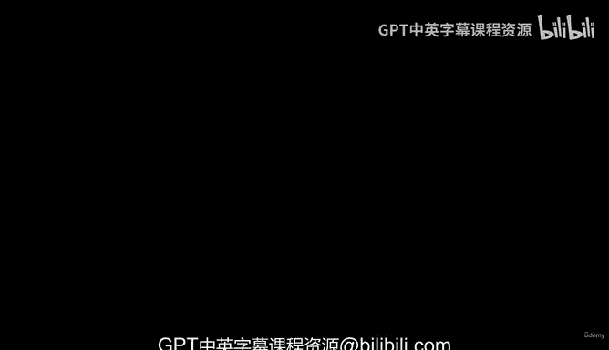
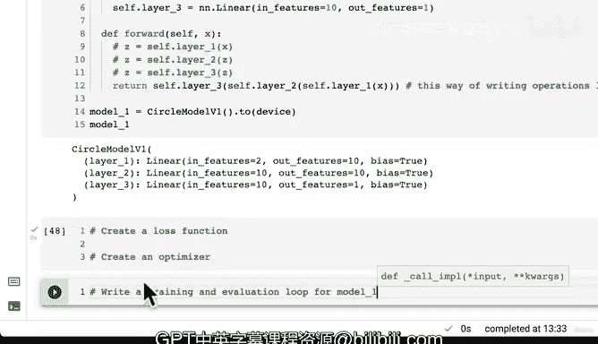

# 79：创建含更多层与隐藏单元的增强模型 🚀



在本节课中，我们将学习如何通过调整模型的**超参数**来提升其性能。具体来说，我们将创建一个新的模型，增加其隐藏层数和每层的神经元（隐藏单元）数量，并延长训练时间，以期获得更好的预测结果。

---

## 概述：从模型角度提升性能

上一节我们讨论了从模型角度提升性能的几个选项。这些选项直接作用于模型本身，而非数据。在机器学习和深度学习中，这类我们可以手动调整的数值被称为**超参数**。

**超参数**与**参数**不同：
*   **参数**是模型内部自动学习的数值，例如权重（`weights`）和偏置（`biases`）。
*   **超参数**是我们作为工程师或科学家可以调整的设定，例如层数、隐藏单元数、训练轮次（`epochs`）、激活函数、学习率和损失函数。

本节课，我们将通过改变几个关键超参数来构建一个增强模型。

---

## 构建增强模型：CircleModelV1

我们将创建一个名为 `CircleModelV1` 的新模型。虽然可以使用 `nn.Sequential` 来构建，但为了练习以及为将来构建更复杂的模型做准备，我们将采用子类化 `nn.Module` 的方式。

我们计划进行三项主要改进：
1.  增加隐藏单元数量（从5个增加到10个）。
2.  增加网络层数（从2层增加到3层）。
3.  增加训练轮次（从100轮增加到1000轮）。

> **科学实验提示**：在实际的机器学习实验中，最好一次只改变一个变量并跟踪结果，这被称为**实验追踪**。这样我们才能明确知道是哪个改动带来了性能提升或下降。本节课为了演示，我们将同时进行多项改动。

以下是模型的定义代码：

```python
import torch
from torch import nn

class CircleModelV1(nn.Module):
    def __init__(self):
        super().__init__()
        # 第一层：输入特征2个，输出10个隐藏单元
        self.layer_1 = nn.Linear(in_features=2, out_features=10)
        # 第二层：输入10个，输出10个隐藏单元
        self.layer_2 = nn.Linear(in_features=10, out_features=10)
        # 第三层：输入10个，输出1个（最终预测）
        self.layer_3 = nn.Linear(in_features=10, out_features=1)

    def forward(self, x):
        # 将数据依次通过所有层
        # 这种写法有助于PyTorch在后台进行可能的运算优化
        return self.layer_3(self.layer_2(self.layer_1(x)))
```

**代码解析**：
*   `in_features` 和 `out_features` 必须前后匹配。第一层的 `in_features=2` 对应我们的输入数据 `X` 有两个特征。
*   最后一层的 `out_features=1` 对应我们的目标标签 `y` 是一个单一数值（二分类问题通常输出一个概率值）。
*   在 `forward` 方法中，我们采用了嵌套调用的方式 `layer_3(layer_2(layer_1(x)))`，这等价于分步计算，但有时能利用PyTorch的图优化带来速度提升。

现在，让我们创建这个模型的实例并将其发送到可用设备上，以确保代码的设备无关性。

```python
# 创建模型实例
model_1 = CircleModelV1()

# 将模型发送到目标设备（例如GPU，如果可用）
device = torch.device("cuda" if torch.cuda.is_available() else "cpu")
model_1.to(device)

# 查看模型结构
print(model_1)
```

---

## 下一步：训练与评估循环

我们的增强模型已经构建完成。接下来，要训练这个模型，我们需要完成以下步骤：

以下是需要完成的准备工作列表：
1.  **创建损失函数**：我们将使用与之前模型类似的损失函数，例如适用于二分类任务的 `nn.BCEWithLogitsLoss`。
2.  **创建优化器**：例如 `torch.optim.SGD` 或 `torch.optim.Adam`，用于更新模型的参数。
3.  **编写训练与评估循环**：我们需要编写代码来让模型在数据上训练1000个轮次，并在每个轮次后评估其性能。

我建议你先尝试自己完成这些步骤。在接下来的视频中，我们将一起实现完整的训练和评估流程，看看增加层数、隐藏单元和训练时间是否能带来更好的结果。

---

## 总结

本节课中我们一起学习了：
*   区分了模型的**参数**与**超参数**。
*   从模型角度出发，通过调整**超参数**（如层数、隐藏单元数、训练轮次）来尝试提升性能。
*   动手创建了一个增强模型 `CircleModelV1`，它拥有三层网络和更多的隐藏单元。
*   了解了在科研中应遵循**一次只改变一个变量**的原则以进行有效的实验追踪。



在下一节，我们将为这个新模型配置损失函数和优化器，并开始训练它，观察其性能变化。