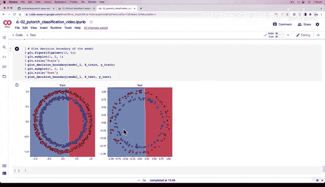
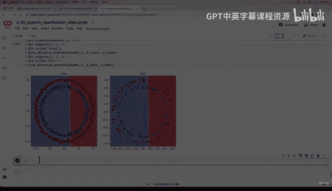

# 80：编写训练测试代码验证模型性能提升 🚀


在本节课中，我们将学习如何编写完整的训练和测试循环代码，以验证我们新构建的模型（CircleModelV1）在数据集上的性能表现。我们将设置损失函数、优化器，并观察模型是否能够从数据中学习到有效的模式。

---

## 模型与数据准备回顾

上一节我们通过子类化 `nn.Module` 创建了 `CircleModelV1`。这是对 `CircleModelV0` 的升级，我们增加了隐藏单元数量（从5个到10个），并额外添加了一个隐藏层。我们已经准备好了一个模型实例。

在流程图中，我们目前处于“构建模型”阶段。我们的数据没有改变，现在需要选择损失函数和优化器。

## 选择损失函数与优化器

我们继续使用与之前相同的损失函数和优化器，以保持实验条件的一致性。

以下是损失函数和优化器的设置代码：

```python
loss_fn = nn.BCEWithLogitsLoss()
optimizer = torch.optim.SGD(params=model_1.parameters(), lr=0.1)
```

**关于模型复杂度的说明**：增加隐藏单元和层数，本质上是为模型提供了更多可调整的参数（数值）。观察 `model_1.state_dict()` 并与 `model_0` 对比，你会发现参数数量显著增加。这为模型创造了更多机会来学习和拟合目标数据集中的模式。这是其背后的理论依据。

## 设置训练环境

为了保证结果的可复现性，我们设置随机种子。同时，我们将训练周期（epochs）增加到1000次，这是我们对模型进行的第三项改进（前两项是增加隐藏单元和层数）。更长的训练时间能让模型有更多机会观察数据并优化其内部模式。

我们还需要将数据移动到目标设备（CPU或GPU），以编写设备无关的代码。

```python
torch.manual_seed(42)
torch.cuda.manual_seed(42)

epochs = 1000

# 将数据移动到目标设备
X_train, y_train = X_train.to(device), y_train.to(device)
X_test, y_test = X_test.to(device), y_test.to(device)
```

## 构建训练循环

现在，我们进入核心部分——编写训练和测试循环。虽然我们可以将很多步骤函数化，但在打基础阶段，亲手编写每一步有助于加深理解。

以下是训练循环的步骤概述：

1.  将模型设置为训练模式。
2.  前向传播，计算原始输出（logits）。
3.  将 logits 通过 sigmoid 函数转换为预测概率，再四舍五入得到预测标签。
4.  计算损失和准确率。
5.  优化器梯度归零。
6.  反向传播，计算梯度。
7.  优化器执行一步，更新模型参数。

测试循环的步骤类似，但需要将模型设置为评估模式，并启用 `torch.inference_mode()` 以节省内存和计算资源。

以下是完整的训练测试循环代码：

```python
for epoch in range(epochs):
    ### 训练阶段
    model_1.train()
    # 1. 前向传播
    y_logits = model_1(X_train).squeeze()
    y_pred = torch.round(torch.sigmoid(y_logits))
    # 2. 计算损失和准确率
    loss = loss_fn(y_logits, y_train)
    acc = accuracy_fn(y_true=y_train, y_pred=y_pred)
    # 3. 优化器梯度归零
    optimizer.zero_grad()
    # 4. 反向传播
    loss.backward()
    # 5. 优化器更新参数
    optimizer.step()

    ### 测试阶段
    model_1.eval()
    with torch.inference_mode():
        # 1. 前向传播
        test_logits = model_1(X_test).squeeze()
        test_pred = torch.round(torch.sigmoid(test_logits))
        # 2. 计算测试损失和准确率
        test_loss = loss_fn(test_logits, y_test)
        test_acc = accuracy_fn(y_true=y_test, y_pred=test_pred)

    ### 打印进度
    if epoch % 100 == 0:
        print(f"Epoch: {epoch} | Loss: {loss:.5f}, Acc: {acc:.2f}% | Test Loss: {test_loss:.5f}, Test Acc: {test_acc:.2f}%")
```

## 运行模型与结果分析

我们运行了拥有三层和每层10个隐藏单元的新模型。然而，结果令人意外：即使训练了1000个周期，模型的准确率仍然徘徊在50%左右，就像随机猜测一样。

为了直观地理解模型的行为，我们绘制了其决策边界。图像显示，模型仍然试图用一条直线来分割我们的圆形数据。这揭示了问题的核心：我们的数据是非线性的，但模型目前仅由线性层堆叠而成，缺乏处理非线性关系的能力。

## 模型能力验证挑战

当前模型似乎在我们的圆形数据集上无法学习。为了验证这个模型结构本身是否具备学习能力，我向你提出一个挑战：

尝试使用我们在“PyTorch工作流基础”章节中创建的线性回归数据集，用这个 `CircleModelV1` 去拟合它。如果模型能在简单的线性数据上学习，那就证明模型结构是有效的，问题在于它当前无法捕捉我们数据的非线性特征。这将是下一节我们要解决的关键问题。

---





本节课中，我们一起编写了完整的训练与测试循环代码，并尝试用更复杂的模型（`CircleModelV1`）来拟合非线性数据。我们发现，仅仅增加模型的宽度和深度，而不引入非线性，无法解决当前问题。这为我们下一节引入激活函数来赋予模型非线性能力做好了铺垫。