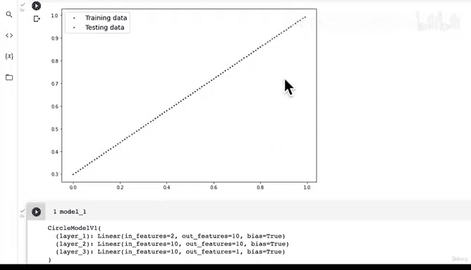

# 81：创建直线数据集检验模型学习能力 📈


在本节课中，我们将学习一种重要的模型调试方法：通过创建一个简单的、已知可解的问题（如拟合一条直线）来检验我们的模型是否具备基本的学习能力。我们将沿用之前学过的 PyTorch 工作流程，但应用到一个新的、更简单的数据集上。

## 概述

在之前的视频中，我们尝试构建一个模型来区分蓝点和红点，但之前的努力都失败了。为了排查问题，我们将创建一个更小、更简单的问题——让模型学习拟合一条直线。这样做的目的是验证我们的模型架构或训练过程是否存在根本性错误。如果模型连一条直线都无法学习，那么它肯定无法解决更复杂的分类问题。

## 创建直线数据集

首先，我们需要创建一个简单的线性回归数据集。这个数据集基于一个我们熟知的公式。

以下是创建数据集的步骤：

1.  **设置参数**：我们定义直线的权重和偏置。
    ```python
    weight = 0.7
    bias = 0.3
    ```

2.  **生成特征数据**：创建从 0 到 1 的 100 个数据点作为输入 `X`。
    ```python
    X_regression = torch.arange(0, 1, 0.01).unsqueeze(dim=1)
    ```

3.  **生成标签数据**：使用线性回归公式 `y = weight * X + bias` 计算对应的标签 `y`。
    ```python
    y_regression = weight * X_regression + bias
    ```

现在，让我们检查一下数据，确保它符合预期。在机器学习中，数据探索至关重要，可视化是理解数据的有效手段。

## 划分训练集和测试集

拥有数据集后，如果尚未划分，我们需要将其分为训练集和测试集。模型将在训练集上学习模式，并期望能泛化到测试集上。

以下是划分数据集的步骤：

1.  **确定分割点**：我们使用 80% 的数据作为训练集。
    ```python
    train_split = int(0.8 * len(X_regression))
    ```

2.  **创建训练集**：根据分割点索引出训练特征和标签。
    ```python
    X_train_regression, y_train_regression = X_regression[:train_split], y_regression[:train_split]
    ```

3.  **创建测试集**：剩余的数据作为测试集。
    ```python
    X_test_regression, y_test_regression = X_regression[train_split:], y_regression[train_split:]
    ```

检查长度，确认我们得到了 80 个训练样本和 20 个测试样本。

## 可视化数据

为了直观地检查数据，我们将使用之前章节（0.1节）中创建的 `plot_predictions` 辅助函数。这个函数保存在 `helper_functions.py` 文件中，可以避免我们重复编写绘图代码。

现在，我们传入新创建的数据来绘制图表：
```python
plot_predictions(train_data=X_train_regression,
                 train_labels=y_train_regression,
                 test_data=X_test_regression,
                 test_labels=y_test_regression)
```

图表将显示我们的训练数据和测试数据。目前我们还没有任何预测结果，这只是对数据的初步观察。

## 思考模型适配性

现在，关键问题来了：我们之前为分类问题构建的 `Model 1` 能否拟合这个新的回归数据集？

我们需要思考：
*   对于这个数据集，我们是否需要调整模型的输入特征数量？
*   我们是否需要改变模型的输出特征数量？

我们将在下一节课中寻找答案。

## 总结



本节课中，我们一起学习了一种核心的调试策略：通过解决一个简单问题来排查复杂模型中的故障。我们创建了一个直线数据集，并将其划分为训练集和测试集，最后对数据进行了可视化。下一步，我们将尝试用现有模型来拟合这条直线，以检验其基本的学习能力。