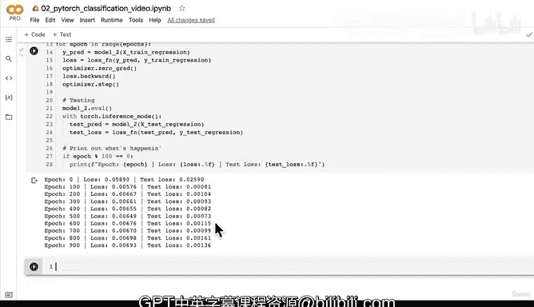

# 82：构建拟合直线数据的模型 📈


在本节课中，我们将学习如何构建一个PyTorch模型来拟合直线数据。我们将通过一个简单的回归问题，回顾模型构建、训练和评估的基本流程，为后续解决更复杂的问题打下基础。

---

## 概述

上一节我们创建了一个直线数据集。本节中，我们将调整之前为分类任务构建的模型，使其能够拟合这个回归数据集。我们将重点关注输入输出形状的匹配、损失函数的选择以及训练循环的搭建。

---

## 调整模型以适应回归数据

我们之前构建的`model1`是为二分类任务设计的，它接受两个输入特征。然而，我们的直线回归数据只有一个输入特征。因此，我们需要创建一个新模型，其输入层应匹配单个特征。

以下是构建`model2`的代码，它使用`nn.Sequential`以更简洁的方式定义网络结构：

```python
model2 = nn.Sequential(
    nn.Linear(in_features=1, out_features=10),
    nn.Linear(in_features=10, out_features=1)
)
```

**核心概念**：`nn.Linear`层执行线性变换，其公式为 `y = xA^T + b`。第一层将1维输入映射到10维隐藏空间，第二层再将10维特征映射回1维输出。

---

## 定义损失函数和优化器

对于回归问题，我们使用L1损失函数（平均绝对误差）。优化器则继续使用随机梯度下降法。

以下是定义损失函数和优化器的代码：

```python
loss_fn = nn.L1Loss()
optimizer = torch.optim.SGD(params=model2.parameters(), lr=0.1)
```

**核心概念**：学习率`lr`是优化器在每一步更新模型参数时的乘数，控制着参数调整的幅度。

---

## 准备训练循环

在开始训练前，我们必须确保模型和数据位于相同的计算设备上（例如CPU或GPU）。以下是准备步骤：

```python
# 将模型和数据发送到目标设备
model2.to(device)
X_train_regression = X_train_regression.to(device)
y_train_regression = y_train_regression.to(device)

# 设置训练轮数
epochs = 1000
```

**重要提示**：如果模型和数据不在同一设备上，代码将会报错。

---

## 实现训练与测试循环

现在，我们将实现完整的训练循环，并在每100轮后打印损失值以监控训练过程。

以下是训练循环的步骤：

1.  前向传播：计算模型预测。
2.  计算损失：比较预测值与真实标签。
3.  反向传播：计算梯度。
4.  优化器步骤：更新模型参数。
5.  评估：在测试集上计算损失。

```python
for epoch in range(epochs):
    # 训练步骤
    model2.train()
    y_pred = model2(X_train_regression)
    loss = loss_fn(y_pred, y_train_regression)
    optimizer.zero_grad()
    loss.backward()
    optimizer.step()

    # 测试步骤
    model2.eval()
    with torch.inference_mode():
        test_pred = model2(X_test_regression)
        test_loss = loss_fn(test_pred, y_test_regression)

    # 每100轮打印一次信息
    if epoch % 100 == 0:
        print(f"Epoch: {epoch} | Train loss: {loss:.5f} | Test loss: {test_loss:.5f}")
```

运行上述代码后，如果训练损失和测试损失都在下降，则表明模型正在从数据中学习。

---

## 总结



本节课中，我们一起学习了如何构建一个用于回归任务的PyTorch模型。我们调整了模型的输入维度以匹配数据，选择了合适的回归损失函数，并实现了完整的训练与评估循环。通过观察损失值的下降，我们确认了模型能够学习并拟合直线数据。在下一课中，我们将使用绘图函数来直观验证模型的预测效果。