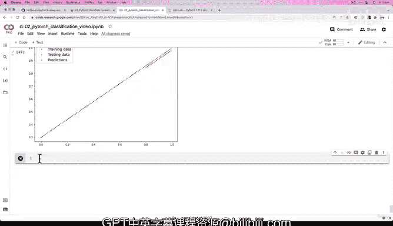

# 83：评估直线数据上的模型预测 📈


在本节课中，我们将学习如何评估一个在直线数据上训练的PyTorch模型，并通过可视化预测结果来确认模型的学习能力。

---

## 概述

上一节我们成功训练了一个模型，使其能够学习直线数据。本节我们将通过可视化模型的预测结果，来确认模型确实具备学习能力，并探讨模型在更复杂数据上可能遇到的限制。

## 模型评估与预测可视化

我们之前构建的模型（Model 2）在直线数据上表现出学习能力。为了确认这一点，我们需要将模型的预测结果可视化。

以下是进行预测和可视化的步骤：

1.  **将模型设置为评估模式**：这会关闭训练时特有的层，如Dropout。
    ```python
    model_2.eval()
    ```

2.  **进行预测（推理）**：使用`torch.inference_mode()`上下文管理器进行高效预测。
    ```python
    with torch.inference_mode():
        y_preds = model_2(X_test_regression)
    ```

3.  **可视化结果**：使用我们之前定义的`plot_predictions`函数来绘制训练数据、测试数据和模型预测。

## 解决设备不匹配错误

在可视化过程中，我们可能会遇到一个常见错误：`TypeError: can‘t convert cuda device type tensor to numpy`。

**错误原因**：我们的模型和数据可能在GPU上，但Matplotlib（用于绘图）依赖的NumPy库只能在CPU上运行。

**解决方案**：在将张量传递给绘图函数之前，使用`.cpu()`方法将其转移到CPU上。
```python
# 对传递给绘图函数的张量调用 .cpu()
plot_predictions(train_data=X_train_regression.cpu(),
                 train_labels=y_train_regression.cpu(),
                 test_data=X_test_regression.cpu(),
                 test_labels=y_test_regression.cpu(),
                 predictions=y_preds.cpu())
```

## 结果分析

成功绘图后，我们可以看到代表模型预测的红点非常接近代表真实测试数据的绿点。这直观地证实了我们的模型（Model 2）具备学习直线关系的能力。

这个结果引出了一个关键问题：既然模型能学会直线数据，为什么之前它在圆形分类数据上表现不佳？

**核心线索在于模型的构成**：我们的模型目前只由线性层（`nn.Linear`）组成。线性函数本质上描述的是直线关系，其公式为：
**`y = wx + b`**

然而，我们的圆形分类数据并非由简单的直线构成，它包含了**非线性**模式。因此，一个仅由线性函数堆叠的模型，其表达能力有限，无法拟合这类复杂数据。

## 过渡到非线性

这揭示了我们在后续课程中要解决的核心问题：如何让模型学习非线性模式。

提示是：我们需要在模型中引入**非线性激活函数**。你已经在之前的代码中见过其中一个（例如 `nn.ReLU`）。在PyTorch的`torch.nn`文档中，你可以找到“Non-linear activations”部分，其中列出了各种可用的函数。

---

## 总结



本节课我们一起学习了如何评估模型在直线数据上的预测性能。我们通过可视化确认了模型具备学习能力，并发现了其局限性：纯线性模型无法处理非线性数据。这为我们下一节引入非线性激活函数来增强模型表达能力奠定了基础。