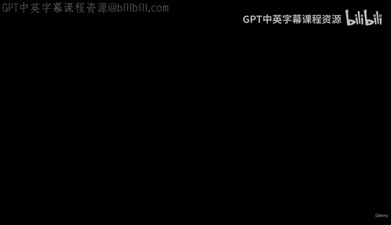
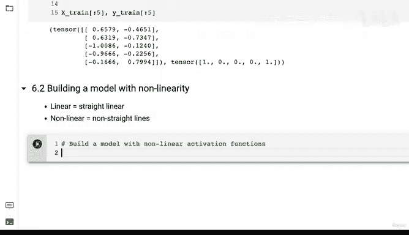
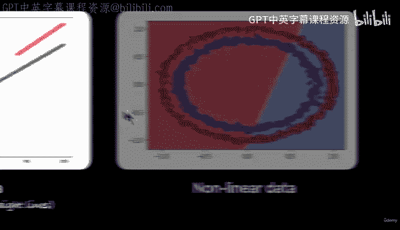
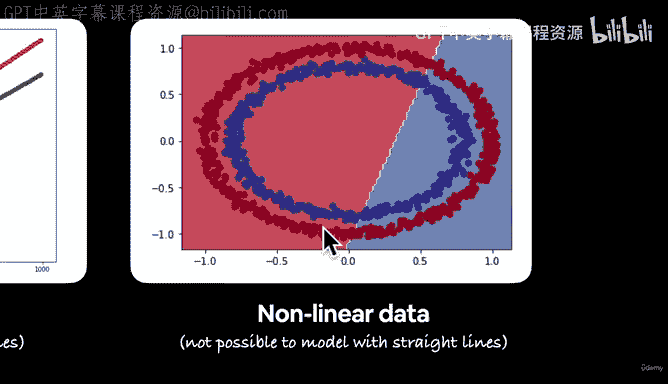
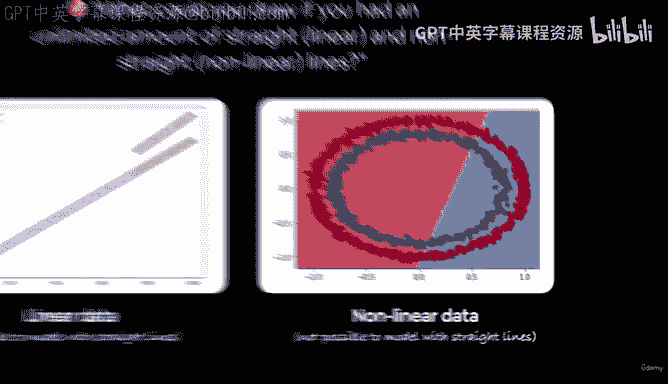
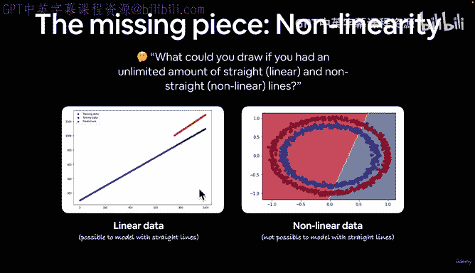
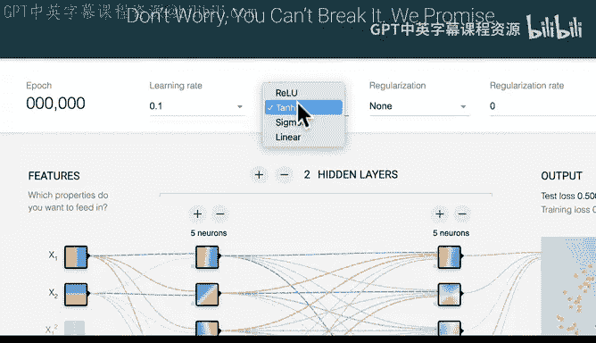

# 85：构建首个非线性神经网络 🧠



在本节课中，我们将学习如何构建一个包含非线性激活函数的神经网络。我们将探讨线性与非线性之间的区别，并动手编写代码，为我们的圆形数据分类模型引入非线性能力。

## 概述：线性与非线性

上一节我们介绍了线性模型，它只能拟合直线。本节中我们来看看非线性模型。

线性意味着直线。相反，非线性意味着非直线。

我们之前构建的线性模型可以拟合呈直线分布的数据。然而，当我们处理非线性数据时，我们需要非线性函数的能力。例如，我们当前处理的是圆形数据。

请思考一个问题：如果你拥有无限数量的直线（即线性线）和非直线（即非线性线），你能画出什么？

## 引入非线性激活函数



现在，让我们开始编写一个包含非线性激活函数的分类模型代码。


我们将从 `torch.nn` 模块导入非线性函数。`torch.nn` 模块包含了许多神经网络层，其中就有一类称为“非线性激活函数”。










以下是 `torch.nn` 中一些常见的非线性激活函数：
*   `nn.Sigmoid`：Sigmoid 激活函数，对输入 X 执行特定数学运算。
*   `nn.ReLU`：另一个常见函数，我们在研究分类网络架构时见过它。

## 构建非线性模型

让我们开始编写代码，构建一个带有非线性激活函数的模型。

```python
from torch import nn

class CircleModelV2(nn.Module):
    def __init__(self):
        super().__init__()
        self.layer_1 = nn.Linear(in_features=2, out_features=10)
        self.layer_2 = nn.Linear(in_features=10, out_features=10)
        self.layer_3 = nn.Linear(in_features=10, out_features=1)
        self.relu = nn.ReLU()
```

我们创建了一个名为 `CircleModelV2` 的类。它包含三个线性层和一个 ReLU 激活函数。

ReLU 代表“修正线性单元”。它的工作原理很简单：它接收一个输入，如果输入是负数，则将其变为 0；如果输入是正数，则保持不变。这个函数的图形不是一条直线，因此它是一种非线性激活函数。

接下来，我们需要实现前向传播方法。

```python
    def forward(self, x):
        # 数据流向：layer_1 -> relu -> layer_2 -> relu -> layer_3
        return self.layer_3(self.relu(self.layer_2(self.relu(self.layer_1(x)))))
```

在前向传播中，我们的数据依次通过以下步骤：
1.  输入 `layer_1`，执行线性运算。
2.  将 `layer_1` 的输出传递给 `relu` 函数。`relu` 会将 `layer_1` 的所有负输出变为 0，并保留正输出。
3.  将结果传递给 `layer_2`，再次执行线性运算。
4.  再次通过 `relu` 函数。
5.  最后，将结果传递给 `layer_3`（输出层）。我们没有在最后使用 `relu`，因为稍后我们会将模型的原始输出（logits）传递给 sigmoid 函数。

现在，让我们实例化我们的模型。

```python
model_3 = CircleModelV2().to(device)
```

## 挑战与总结

本节课中我们一起学习了非线性激活函数的概念，并构建了我们的第一个非线性神经网络模型 `CircleModelV2`。

我向你提出两个挑战：
1.  尝试编写训练代码，看看这个模型是否能在我们的圆形数据上有效工作。
2.  访问 TensorFlow Playground，尝试重建我们这里的神经网络。你可以设置两个隐藏层（每层5个神经元，我们的模型是每层10个），将学习率设置为0.1，使用随机梯度下降，并将激活函数从“Linear”改为“ReLU”，然后运行看看会发生什么。



在接下来的视频中，我们将继续完善训练代码并评估模型的性能。