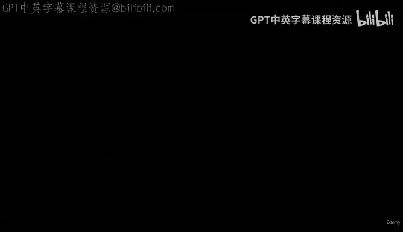
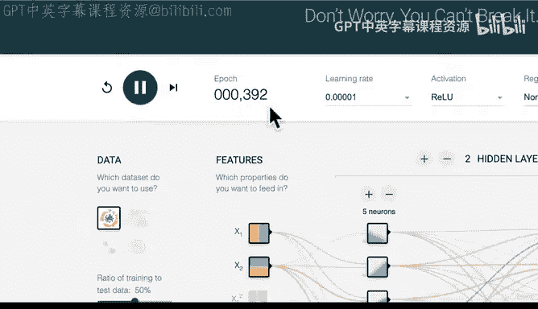
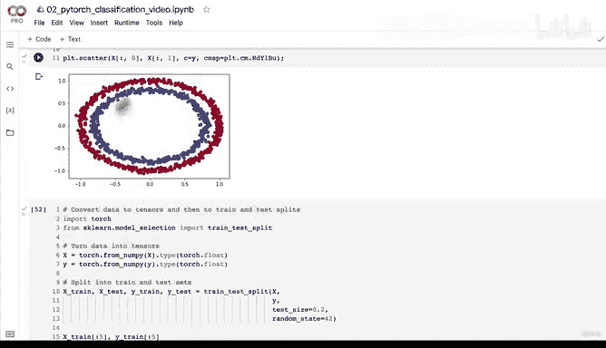

# 86：编写首个非线性模型训练测试代码 🚀



在本节课中，我们将学习如何构建并训练一个包含非线性激活函数的PyTorch模型。我们将使用ReLU激活函数，并观察它如何帮助模型学习非线性数据中的模式。

---

## 概述

上一节我们介绍了线性模型在处理非线性数据时的局限性。本节中，我们来看看如何通过引入非线性激活函数（如ReLU）来增强模型的能力，使其能够学习更复杂的模式。



## 非线性激活函数：ReLU

ReLU是一个流行且有效的非线性激活函数。神经网络的核心在于结合线性与非线性函数，从而有能力发现数据中的模式。对于我们的数据集（蓝点和红点），虽然规模小，但同样的原理适用于更大的数据集和模型。

ReLU函数的数学定义是：
**`output = max(0, input)`**

这意味着，对于负的输入，输出为0；对于正的输入，输出保持不变。这个函数本身没有需要优化的参数，这使得它计算高效。

## 学习率的影响

在训练开始前，我们先直观感受一下学习率（Learning Rate）对训练过程的影响。学习率控制着模型参数更新的步长。

以下是不同学习率下训练损失的下降趋势：
*   **较高的学习率（如0.1）**：损失值迅速下降，模型很快收敛。
*   **较低的学习率（如0.001）**：损失值下降缓慢，需要更多训练轮次（epochs）才能达到相同效果。

选择合适的**学习率**是训练成功的关键之一。

## 构建模型、损失函数与优化器

现在，让我们开始编写代码。我们将构建一个包含两个隐藏层和非线性激活函数的模型。

首先，我们设置损失函数和优化器。由于我们处理的是二分类问题（蓝点或红点），因此使用二元交叉熵损失（Binary Cross Entropy Loss）。

```python
import torch
import torch.nn as nn

# 定义模型
class NonLinearModel(nn.Module):
    def __init__(self):
        super().__init__()
        self.layer_1 = nn.Linear(in_features=2, out_features=5)
        self.layer_2 = nn.Linear(in_features=5, out_features=5)
        self.layer_3 = nn.Linear(in_features=5, out_features=1)
        self.relu = nn.ReLU() # 引入非线性激活函数

    def forward(self, x):
        x = self.relu(self.layer_1(x))
        x = self.relu(self.layer_2(x))
        x = self.layer_3(x)
        return x

# 实例化模型
model_3 = NonLinearModel()

# 定义损失函数和优化器
loss_fn = nn.BCEWithLogitsLoss() # 适用于logits输入的二元交叉熵
optimizer = torch.optim.SGD(params=model_3.parameters(), lr=0.1)
```

## 训练循环

接下来，我们编写训练循环代码。这个过程包括前向传播、计算损失、反向传播和优化器更新参数。

以下是训练步骤的详细说明：
1.  **前向传播**：将训练数据输入模型，得到原始输出（logits）。
2.  **计算损失与准确率**：使用损失函数计算预测值与真实标签之间的误差，并计算当前准确率。
3.  **反向传播**：调用 `loss.backward()`，PyTorch会自动计算所有参数的梯度。
4.  **优化器步骤**：调用 `optimizer.step()`，优化器根据梯度更新模型参数。
5.  **梯度清零**：在每个epoch开始前，调用 `optimizer.zero_grad()` 清空上一轮的梯度，防止累积。
6.  **测试集评估**：在推理模式下，使用测试集评估模型性能，计算测试损失和准确率。

```python
torch.manual_seed(42)
epochs = 1000

# 将数据转移到正确的设备（如GPU）
X_train, y_train = X_train.to(device), y_train.to(device)
X_test, y_test = X_test.to(device), y_test.to(device)

for epoch in range(epochs):
    ### 训练阶段 ###
    model_3.train()
    # 1. 前向传播
    train_logits = model_3(X_train).squeeze()
    train_pred = torch.round(torch.sigmoid(train_logits))

    # 2. 计算损失与准确率
    train_loss = loss_fn(train_logits, y_train)
    train_acc = accuracy_fn(y_true=y_train, y_pred=train_pred)

    # 3. 优化器梯度清零
    optimizer.zero_grad()

    # 4. 反向传播
    train_loss.backward()

    # 5. 优化器更新参数
    optimizer.step()

    ### 测试阶段 ###
    model_3.eval()
    with torch.inference_mode():
        # 1. 前向传播
        test_logits = model_3(X_test).squeeze()
        test_pred = torch.round(torch.sigmoid(test_logits))

        # 2. 计算损失与准确率
        test_loss = loss_fn(test_logits, y_test)
        test_acc = accuracy_fn(y_true=y_test, y_pred=test_pred)

    # 打印训练信息
    if epoch % 100 == 0:
        print(f"Epoch: {epoch} | Train Loss: {train_loss:.4f}, Train Acc: {train_acc:.2f}% | Test Loss: {test_loss:.4f}, Test Acc: {test_acc:.2f}%")
```

运行代码后，我们观察到模型的准确率有所提升，损失值下降。这证明了非线性激活函数的威力。仅仅添加了ReLU层，就赋予了模型结合直线（线性）与曲线（非线性）的能力，使其有可能学会区分这两个圆圈。

## 总结



本节课中我们一起学习了如何构建和训练一个非线性PyTorch模型。我们引入了ReLU激活函数，并理解了它如何帮助模型学习非线性数据。我们还实践了完整的训练循环，包括设置设备无关代码、定义损失函数与优化器，以及执行前向传播、反向传播和参数更新。在下一节课中，我们将可视化模型的决策边界，看看它究竟学到了什么。