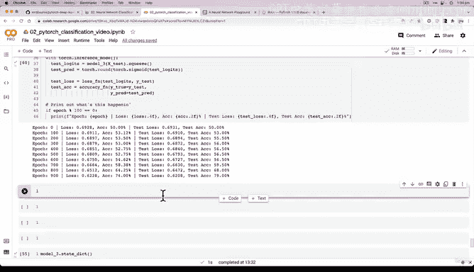
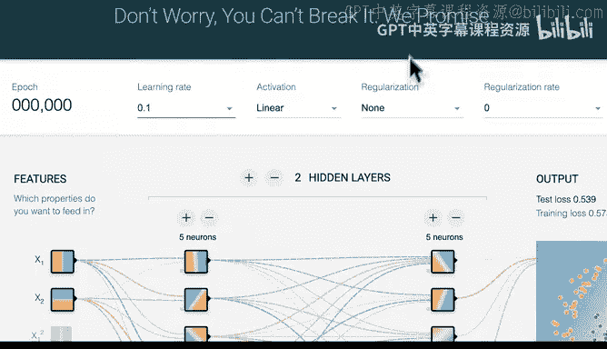
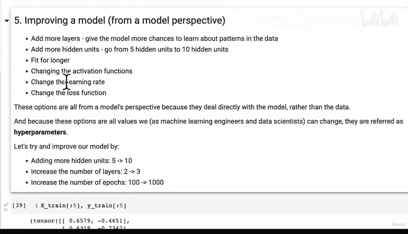

#  87：首个非线性模型的预测与评估 📊

在本节课中，我们将学习如何对我们刚刚训练好的首个非线性模型进行预测和评估。我们将通过可视化手段来直观地理解模型的性能，并将其与之前的纯线性模型进行比较。

---

## 模型评估与可视化




在上一节中，我们训练了第一个结合了线性函数（直线）和非线性函数（非直线）能力的模型。经过1000个训练周期后，模型的结果看起来比纯猜测（准确率为50%，因为我们有500个红点和500个蓝点，类别完全平衡）要好一些。

现在，我们需要评估我们的模型，因为目前它只是纸面上的数字。我们喜欢通过可视化来评估事物。

评估一个用非线性激活函数训练的模型时，我们还需要理解一个核心观点：神经网络本质上就是线性函数和非线性函数的大型组合，旨在数据中寻找规律。

基于此，让我们用我们最近训练的模型——模型3——来进行一些预测。

我们将把它设置为评估模式，并开启推理模式。

```python
# 将模型设置为评估模式
model_3.eval()



# 开启推理模式进行预测
with torch.inference_mode():
    y_preds = torch.round(torch.sigmoid(model_3(X_test))).squeeze()
```

我们在这里使用了 `.squeeze()` 方法，因为在之前的视频中我们遇到了一些形状错误。这实际上是一个很好的经历，因为它让我们现场解决了一个深度学习中最常见的问题之一。

让我们查看一下预测结果 `y_preds`，同时也查看一下真实标签 `y_test`。

```python
print(y_preds[:10])
print(y_test[:10])
```

记住，在评估预测时，我们希望预测结果的格式与原始标签的格式相同，这样才能进行公平的比较。从格式上看，这两者看起来是相同的：它们都在CUDA上，并且都是浮点数类型。我们可以看到模型在这个样本上预测错了，而其他样本看起来预测得不错。

如果我们将结果可视化，可能会看得更清楚。

---

## 绘制决策边界

你可能已经尝试过这个挑战了：绘制决策边界。让我们现在来实现它。

```python
import matplotlib.pyplot as plt

# 设置图形大小
plt.figure(figsize=(12, 6))

# 一个子图：训练数据上的决策边界
plt.subplot(1, 2, 1)
plt.title("Train Data Decision Boundary")
plot_decision_boundary(model_3, X_train, y_train)

# 二个子图：测试数据上的决策边界
plt.subplot(1, 2, 2)
plt.title("Test Data Decision Boundary")
plot_decision_boundary(model_3, X_test, y_test)

plt.show()
```

`plot_decision_boundary` 函数会在幕后为我们创建漂亮的图形，对输入特征 `X` 进行预测，然后与真实值 `Y` 进行比较。

让我们看看结果如何。

---

## 结果分析与挑战

看！这是我们的第一个非线性模型。它并不完美，但肯定比我们之前拥有的模型要好得多。

*   **模型1（无非线性）**：其决策边界是一条直线，无法很好地分割非线性数据。
*   **模型3（有非线性）**：其决策边界是曲线，能够更好地拟合数据的分布。

你看到非线性（或者说，直线与非直线结合）的力量了吗？

不过，我觉得我们可以做得比这更好。目前的模型在测试数据上达到了大约79%的准确率。

**你的挑战是：你能改进模型3，使其在测试数据上的准确率超过80%吗？**

我相信你可以做到。

以下是一些改进模型的思路，你可以尝试：

*   **增加层数**：在模型中添加更多的隐藏层。
*   **增加隐藏单元**：增加每一层神经元的数量。
*   **延长训练时间**：增加训练的周期数（epochs）。
*   **调整激活函数**：如果你添加了更多层，确保在它们之上也使用ReLU等非线性激活函数。
*   **降低学习率**：目前我们使用的学习率是0.1，尝试调低它看看效果。

尝试一下吧！这将是你额外的练习挑战。在下一节中，我们将动手编写代码来复现这些非线性激活函数。

---



## 总结

在本节课中，我们一起学习了如何评估非线性模型：
1.  我们使用模型进行预测，并将其设置为评估和推理模式。
2.  我们通过可视化决策边界，直观地比较了非线性模型与纯线性模型的性能差异。
3.  我们分析了结果，并提出了改进模型性能的挑战，包括调整模型结构、超参数和训练过程。

记住，模型评估和迭代优化是机器学习工作流中至关重要的环节。