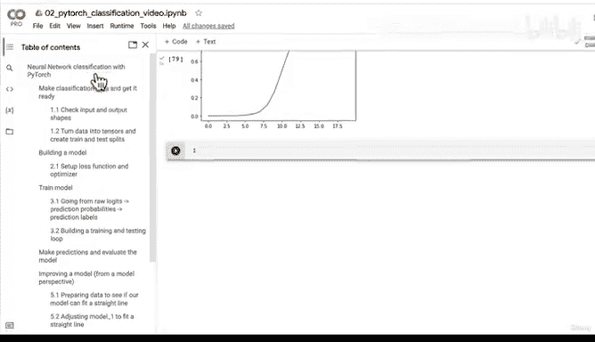

# 88：使用纯 PyTorch 复现非线性激活函数 🔧


在本节课中，我们将学习如何仅使用 PyTorch 的基础张量操作，手动复现神经网络中常用的非线性激活函数。我们将重点关注 ReLU 和 Sigmoid 函数，并理解它们如何在神经网络中发挥作用。

## 概述

上一节我们介绍了如何通过添加更多层、调整隐藏单元数量和学习率来改进模型性能。本节中，我们来看看构成神经网络的核心“工具”——线性与非线性函数。我们将通过手动编写代码来复现这些非线性激活函数，从而更深入地理解其内部机制。

## 复现线性激活函数

一切计算都始于张量。首先，我们创建一个基础张量作为输入。

```python
import torch
import matplotlib.pyplot as plt

# 创建一个从-10到10的张量，数据类型为32位浮点数
A = torch.arange(start=-10, end=10, step=1, dtype=torch.float32)
```

现在，让我们可视化这个数据。它是一个从-10到10的直线，代表一个线性关系。

```python
plt.plot(A)
plt.show()
```

## 复现 ReLU 激活函数

ReLU（Rectified Linear Unit）函数是神经网络中最常用的激活函数之一。它的定义很简单：对于输入 `x`，输出是 `max(0, x)`。这意味着所有负数值被置为0，而正数值保持不变。

我们可以直接调用 PyTorch 内置的 `torch.relu` 函数来查看效果。

```python
plt.plot(torch.relu(A))
plt.show()
```

但我们的目标是手动复现它。以下是自定义 ReLU 函数的实现：

```python
def custom_relu(x: torch.Tensor) -> torch.Tensor:
    """手动实现 ReLU 激活函数。"""
    return torch.maximum(torch.tensor(0), x)
```

让我们测试并绘制我们自定义的 ReLU 函数，可以看到它与 PyTorch 内置函数输出一致。

```python
plt.plot(custom_relu(A))
plt.show()
```

## 复现 Sigmoid 激活函数

另一个常见的非线性激活函数是 Sigmoid。它将输入值压缩到 0 和 1 之间，其数学公式为：

**σ(x) = 1 / (1 + e^(-x))**

首先，我们看看 PyTorch 内置 `torch.sigmoid` 函数的效果。

```python
plt.plot(torch.sigmoid(A))
plt.show()
```

现在，让我们根据公式手动实现它：

```python
def custom_sigmoid(x: torch.Tensor) -> torch.Tensor:
    """手动实现 Sigmoid 激活函数。"""
    return 1 / (1 + torch.exp(-x))
```

绘制我们自定义的 Sigmoid 函数，验证其输出与内置函数相同。

```python
plt.plot(custom_sigmoid(A))
plt.show()
```

## 神经网络的工作原理

通过以上练习，我们揭示了神经网络幕后的核心操作。一个神经网络本质上就是一系列线性层（进行线性变换）和非线性激活函数（如 ReLU 或 Sigmoid）的堆叠。模型通过组合这些“工具”，自动在数据中寻找最佳模式，以最小化损失函数并提高准确率。

虽然我们可以手动构建所有组件，但使用 PyTorch 提供的高层 API（如 `nn.Linear` 和 `nn.ReLU`）有诸多好处：它们经过充分测试、计算高效、能自动利用 GPU，并且让构建模型像搭积木一样简单直观。



## 总结

本节课中，我们一起学习了如何从零开始复现两个关键的非线性激活函数：ReLU 和 Sigmoid。我们通过编写自定义函数并可视化结果，深入理解了它们如何将线性输入转化为非线性输出，这是神经网络能够学习复杂模式的基础。在接下来的课程中，我们将把目前为二分类问题建立的工作流程，应用到更具挑战性的多分类问题中。